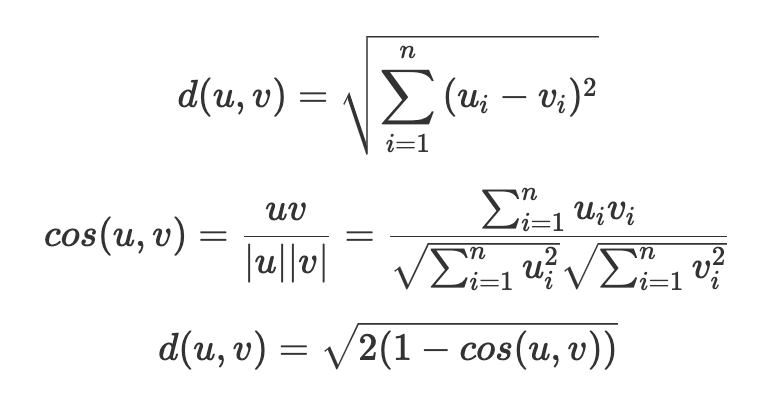

# int-experience

## byte

### aml

1st

+ 新场景用户少，怎么学习其他场景知识

初期，主feed年轻女性+少量频道样本双塔u2i，中期，还是两个场景样本，构图，通过user传播扩散，频道dau较高后，只使用频道样本训

+ deepwalk与gcn区别

实践中，deepwalk更偏记忆，gcn更好包括邻居信息，相对泛化一点

+ gcf的游走长度什么的超参怎么设置的

walklen = 20，窗口左右各5个，u作为起点和i作为起点分别游走最多xx次

+ 游走窗口与游走长度有啥关系，比如固定窗口，长度变化会有啥影响

瞎说的。。类似bert和cnn，对长序列建模和长距离依赖的捕捉能力吧 好像面试官听到后有点懵

+ gcf训练的时候怎么衡量效果

例如abc，ba是一个正样本，b随机就是负，转化成二分类问题 in batch随机采样 算auc 

+ gcf gcn训练频次等

gcn是基于pgl的，因为频道样本相对少，天级别增量训，且可以训多轮。gcf是基于abxxx的，小时级增量训

+ lightgcn层数，有做过消融实验么，u和i的层数一样吗

框架不支持区分u i分别设置层数，因此都是一样的，3层，每层邻居5 3 2（最终上线是1层 邻居5），也实验过不同设置，但没试太多种组合

+ mn最终双塔有没有normalize？

第一版是内积，无norm，后来改成cos，同时改了激活函数为selu，有提升，再后来cos属于-1到1，加了个伸缩变换，例如*6后再sigmoid

+ mn建库时怎么衡量ii距离

ui用内积，建库用的是angular，也就是欧式，为什么不太清楚。。其实可以参考下[https://www.zhihu.com/question/505942505?utm_source=wechat_session&utm_medium=social&s_r=0](https://www.zhihu.com/question/505942505?utm_source=wechat_session&utm_medium=social&s_r=0)

[https://zhuanlan.zhihu.com/p/158199835](https://zhuanlan.zhihu.com/p/158199835)

也就是 

+ query你们怎么用的，看着没用文本信息

gcf里是只用了id和切词,simnet本身q和t都是文本，erniesage的节点其实也是文本，只是聚合函数用的是ernie

+ 主feed+频道一起训，user有筛选，那item呢

训练的时候都保留了，建库只用频道可分发资源建库，但因为主feed也参与训练了，所以比如icf的时候，是能用来作为trigger召回频道资源的

代码：拓扑排序。。不会 跳过；手写auc

2nd

大致在之前gcf相关基础上又问了gcf样本的周期（比如图文 视频的有效期是多久，一次（即一个delta）分别用多久的语料来训），query怎么加进去的，gcn参数，模型怎么增量训的，啥叫feasign 你们居然是记录feasign的show clk？ 怎么checkpoint、base、delta问了很久（感觉没搞过ctr预估？这也要问？）

题目问了最长连续序列，需要返回这个子序列，不止是最大长度，没写出最优解。。gg

### dy-ds

题目：

1st: k个升序链表merge 原题

2nd：一题没见过的dp，求xxx的方法总数。先给出了回溯的方法，然后提示说可以dp来解，二维dp，答出来了思路，没让具体写

其他问题（答的不一定对啊。。）：

qps多少？全机房7 8k，主feed1w+接近2w

精排总quota多少？3k

精排模型结构？ctr单独一个模型，完成率时长另一个模型，互动另一个

互动多少个塔？7 8个塔，包括收藏 分享 关注啥的

时长 完成率咋建模？时长：当前时长/资源avg时长，0-1之间，回归 rmse。完成率：时长/固有时长，可能播放多次，完成率大于1，但不会非常大，也是rmse，没啥特殊处理

时长 完成率有啥特殊特征？user侧会有历史类目的avg时长 avg完成率之类的

粗排怎么cgc？u内部cgc，输出3个头，和i的3个头分别搞一次

有什么seq特征？user不同时间窗口的点击item list，点击类目list

seq怎么建模？sumpooling。有试过attention之类的么？u和i的att肯定不行，因为是粗排，u内部的selfatt其实可以搞，但训不动，在线infer也很慢不行

模型有连续值特征吗？连续值特征都离散化了，通过过去x天的展现日志统计，按分位数分桶。因为是抽取算子，一旦确定了分桶阈值就不改了。

更新频率？精排分钟级，粗排召回小时级

deepwalk？u-i有点击就有边，游走，得到序列，w2v

sideinfo？u和i都有，方便冷item/user也有表示

游走概率？随机，试过按u-i时长之类的加权重要性采样，效果一般

怎么搞的负采样？batch内随机，输入只有点击样本，相当于随机拿别人的正样本当成我的负样本。也试过在这个采样概率上基于i-i相似度做一些重要性采样，比如非常像的其实不应该采成负，比较像的是hard-neg。和google那篇sampling bias-corrected不太一样，那篇是基于出现次数做的采样

你们用的abacus，会有更复杂的负样本处理逻辑么？有试过用另外一个模型来判断两个样本的相似度，类似gan的思想，但成本比较大。

w2v具体怎么训的？skipgram，abcd 那对b来讲，ab是正，a可以batch内找k个负，就是k个二分类，算auc

模型迭代时，怎么判断收敛了？基线a，实验b，b基于a热启，同时训，当两个的auc gap基本稳定时就当做收敛了

怎么衡量召回效果？准召，比如模型a和b，用相同的候选集，召回k个item，看能覆盖这个用户未来n小时的多少点击item。这个涨了基本上线单队列也会涨。

不同队列间怎么分配精排quota？正常就按粗排分排，还会有一些基于后验或者别的逻辑的调权，还有基于用户的资源类型偏好预估，比如更喜欢图文就图文出多点

队列层面对粗排quota是怎么设置的？各队列是独立server，一般不会跨队列设置，每个队列自己设。一般是写死的，比如根据主feed经验，表现比较好的队列就设多一点。有些大队列内部有多个子队列，会通过记录用户对每个子队列的偏好，通过ts动态调整quota。

队列怎么决定哪些item能进粗排？最简单就是根据召回时的score，例如u-i相似度。复杂的，可以再加一些user侧 item侧 u-i组合特征，过一个简单模型如xgb或者几层小nn，根据这个预估值来排序。

全系统漏斗不一致怎么搞？粗排用的是精排比较好的特征且语料相同，所以粗精排间一致性还好。几个主召回，如graph 双塔因为是基于用户行为训的，也相对还好。一些比如探索或者新热的，就只能通过别的类似保quota的保量通路了

有漏斗相关的建模么？全链路各阶段会采样落一些样本，多塔多目标建模各漏斗概率，比如展现率，进粗排的率，xx率之类的

一小时样本有多少？高峰期一两亿，主feed有3 4亿，一天几十亿。

有采样么？我们这个场景没采样，能训得动

ctr多少？8-9%，主feed有10%左右，图文差点，小视频比较高

粗排训一轮多久？读样本+训练+dump模型 三四十min，配送到线上一二十min

各阶段多样性怎么保证？队列会有一些简单的基于规则的，例如同一个类目不能超过百分之几，同一个tag，同一个作者。精排前也是类似的硬打散，精排后因为候选少了，可以用dpp mmr之类的相对复杂的方法

会平衡ee么？主要是新用户上搞下ee，通过类目ts，保证探索效率

ann索引构建方法？架构有个平台，可以选annoy hnsw scann之类的，具体细节不是很清楚

候选集大小？能直接暴力算么？我们频道两三百w，其实要暴力也行，就是没资源。主feed是kw级别，同样考虑资源问题，并没有用暴力。凤巢是亿级别，他们是ann。

distill？输入两个活跃用户u1 u2，基于feed行为的活跃用户模型能得到score，基于他们的query 地理位置之类的冷启特征能得到pred，学pred和score的rmse

crowd？各种特征组合，如男-18~24岁-安装wx，这个人群下有100w用户，随机抽k个，看下两两的ucf向量相似度，不太像的话就是个没用的crowd，扔了。如果还ok，对这100w通过mr取个平均，得到中心向量，然后通过最大堆找出离中心最近topk用户，再拿这些用户点过的item，投票+流行度消偏（比如有些item在全局热门就打压）

生态？资源在从入库到最终可能成为爆款会经历很多阶段，比如xx小时内点击/展现达到n次，在我们场景分成3个阶段 冷启 预热 全面分发，冷启时item没用户行为，那就通过作者来表示，而作者可以通过他的活跃用户铁粉的user向量来表示，线上u2i；预热有用户点击了，那就用前k次点击这个item的用户向量来表示这个item，线上还是u2i。全面分发就是正常各队列召回

query效果咋样？冷用户比较好，他们不怎么用feed，一用feed发现能出搜过的东西，会比较感兴趣。活跃用户不一定，有的人会很反感，类似侵犯隐私的感觉

哪个队列占比最高？cf里的ucf，多个场景都是类似表现

有试过别的gnn么？因为换了个框架，pgl，当时问pgl的同学，说ligtgcn对低活用户多的场景效果比较好，别的因为有nn，如果id missing了，会学出很奇怪的emb，所以就试了lightgcn

多场景一起建模，样本分布差别很大怎么办？如果真的是特别稀疏的场景，要么基于主任务的emb单独建模，这样能训得更充分点。如果样本分布差距不是很大，其实可以联训，要么调下样本权重，要么通过网络结构上的改动比如加对某些特征一些gate，相当于建模不同场景的不同weight之类的

