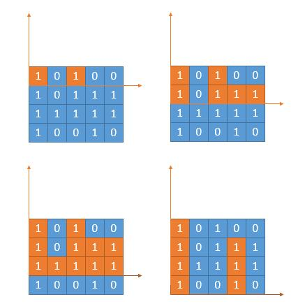
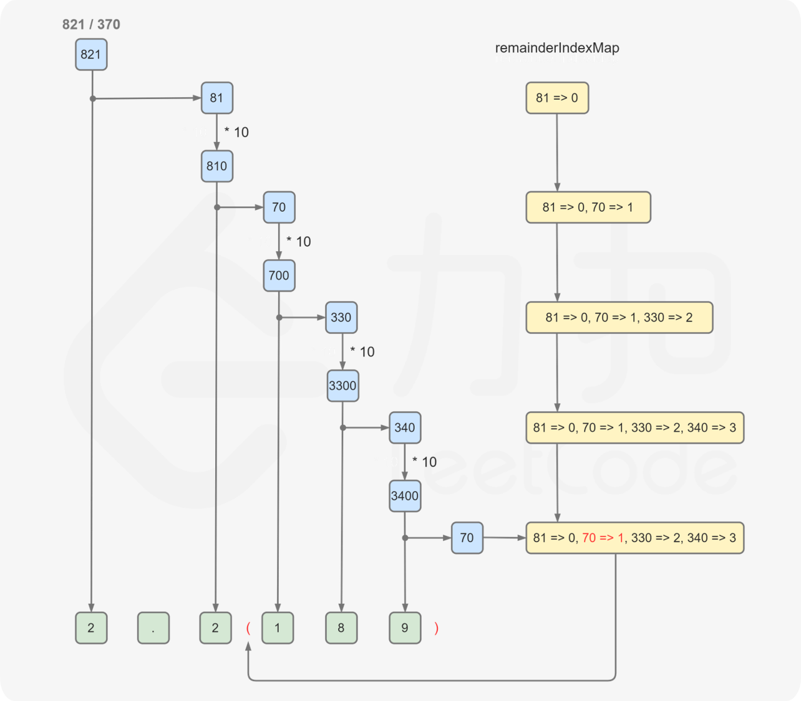

# int-summary

## 概述

本文下载地址：[https://github.com/daiwk/int-collections/blob/master/int-summary.pdf](https://github.com/daiwk/int-collections/blob/master/int-summary.pdf)

主要是leetcode相关的题

参考1：[https://leetcode-cn.com/leetbook/detail/top-interview-questions-medium/](https://leetcode-cn.com/leetbook/detail/
top-interview-questions-medium/)

参考2：[https://leetcode.cn/problem-list/2cktkvj/](https://leetcode.cn/problem-list/2cktkvj/)

## 数组和字符串

### 罗马数字转整数

罗马数字包含以下七种字符: I， V， X， L，C，D 和 M。

```
字符          数值
I             1
V             5
X             10
L             50
C             100
D             500
M             1000
```

例如， 罗马数字 2 写做 II ，即为两个并列的 1。12 写做 XII ，即为 X + II 。 27 写做  XXVII, 即为 XX + V + II 。

通常情况下，罗马数字中小的数字在大的数字的右边。但也存在特例，例如 4 不写做 IIII，而是 IV。数字 1 在数字 5 的左边，所表示的数等于大数 5 减小数 1 得到的数值 4 。同样地，数字 9 表示为 IX。这个特殊的规则只适用于以下六种情况：

+ I 可以放在 V (5) 和 X (10) 的左边，来表示 4 和 9。
+ X 可以放在 L (50) 和 C (100) 的左边，来表示 40 和 90。 
+ C 可以放在 D (500) 和 M (1000) 的左边，来表示 400 和 900。

给定一个罗马数字，将其转换成整数。输入确保在 1 到 3999 的范围内。

```
示例 1:

输入: "III"
输出: 3
示例 2:

输入: "IV"
输出: 4
示例 3:

输入: "IX"
输出: 9
示例 4:

输入: "LVIII"
输出: 58
解释: L = 50, V= 5, III = 3.
示例 5:

输入: "MCMXCIV"
输出: 1994
解释: M = 1000, CM = 900, XC = 90, IV = 4.

```

**解答：**

+ 第一，如果当前数字是**最后一个数字**，或者**之后的数字比它小**的话，则加上当前数字
+ 第二，其他情况则减去这个数字(例如，IV，看到I的时候就是减去I，然后到V就是加V; XL，看到X的时候就是-X，然后到L就是加L)

```cpp
class Solution {
public:
    int romanToInt(string s) {
        unordered_map<char, int> x_map;
        x_map.insert(std::make_pair('I', 1));
        x_map.insert(std::make_pair('V', 5));
        x_map.insert(std::make_pair('X', 10));
        x_map.insert(std::make_pair('L', 50));
        x_map.insert(std::make_pair('C', 100));
        x_map.insert(std::make_pair('D', 500));
        x_map.insert(std::make_pair('M', 1000));
        int res = 0;
        for (int i = 0; i < s.size(); ++i) {
            cout << i << s[i] << endl;
            int val = x_map[s[i]];
            if (i == s.size() - 1 || x_map[s[i+1]] <= x_map[s[i]]) {
                res += val;
            } else {
                res -= val;
            }
        }
        return res;
    }
};
```

### 【top100】两数之和

给定一个整数数组和一个目标值，找出数组中和为目标值的两个数。

你可以假设每个输入只对应一种答案，且同样的元素不能被重复利用。

**示例:**

给定 nums = [2, 7, 11, 15], target = 9

因为 nums[0] + nums[1] = 2 + 7 = 9 所以返回 [0, 1]

**解法：**

用一个map，key是元素值，value是idx 看新来的这个元素的目标值（tgt - nums[i]）在不在map里，在的话把它的value拿出来就行了。。

```cpp
class Solution {
public:
    vector<int> twoSum(vector<int>& nums, int target) {
        vector<int> res;
        unordered_map<int, int> map;
        for (int i = 0; i < nums.size(); ++i) {
            const int& tgt_val = target - nums[i];
            if (map.find(tgt_val) != map.end()) {   
                res.push_back(map[tgt_val]);
                res.push_back(i);
                return res;
            } else {
                map.insert(std::make_pair(nums[i], i));
            }
        }
    }
};
```


### 【top100】三数之和

给你一个包含 n 个整数的数组 nums，判断 nums 中是否存在三个元素 a，b，c ，使得 a + b + c = 0 ？请你找出所有和为 0 且不重复的三元组。

注意：答案中不可以包含重复的三元组。

```cpp
    vector<vector<int>> threeSum(vector<int>& nums) 
    {
        int size = nums.size();
        vector<vector<int> >res;            // 保存结果（所有不重复的三元组）
        if (size < 3) {
            return res;          // 特判
        }
        std::sort(nums.begin(), nums.end());// 排序（默认递增）
        for (int i = 0; i < size; i++)      // 固定第一个数，转化为求两数之和
        {
            if (nums[i] > 0) { // ！！！容易漏掉
                return res; // 第一个数大于 0，后面都是递增正数，不可能相加为零了
            }
            // 去重：如果此数已经选取过，跳过
            if (i > 0 && nums[i] == nums[i - 1]) {
                continue;
            }
            // 双指针在nums[i]后面的区间中寻找和为0-nums[i]的另外两个数
            int left = i + 1;
            int right = size - 1;
            while (left < right)
            {
                if (nums[left] + nums[right] > -nums[i]) {
                    right--;    // 两数之和太大，右指针左移
                } else if (nums[left] + nums[right] < -nums[i]) {
                    left++;     // 两数之和太小，左指针右移
                } else {
                    // 找到一个和为零的三元组，添加到结果中，左右指针内缩，继续寻找
                    vector<int> tmp {nums[i], nums[left], nums[right]};
                    res.push_back(tmp);
                    left++;
                    right--;
                    // 去重：第二个数和第三个数也不重复选取 ！！！容易漏掉
                    // 例如：[-4,1,1,1,2,3,3,3], i=0, left=1, right=5
                    while (left < right && nums[left] == nums[left-1]) {
                        left++;
                    }
                    while (left < right && nums[right] == nums[right+1]) {
                        right--;
                    }
                }
            }
        }
        return res;
    }
```

### 矩阵置零

给定一个 m x n 的矩阵，如果一个元素为 0 ，则将其所在行和列的所有元素都设为 0 。请使用 原地 算法。

```cpp
    void setZeroes(vector<vector<int>>& matrix) {
        int row = matrix.size();
        int col = matrix[0].size();
        // 用两个辅助数组，存这行和这列是否要变成0，
        // 然后再遍历原矩阵，如果二者有一个要变0，那就变成0
        vector<bool> rows(row, false);
        vector<bool> cols(col, false);
        for (int i = 0; i < row; ++i) {
            for (int j = 0; j < col; ++j) {
                if (matrix[i][j] == 0) {
                    rows[i] = true;
                    cols[j] = true;
                }    
            }
        }
        for (int i = 0; i < row; ++i) {
            for (int j = 0; j < col; ++j) {
                if (rows[i] || cols[j]) {
                    matrix[i][j] = 0;
                }    
            }
        }
    }
```

### 【top100】字母异位词分组

给你一个字符串数组，请你将 字母异位词 组合在一起。可以按任意顺序返回结果列表。

字母异位词 是由重新排列源单词的字母得到的一个新单词，所有源单词中的字母通常恰好只用一次。

其实就是个倒排

```cpp
    vector<vector<string>> groupAnagrams(vector<string>& strs) {
        unordered_map<string, vector<string> > xmap;
        for (auto& it: strs) {
            string xit = it;
            // 对string进行sort，搞成一个词，扔进map
            sort(xit.begin(), xit.end());
            xmap[xit].emplace_back(it);
        }
        vector<vector<string>> res;
        for (auto& it: xmap) {
            res.emplace_back(it.second);
        }
        return res;
    }
```

### 【top100】无重复字符的最长子串

给定一个字符串，请你找出其中不含有重复字符的 最长子串 的长度。

```
输入: s = "pwwkew"
输出: 3
解释: 因为无重复字符的最长子串是 "wke"，所以其长度为 3。
     请注意，你的答案必须是 子串 的长度，"pwke" 是一个子序列，不是子串。
```

双指针

```cpp
   int lengthOfLongestSubstring(string s) {
        set<char> set_char;
        int res = 0;
        // 双指针，两个指针都从头开始
        for (int i = 0, j = 0; i < s.size() && j < s.size(); ) {
            if (set_char.find(s[j]) != set_char.end()) {
                //找到重复了，那就把起始的扔了
                set_char.erase(s[i]);
                ++i;
            } else {
                if (j - i + 1 > res) {
                    res = j - i + 1;
                }
                set_char.insert(s[j]);
                //没重复的，右指针继续往前找
                ++j;
            }
        }
        
        return res;
    }
```

### 【top100】寻找两个正序数组的中位数

给定两个大小为 m 和 n 的有序数组 nums1 和 nums2 。

请找出这两个有序数组的中位数。要求算法的时间复杂度为 O(log (m+n)) 。

你可以假设 nums1 和 nums2 不同时为空。

```
示例 1:

nums1 = [1, 3]
nums2 = [2]

中位数是 2.0

示例 2:

nums1 = [1, 2]
nums2 = [3, 4]

中位数是 (2 + 3)/2 = 2.5
```

**解答：**

方法1(复杂度O(m+n))：

先归并两个数组，再取中点，归并的复杂度是O(m+n)，参考第88题[https://leetcode-cn.com/problems/merge-sorted-array/description/](https://leetcode-cn.com/problems/merge-sorted-array/description/)

```cpp
    double findMedianSortedArrays(vector<int>& nums1, vector<int>& nums2) {
        vector<int> tmp;
        int m = nums1.size();
        int n = nums2.size();
        int total_size = n + m;
        tmp.resize(total_size);
        // 倒着来
        int i = m - 1;
        int j = n - 1;
        // 如果有重复的，也要复制两遍
        while (j >= 0) {
            if (i < 0) {
                // 如果i数组遍历完了，要把j数据剩下的全部拷过来,记住是<j+1
                for(int k = 0; k < j + 1; ++k) {
                    tmp[k] = nums2[k];
                }
                break;
            }
            if (nums2[j] > nums1[i]) {
                // 留大的下来，留谁的就谁的指针--
                // 注意是i + j + 1
                tmp[i + j + 1] = nums2[j];
                j--;
            } else {
                tmp[i + j + 1] = nums1[i];
                i--;
            }
        }
        if (j < 0) {
            // 同理，j遍历完了就把i剩下的搞过来
            for(int k = 0; k < i + 1; ++k) {
                tmp[k] = nums1[k];
            }
        }
        // 以上是归并两个数组的方法
        if (total_size % 2 != 0) {
            return tmp[total_size / 2];
        } else {
            return (tmp[total_size / 2 - 1] + tmp[total_size / 2]) *1.0 / 2;
        }
    }
```

方法2：二分查找

[https://leetcode-cn.com/problems/median-of-two-sorted-arrays/solution/xun-zhao-liang-ge-you-xu-shu-zu-de-zhong-wei-s-114/](https://leetcode-cn.com/problems/median-of-two-sorted-arrays/solution/xun-zhao-liang-ge-you-xu-shu-zu-de-zhong-wei-s-114/)

### 最长公共前缀

编写一个函数来查找字符串数组中的最长公共前缀。

如果不存在公共前缀，返回空字符串 ""。

```
示例 1：

输入：strs = ["flower","flow","flight"]
输出："fl"
示例 2：

输入：strs = ["dog","racecar","car"]
输出：""
解释：输入不存在公共前缀。
```

注意这里说的是前缀，不是子序列，所以两个str都从0开始，同一个指针一起移动就行。。可以只遍历短的长度

另外，随着遍历的字符串变多，公共前缀是会变短的，变成0就可以return，如果完了还不是0，那就是要的了

另外，不用str[i]和str[i+1]比较再和prefix，直接str[i]和prefix比较就行，这样循环简单点

```cpp
    string longestCommonPrefix(vector<string>& strs) {
        string comm_prefix = strs[0];
        for (int i = 0; i < strs.size(); ++i) {
            lcp_sub(strs[i], comm_prefix);
            if (comm_prefix == "") {
                return comm_prefix;
            }
        }
        return comm_prefix;
    }
    void lcp_sub(const string &a, string& b) {
        int len = min(a.length(), b.length());
        int i = 0;
        while(i < len) {
            if (a[i] != b[i]) {
                break;
            }
            ++i;
        }
        if (a[i] != b[i]) {
            b = b.substr(0, i);
        } else {
            b = b.substr(0, i + 1);
        }
    }
```

有点绕，还是抄答案吧：

```cpp
    string longestCommonPrefix(vector<string>& strs) {
        string comm_prefix = strs[0];
        for (int i = 0; i < strs.size(); ++i) {
            lcp_sub(strs[i], comm_prefix);
            if (comm_prefix == "") {
                return comm_prefix;
            }
        }
        return comm_prefix;
    }
    void lcp_sub(const string &a, string& b) {
        int len = min(a.length(), b.length());
        int i = 0;
        // while一起判断了，就不用再对i i+1处理了。。
        while (i < len && a[i] == b[i]) {
            ++i;
        }
        b = b.substr(0, i);
    }
```

### 存在重复元素

给你一个整数数组 nums 。如果任一值在数组中出现 至少两次 ，返回 true ；如果数组中每个元素互不相同，返回 false 。

```cpp
    bool containsDuplicate(vector<int>& nums) {
        unordered_set<int> xset;
        for(auto& i: nums) {
            if (xset.count(i)) {
                return true;
            }
            xset.emplace(i);
        }
        return false;
    }
```

### 整数反转

给定一个 32 位有符号整数，将整数中的数字进行反转。

**示例：**

```
示例 1:
输入: 123
输出: 321

示例 2:
输入: -123
输出: -321

示例 3:
输入: 120
输出: 21
```

注意:

假设我们的环境只能存储 32 位有符号整数，其数值范围是 [−2^31,  2^31 − 1]。根据这个假设，如果反转后的整数溢出，则返回 0。

**解答**

写一个valid函数，记得参数变成long，然后去看这个long是不是在int32的范围里

```cpp
class Solution {
public:
    bool valid(long x) { // 注意，这里要是long
        if (x > 0) {
            if (x >= pow(2, 31) -1)
                return false;
        }
        if (x < 0) {
            if (x <= -pow(2, 31)) {
                return false;
            }
        }
        return true;
    }

    int reverse(int x) {
        long tmp = 0;
        // 开始判断一下范围
        if (!valid(x)) {
            return 0;
        }
        bool flag = true;
        // 统一变成正数，处理完如果原来是负的再变回去
        if (x < 0) {
            x = -x;
            flag = false;
        }
        while (x != 0) {
            tmp *= 10; // tmp向左移一位
            tmp += x % 10; // 取出x的最低位
            x /= 10; // x往右移一位
        }
        if (flag == false) {
            tmp = -tmp;
        }
        // 结束再判断一下范围
        if (valid(tmp)) {
            return tmp;
        }
        return 0; 
};
```

### 【top100】只出现一次的数字

给定一个非空整数数组，除了某个元素只出现一次以外，其余每个元素均出现两次。找出那个只出现了一次的元素。

异或：

+ 任何数和 0 做异或运算，结果仍然是原来的数
+ 任何数和其自身做异或运算，结果是 0
+ 异或运算满足交换律和结合律

所以

a^b^a=a^a^b=(a^a)^b=0^b=b

所以把所有数异或一遍就是那个只出现一次的数了。。

```cpp
    int singleNumber(vector<int>& nums) {
        int res = 0; // 初始化为0
        for (auto& i: nums) {
            res ^= i;
        }
        return res;
    }
```

### 【top100】有效的括号

给定一个只包括``` '('，')'，'{'，'}'，'['，']' ```的字符串，判断字符串是否有效。

有效字符串需满足：

+ 左括号必须用相同类型的右括号闭合。
+ 左括号必须以正确的顺序闭合。
+ 注意空字符串可被认为是有效字符串。

```
示例 1:

输入: "()"
输出: true
示例 2:

输入: "()[]{}"
输出: true
示例 3:

输入: "(]"
输出: false
示例 4:

输入: "([)]"
输出: false
示例 5:

输入: "{[]}"
输出: true
```

**解答：**

注意一定要**先判断st.size()>0再取top**，不然会出错

```cpp
class Solution {
public:
    bool isValid(string s) {
        stack<char> st;
        unordered_map<char, char> mp;
        // 先用map存一下左右括号的映射关系，
        // 因为是栈，遇到右括号才想着pop，所以key是右括号！！
        mp.insert(std::make_pair('}', '{'));
        mp.insert(std::make_pair(']', '['));
        mp.insert(std::make_pair(')', '('));
        for (int i = 0; i < s.size(); i++) {
            if (mp.find(s[i]) != mp.end() && 
                st.size() > 0 && 
                mp[s[i]] == st.top()) {
                st.pop();
            } else {
                st.push(s[i]);
            }
        }
        if (st.size() == 0) return true;
        return false;
    }
};
```

#### 基础的括号匹配

[https://www.luogu.com.cn/problem/P1739](https://www.luogu.com.cn/problem/P1739)

假设一个表达式有英文字母（小写）、运算符（+，—，*，/）和左右小（圆）括号构成，以“@”作为表达式的结束符。请编写一个程序检查表达式中的左右圆括号是否匹配，若匹配，则返回“YES”；否则返回“NO”。表达式长度小于255，左圆括号少于20个。

```
输入格式
一行：表达式

输出格式
一行：“YES” 或“NO”
```

解答：

栈的思想，可以不用栈，用一个变量top，遇到左括号++,右括号--，看最后是不是0

注意：

**如果先出现了右括号，前面没有左括号的时候（top=0时出现了右括号），直接是NO**

```cpp
#include<iostream>
#include<cstdio>
#include<string>
using namespace std;
char c;
int top = 0;
int main()
{
    for(; ; )
    {
        cin >> c;
        if (c == '@') break;
        if (c == '(') top++;
        else if( c==')' && top > 0) {
            top--;
        } else if(c==')') {
            cout << "NO";
            return 0;
        }
    }
    if(top == 0) {
        cout<<"YES";
    } else {
        cout<<"NO";
    }
    return 0;
}
```

### 回文数

判断一个整数是否是回文数。回文数是指正序（从左向右）和倒序（从右向左）读都是一样的整数。

```
示例 1:

输入: 121
输出: true
示例 2:

输入: -121
输出: false
解释: 从左向右读, 为 -121 。 从右向左读, 为 121- 。因此它不是一个回文数。
示例 3:

输入: 10
输出: false
解释: 从右向左读, 为 01 。因此它不是一个回文数。
```

**解答**

为了避免数字反转可能导致的溢出问题，为什么不考虑只反转 数字的一半？毕竟，如果该数字是回文，**其后半部分反转后应该与原始数字的前半部分相同。**

例如，输入 1221，我们可以将数字“1221”的后半部分从“21”反转为“12”，并将其与前半部分“12”进行比较，因为二者相同，我们得知数字 1221 是回文。

* 特判

**所有负数都不可能是回文，例如：-123 不是回文，因为 - 不等于 3**

**!!!!尾数能被10整除，即尾数是0的也不行，因为首位不是0**

* 反转

对于数字 1221，如果执行 1221 % 10，我们将得到最后一位数字 1，要得到倒数第二位数字，我们可以先通过除以 10 把最后一位数字从 1221 中移除，1221 / 10 = 122，再求出上一步结果除以10的余数，122 % 10 = 2，就可以得到倒数第二位数字。如果我们把**最后一位数字乘以10**，再**加上倒数第二位数字**，1 * 10 + 2 = 12，就得到了我们想要的反转后的数字。 如果继续这个过程，我们将得到更多位数的反转数字。

所以，每次把**上一次的数字\*10**，**加上这一次的最后一位数字**，然后**x/=10**，**把这次的尾数扔掉**

现在的问题是，我们如何知道反转数字的位数已经达到原始数字位数的一半？

* 终止

我们将原始数字除以 10，然后给反转后的数字乘上 10，所以，当除完的原始数字不大于反转后的数字时，就意味着我们已经处理了一半位数的数字。

例如，原数字是4123，反转到321>41的时候，就到一半了；如果原数字是412，反转到21>4的时候也到一半了。也就是反转的位数比剩下的多，肯定到一半了。或者，原数字是1234，反转到34>12

举个是回文数的例子，原数字是3223，32==32，break了；原数字121，12>1，break掉

**当数字长度为奇数时，我们可以通过 revertedNumber/10 去除处于中位的数字。**

例如，当输入为 12321 时，在 while 循环的末尾我们可以得到 x = 12，revertedNumber = 123

由于处于中位的数字不影响回文（它总是与自己相等），所以我们可以简单地将其去除。所以对于奇数位，就是判断x==revertedNumber/10

```cpp
class Solution {
public:
    bool isPalindrome(int x) {
        if(x < 0 || (x % 10 == 0 && x != 0)) { //边界！！
            return false;
        }
        int revertedNumber = 0;
        while(x > revertedNumber) { // 大于
            revertedNumber = revertedNumber * 10 + x % 10; // 这么判断 
            x /= 10;
        }
        return (x == revertedNumber || x == revertedNumber / 10);
    }
};
```

### 【top100】盛最多水的容器

给定一个长度为 n 的整数数组 height 。有 n 条垂线，第 i 条线的两个端点是 (i, 0) 和 (i, height[i]) 。

找出其中的两条线，使得它们与 x 轴共同构成的容器可以容纳最多的水。

返回容器可以储存的最大水量。

说明：你不能倾斜容器。

双指针！！

对于i，j两个点，能接的水量是min(num[i],num[j]) * (j - i)

这个时候应该移动的是num[i]和num[j]中较小的那个，因为j-i肯定会变小，

而想要变大，只能min(num[i],num[j])变大，所以要把小的移一下试试，如果小的在左边那就右移，否则同理

```cpp
    int maxArea(vector<int>& height) {
        // 对于i，j两个点，能接的水量是min(num[i],num[j]) * (j - i)
        // 这个时候应该移动的是num[i]和num[j]中较小的那个，因为j-i肯定会变小，
        // 而想要变大，只能min(num[i],num[j])变大，所以要把小的移一下试试，如果小的在左边那就右移，否则同理
        int max_res = 0;
        int i = 0, j = height.size() - 1;
        while (i < j) {
            int cur_water = min(height[i], height[j]) * (j - i);
            max_res = max(max_res, cur_water);
            if (height[i] >= height[j]) {
                --j;
            } else {
                ++i;
            }
        }
        return max_res;
    }
```

### 最接近的三数之和

给你一个长度为 n 的整数数组 nums 和 一个目标值 target。请你从 nums 中选出三个整数，使它们的和与 target 最接近。

返回这三个数的和。

假定每组输入只存在恰好一个解。

**解法**

「最接近」即为**差值的绝对值最小**

类似三数之和，双指针，固定第一个数，希望剩下b+c最接近target


```cpp
    int threeSumClosest(vector<int>& nums, int target) {
        int n = nums.size();
        if (n < 3) {
            return -1;
        }
        sort(nums.begin(), nums.end());
        int dist = INT_MAX;
        int res = INT_MIN;
        for (int i = 0; i < n; ++i) {
            int left = i + 1;
            int right = n - 1;
            // 保证和上一次枚举的元素不相等
            if (i > 0 && nums[i] == nums[i - 1]) {
                continue;
            }
            while (left < right) {
                int sum = nums[i] + nums[left] + nums[right];
                if (sum < target) {
                    ++left;
                    // 注意，这个和三数之和那题的位置不一样
                    while (left < right && nums[left] == nums[left - 1]) {
                        left++;
                    }
                } else if(sum > target) {
                    --right;
                    // 注意，这个和三数之和那题的位置不一样
                    while (left < right && nums[right] == nums[right + 1]) {
                        --right;
                    }
                } else {
                    return sum;
                }
                if (dist > abs(sum - target)) {
                    res = sum;
                    dist = abs(sum - target);
                }
            }
        }
        return res;
    }
```

### Z 字形变换

将一个给定字符串 s 根据给定的行数 numRows ，以从上往下、从左到右进行 Z 字形排列。

比如输入字符串为 "PAYPALISHIRING" 行数为 3 时，排列如下：

```
P   A   H   N
A P L S I I G
Y   I   R
```

之后，你的输出需要从左往右逐行读取，产生出一个新的字符串，比如："PAHNAPLSIIGYIR"。

请你实现这个将字符串进行指定行数变换的函数：

```
示例 2：
输入：s = "PAYPALISHIRING", numRows = 4
输出："PINALSIGYAHRPI"
解释：
P     I    N
A   L S  I G
Y A   H R
P     I
```

画个图，直接找出新字符串每一位对应原来的下标

会向下填写 r 个字符，然后向右上继续填写 r−2 个字符(斜线的r扣掉最后一行，和新的第一行的各一个字符)，所以变换周期是t=2r-2。

所以第一行的下标都是2r-2的倍数即0+kt，而最后一行就应该是r-1 + kt

而中间的第i行，除了k个数外，每一轮间还有一个数，那个数是(k + 1)t-i 


```cpp
    string convert(string s, int numRows) {
        
        int t = 2 * numRows - 2;
        int i = 0;
        if (t == 0) {
            return s;
        }
        int round = s.length() / t;
        string res;
        while (i < numRows) {
            int k = 0;
            int idx = 0;
            if (i == 0) {
                while (k <= round) {
                    idx = k * t;
                    if (idx < s.length()) {
                        res.push_back(s[idx]);
                    }
                    k++;
                }
            } else if (i < numRows -1) {
                k = 0;
                while (k <= round) {
                   idx = i + k * t;
                   if (idx < s.length()) {
                        res.push_back(s[idx]);
                   }
                   idx = (k + 1) * t - i;
                   if (idx > 0 && idx < s.length()) {
                        res.push_back(s[idx]); 
                   }
                   ++k;
                }
            } else {
                k = 0;
                while (k <= round) {
                    idx = numRows - 1 + k * t;
                    if (idx < s.length()) {
                        res.push_back(s[idx]);
                    }
                    k++;
                }
            }
            ++i;
        }
        return res;
    }
```

标准答案简单很多：

其实就是。。而中间的第i行，除了k个数外，每一轮间还有一个数，那个数是(k + 1)t-i = kt + t-i

这样，就都有kt了

所以就是每个周期塞两个数（不越界的情况下），

第一个数是每个周期的起始下标kt + i

第二个数是kt+t-i

限制一下最后一行和第一行只插入一个数，不然会出问题！！

```cpp
    string convert(string s, int numRows) {
        int t = 2 * numRows - 2;
        int i = 0;
        if (t == 0) {
            return s;
        }
        int round = s.length() / t;
        string res;
        while (i < numRows) {
            for (int j = 0; j + i < s.length(); j += t) {
                // 循环k轮，枚举每轮的起始下标
                res.push_back(s[j + i]); // 当前周期第一个字符
                // 注意，这里要限制0<i < numRows -1，因为第一行和最后一行只加一个数！！！！！
                if (0 < i && i < numRows - 1 && j + t - i < s.length()) {
                    res.push_back(s[j + t - i]);
                }
            }
            ++i;
        }
        return res;
    }
```

### 删除有序数组中的重复项

给你一个 升序排列 的数组 nums ，请你 原地 删除重复出现的元素，使每个元素 只出现一次 ，返回删除后数组的新长度。元素的 相对顺序 应该保持 一致 。

由于在某些语言中不能改变数组的长度，所以必须将结果放在数组nums的第一部分。更规范地说，如果在删除重复项之后有 k 个元素，那么 nums 的前 k 个元素应该保存最终结果。

将最终结果插入 nums 的前 k 个位置后返回 k 。

不要使用额外的空间，你必须在 原地 修改输入数组 并在使用 O(1) 额外空间的条件下完成。

**解法**

双指针，一快一慢，如果遇到不相等的，那就把快的值复制到慢的下一位，两个指针继续移动。

```cpp
    int removeDuplicates(vector<int>& nums) {
        if (nums.size() == 0) return 0;
        int i = 0;
        for (int j = 1; j < nums.size(); j++) {
            if (nums[j] != nums[i]) {
                // 不相等，且j比i快，那就说明ij中间可能是一串重复的数，
                // 就把num[j]赋值给num[i+1],然后两个指针都往后移
                nums[i + 1] = nums[j];
                ++i;
            }
        }
        return i + 1;
    }
```

### 螺旋矩阵

给你一个 m 行 n 列的矩阵 matrix ，请按照 顺时针螺旋顺序 ，返回矩阵中的所有元素。

参考[https://leetcode.cn/problems/spiral-matrix/solution/cxiang-xi-ti-jie-by-youlookdeliciousc-3/](https://leetcode.cn/problems/spiral-matrix/solution/cxiang-xi-ti-jie-by-youlookdeliciousc-3/)

+ 首先设定上下左右边界
+ 其次向右移动到最右，此时第一行因为已经使用过了，可以将其从图中删去，体现在代码中就是重新定义上边界
+ 判断若重新定义后，上下边界交错，表明螺旋矩阵遍历结束，跳出循环，返回答案
+ 若上下边界不交错，则遍历还未结束，接着向下向左向上移动，操作过程与第一，二步同理
+ 不断循环以上步骤，直到某两条边界交错，跳出循环，返回答案

```cpp
    vector<int> spiralOrder(vector<vector<int>>& matrix) {
        // 首先设定上下左右边界
        // 其次向右移动到最右，此时第一行因为已经使用过了，可以将其从图中删去，体现在代码中就是重新定义上边界
        // 判断若重新定义后，上下边界交错，表明螺旋矩阵遍历结束，跳出循环，返回答案
        // 若上下边界不交错，则遍历还未结束，接着向下向左向上移动，操作过程与第一，二步同理
        // 不断循环以上步骤，直到某两条边界交错，跳出循环，返回答案
        vector<int> res;
        if (matrix.empty()) {
            return res;
        }
        int up = 0;
        int right = matrix[0].size() - 1;
        int down = matrix.size() - 1;
        int left = 0;
        while(true) {
            for (int i = left; i <= right; ++i) {
                res.push_back(matrix[up][i]);
            }
            if (++up > down) break;
            for (int i = up; i <= down; ++i) {
                res.push_back(matrix[i][right]);
            }
            if (--right < left) break;
            for (int i = right; i >= left; --i) {
                res.push_back(matrix[down][i]);
            }
            if (--down < up) break;
            for (int i = down; i >= up; --i) {
                res.push_back(matrix[i][left]);
            }
            if (++left > right) break;
        }
        return res;
    }
```

### 判定字符是否唯一

实现一个算法，确定一个字符串 s 的所有字符是否全都不同。

```
示例 1：
输入: s = "leetcode"
输出: false 
```

位运算

其实就是位图，假设当前是b，那1左移'b'-'a'位，和mark&一下，如果是0，说明这一位还没有出现过，那就和mark|一下得到新的mark，反之，不是0的话，就说明这一位之前出现过了

```cpp
    bool isUnique(string astr) {
        int mark = 0;
        for (auto& i: astr) {
            int bit = i - 'a';
            int res = 1<<bit;
            // 这里要加括号！！因为!=比&的优先级要高。。
            //或者也可以直接 if(res&mark)
            if ((res & mark) != 0) {
                return false;
            }
            mark |= res;
        }
        return true;
    }
```

### 第一个错误的版本

你是产品经理，目前正在带领一个团队开发新的产品。不幸的是，你的产品的最新版本没有通过质量检测。由于每个版本都是基于之前的版本开发的，所以错误的版本之后的所有版本都是错的。

假设你有 n 个版本 [1, 2, ..., n]，你想找出导致之后所有版本出错的第一个错误的版本。

你可以通过调用 bool isBadVersion(version) 接口来判断版本号 version 是否在单元测试中出错。实现一个函数来查找第一个错误的版本。你应该尽量减少对调用 API 的次数。

二分

```cpp
    int firstBadVersion(int n) {
        int left = 0, right = n - 1;
        while(left <= right) {
            int mid = left + (right - left) / 2;
            if (isBadVersion(mid + 1)) {
                right = mid - 1;
            } else {
                left = mid + 1;
            }
        }
       return left + 1;
    }
```

### 字符串相乘

给定两个以字符串形式表示的非负整数 num1 和 num2，返回 num1 和 num2 的乘积，它们的乘积也表示为字符串形式。

注意：不能使用任何内置的 BigInteger 库或直接将输入转换为整数。

就是模拟竖式计算。。

```cpp
    string multiply(string num1, string num2) {
        if (num1 == "0" || num2 == "0") {
            return "0";
        }
        string res = "0";
        int m = num1.size(), n = num2.size();
        //遍历num2
        for (int i = n - 1; i >= 0; --i) {
            string cur; // 先都扔原始数字进去，后面一起+'0'
            for (int j = n - 1; j > i; j--) {
                cur.push_back(0); 
            }
            int y = num2.at(i) - '0'; 
            int add = 0; // 进位
            for (int j = m - 1; j >= 0; --j) {
                // 遍历num1
                int x = num1[j] - '0';
                int product = x * y + add;
                cur.push_back(product % 10);
                add = product / 10; //进位
            }
            while (add != 0) {
                // 因为最终可以进好多位，要逐位产出
                cur.push_back(add % 10);
                add /= 10;
            }
            reverse(cur.begin(), cur.end());
            for (auto& i: cur) {
                i += '0';
            }
            res = add_string(res, cur);
        }
        return res;
    }
    string add_string(string num1, string num2) {
        int i = num1.size() - 1, j = num2.size() - 1, add = 0;
        string res;
        while (i >= 0 || j >= 0 || add != 0) {
            int x = i >= 0? num1.at(i) - '0': 0; //防越界
            int y = j >= 0? num2.at(j) - '0': 0; //防越界
            int result = x + y + add;
            res.push_back(result % 10);
            add = result / 10;
            --i;
            --j;
        }
        reverse(res.begin(), res.end());
        for (auto& i: res) {
            i += '0';
        }
        return res;
    }
```

### 【top100】最长连续序列

给定一个未排序的整数数组 nums ，找出数字连续的最长序列（不要求序列元素在原数组中连续）的长度。

请你设计并实现时间复杂度为 O(n) 的算法解决此问题。

**其实只需要每次在哈希表中检查是否存在x−1即可。如果x-1存在，说明当前数x不是连续序列的起始数字，我们跳过这个数。**

```cpp
    int longestConsecutive(vector<int>& vec) {
        unordered_set<int> xset;
        for (auto& i: vec) {
            xset.emplace(i);
        }
        int max_len = 0;
        vector<int> res_vec;
        for (auto& item: xset) {
            vector<int> tmp_vec;
            int tmp_len = 0;
            int i = 0;
            if (!xset.count(item - 1)) {
                while (xset.count(item + i)) {
                    // cout << "aa2 " << i << " " << item-i << endl;
                    tmp_vec.emplace_back(item + i);
                    i++;
                }
            }
            tmp_len += i;
            if (tmp_len > max_len) {
                res_vec.swap(tmp_vec);
            }
            max_len = max(max_len, tmp_len);
        }
        return max_len;
    }
```


#### 类似的byte面试题

返回一个序列中最长的连续数组

题目描述
Input: ​
[0,  78, 1, 2, -1, 5, 6, 7, 7]​

Output: ​
[-1, 0, 1, 2]
​

自己的解法，能过68/71，超时。。其实两个while可以去掉一个，这样也只能过69/71

```cpp
#include <iostream>
#include <unordered_set>
#include <vector>
using namespace std;

pair<vector<int>, int> get_max_len(const vector<int>& vec) {
    unordered_set<int> xset;
    for (auto& i: vec) {
        xset.emplace(i);
    }
    int max_len = 0;
    vector<int> res_vec;
    for (auto& item: xset) {
        vector<int> tmp_vec;
        int tmp_len = 0;
        int i = 0;
        // 可以只留一个while
        while (xset.count(item - i)) {
            // cout << "aa1 " << i << " " << item-i << endl;
            tmp_vec.emplace_back(item - i);
            i++;
        }
        tmp_len += i;
        
        i = 1;
        while (xset.count(item + i)) {
            // cout << "aa2 " << i << " " << item-i << endl;
            tmp_vec.emplace_back(item + i);
            i++;
        }
        tmp_len += i -1;
        if (tmp_len > max_len) {
            res_vec.swap(tmp_vec);
        }
        max_len = max(max_len, tmp_len);
    }
    return {res_vec, max_len};
}

int main() {
    vector<int> vec {0, 78, 1,2,-1,5,6,7,7};
    auto res = get_max_len(vec);
    cout << res.second << endl;
    cout << "=====" << endl;
    for (const auto&i: res.first) {
        cout << i << endl;
    }

    return 0;
}
```

优化后的解法：

```cpp
#include <iostream>
#include <unordered_set>
#include <vector>
using namespace std;

pair<vector<int>, int> get_max_len(const vector<int>& vec) {
    unordered_set<int> xset;
    for (auto& i: vec) {
        xset.emplace(i);
    }
    int max_len = 0;
    vector<int> res_vec;
    for (auto& item: xset) {
        vector<int> tmp_vec;
        int tmp_len = 0;
        int i = 0;
//        // 可以只留一个while
//        while (xset.count(item - i)) {
//            // cout << "aa1 " << i << " " << item-i << endl;
//            tmp_vec.emplace_back(item - i);
//            i++;
//        }
//        tmp_len += i;

//        i = 1;
        if (!xset.count(item - 1)) {
            while (xset.count(item + i)) {
                // cout << "aa2 " << i << " " << item-i << endl;
                tmp_vec.emplace_back(item + i);
                i++;
            }
        }
//        tmp_len += i -1;
        tmp_len += i;
        if (tmp_len > max_len) {
            res_vec.swap(tmp_vec);
        }
        max_len = max(max_len, tmp_len);
    }
    return {res_vec, max_len};
}

int main() {
    vector<int> vec {0, 78, 1,2,-1,5,6,7,7};
    auto res = get_max_len(vec);
    cout << res.second << endl;
    cout << "=====" << endl;
    for (const auto&i: res.first) {
        cout << i << endl;
    }

    return 0;
}
```

### 【top100】最长有效括号

给你一个只包含 '(' 和 ')' 的字符串，找出最长有效（格式正确且连续）括号子串的长度。

```
示例 2：

输入：s = ")()())"
输出：4
解释：最长有效括号子串是 "()()"
```

**解法**

可以是dp也可以是栈

栈的解法就是栈里放的是int，而不是左右括号

始终保持**栈底**元素为当前已经遍历过的元素中**最后一个没有被匹配的右括号的下标**

+ 遇到左括号，把**下标扔进栈里**
+ 遇到右括号
    + **弹出栈顶**，表示有左括号和它匹配上了，**弹出之后**：
        + 如果栈为空，说明当前右括号没人和他匹配，就把它的下标扔进去，这就满足了**最后一个没有被匹配的右括号的下标**
        + 如果栈不空，**当前右括号下标减掉栈顶**就是**以这个右括号结尾的最长有效括号长度**。。

如果一开始栈为空，第一个字符为左括号的时候我们会将其放入栈中，这样就不满足提及的「最后一个没有被匹配的右括号的下标」，为了保持统一，我们在**一开始的时候往栈中放入一个值为 -1 的元素**。

{ height="100" }


如上图，先-1入栈，然后遇到(，就扔一个0进去，然后i=1的时候，栈顶的0其实和它是匹配的，就扔掉，这个时候1-(-1)就是2了，其实就是扔掉的那对括号的长度

```cpp
    int longestValidParentheses(string s) {
        int max_res = 0;
        stack<int> stk;
        stk.push(-1);// 如上所述，为了保证栈底一直是xxx的右括号
        for (int i = 0; i < s.length(); ++i) {
            if (s[i] == '(') {
                stk.push(i);
            } else if (s[i] == ')') {
                stk.pop();
                if (stk.empty()) {
                    stk.push(i);
                } else {
                    max_res = max(max_res, i - stk.top());
                }
            }
        }
        return max_res;
    }
```

### 【top100】滑动窗口最大值

给你一个整数数组 nums，有一个大小为 k 的滑动窗口从数组的最左侧移动到数组的最右侧。你只可以看到在滑动窗口内的 k 个数字。滑动窗口每次只向右移动一位。

返回 滑动窗口中的最大值 。

```
示例 1：

输入：nums = [1,3,-1,-3,5,3,6,7], k = 3
输出：[3,3,5,5,6,7]
解释：
滑动窗口的位置                最大值
---------------               -----
[1  3  -1] -3  5  3  6  7       3
 1 [3  -1  -3] 5  3  6  7       3
 1  3 [-1  -3  5] 3  6  7       5
 1  3  -1 [-3  5  3] 6  7       5
 1  3  -1  -3 [5  3  6] 7       6
 1  3  -1  -3  5 [3  6  7]      7
```

**优先队列**

这题要的是**每个**滑动窗口对应的最大值

搞一个大小为k的大顶堆，堆顶就是max，这个时候，堆里需要存```<nums[i], i>```这样的pair

何时pop堆顶元素？当再来一个元素的时候，堆顶不在滑动窗口中时！

也就是说，假设这个时候遍历到了第i个元素，那么堆顶的下标m距离i超过k了，那就是```i - m + 1 > k```，即```i-m >=k```

```cpp
    vector<int> maxSlidingWindow(vector<int>& nums, int k) {
        vector<int> res;
        struct MyCmp {
            bool operator() (const pair<int, int>& a, const pair<int, int>& b) {
                return a.first < b.first;
            }
        };
        priority_queue<pair<int, int>, vector<pair<int, int> >, MyCmp> q;
        for (int i = 0; i < k; ++i) {
            q.push({nums[i], i});
        }
        // 先push_back进去！！！要不然后面可能给pop掉了。。
        res.push_back(q.top().first);
        for (int i = k; i < nums.size(); ++i) {
            // 先塞进堆里
            q.push({nums[i], i});
            // 这是个while，要一次性把窗口外的都删了，
            // 可能删不全，但下个i的时候会继续删
            while (i - q.top().second >= k) {
                q.pop();
            }
            // 堆顶就是当前这个窗口的max
            res.push_back(q.top().first);
        }
        return res;
    }
```

### 【top100】和为 K 的子数组

给你一个整数数组 nums 和一个整数 k ，请你统计并返回 该数组中和为 k 的子数组的个数 。

```
示例 1：
输入：nums = [1,1,1], k = 2
输出：2

示例 2：
输入：nums = [1,2,3], k = 3
输出：2
```

子数组指的就是连续的

pre[i]：[0,i]这段(闭区间)结尾的子数组的和

所以```pre[i] = pre[i-1]+nums[i]```

那[i,j]的和就是```pre[i] - pre[j-1]```，看看这个和是不是k

看看有多少个j，能够```pre[i]-pre[j-1]==k```，所以```pre[j-1] = pre[i] - k```

那就可以用一个map来存，key是```pre[j]```，value是出现次数

对于i来讲，首先```map[pre[i]]++```，如果```pre[i] - k```已经有了，那就```count+=map[pre[i] - k]```

另外，```pre[i]=pre[i-1] + nums[i]```，其实用一个数一直更新就行，不用数组

```cpp
    int subarraySum(vector<int>& nums, int k) {
        unordered_map<int, int> xmap;
        int count = 0;
        int pre = 0;
        xmap[pre] = 1; // 这里要加上，要不0会漏掉。。
        for (int i = 0; i < nums.size(); ++i) {
            pre += nums[i];
            if (xmap.find(pre - k) != xmap.end()) {
                count += xmap[pre - k];
            }
            xmap[pre]++;
        }
        return count;
    }
```

### 【top100】字符串解码

给定一个经过编码的字符串，返回它解码后的字符串。

编码规则为: k[encoded_string]，表示其中方括号内部的 encoded_string 正好重复 k 次。注意 k 保证为正整数。

你可以认为输入字符串总是有效的；输入字符串中没有额外的空格，且输入的方括号总是符合格式要求的。

此外，你可以认为原始数据不包含数字，所有的数字只表示重复的次数 k ，例如不会出现像 3a 或 2[4] 的输入。

```
示例 1：
输入：s = "3[a]2[bc]"
输出："aaabcbc"

示例 2：
输入：s = "3[a2[c]]"
输出："accaccacc"

示例 3：
输入：s = "2[abc]3[cd]ef"
输出："abcabccdcdcdef"

示例 4：
输入：s = "abc3[cd]xyz"
输出："abccdcdcdxyz"
```

栈

可能出现括号嵌套的情况，如```2[a2[bc]]```，可以搞成```2[abcbc]```，也就是从最内层的括号开始展开

遍历数组：

+ 如果是数字，解析出完整的数字（可能多位），进栈
+ 如果是字母或者左括号，进栈
+ 如果是右括号，一直出栈，直到出了左括号，搞成一个字符串，然后reverse，剩下的就是一个数字，然后把这个字符串重复这么多次就是了，**然后把这个扔回栈里去**

最终栈里剩下的是几段string，全pop出来，再reverse一下就是要的了

```cpp
    string get_string(const vector<string>& vec) {
        string tmp_str = "";
        for (int j = 0; j < vec.size(); ++j) {
            tmp_str += vec[j];
        }
        return tmp_str;
    }

    string decodeString(string s) {
        stack<string> stk;
        size_t ptr = 0;
        string res = "";
        while (ptr < s.size()) {
            if (isdigit(s[ptr])) {
                string tmp_str = "";
                while (isdigit(s[ptr])) {;
                    tmp_str += string(1, s[ptr++]);
                }
                stk.push(tmp_str);
            } else if (isalpha(s[ptr]) || s[ptr] == '[') {
                stk.push(string(1, s[ptr++]));
            } else if (s[ptr] == ']') {
                vector<string> tmp_vec;
                vector<string> tmp_str_vec;
                while(stk.top() != "[") {
                    string tmp = stk.top();
                    tmp_str_vec.push_back(tmp);
                    stk.pop();
                }
                reverse(tmp_str_vec.begin(), tmp_str_vec.end());
                string tmp_str = get_string(tmp_str_vec);
                cout << tmp_str << endl;
                stk.pop(); // pop掉[
                int digit = atoi(stk.top().c_str()); // atoi转成int
                stk.pop();
                string x_str = "";
                while (digit) {
                    tmp_vec.push_back(tmp_str);
                    digit--;
                }
                string xtmp_str = get_string(tmp_vec);
                stk.push(xtmp_str);// 要塞回栈里去！！！
                cout << xtmp_str << "qqq" << endl;
                ptr++;
            }
        }
        vector<string> res_vec;
        // 全部搞出来，因为可能会有多段结果
        while(!stk.empty()) {
            res_vec.push_back(stk.top());
            stk.pop();
        }
        reverse(res_vec.begin(), res_vec.end());
        res = get_string(res_vec);
        return res;
    }
```

### 【top100】最小覆盖子串

给你一个字符串 s 、一个字符串 t 。返回 s 中涵盖 t 所有字符的最小子串。如果 s 中不存在涵盖 t 所有字符的子串，则返回空字符串 "" 。

注意：

对于 t 中重复字符，我们寻找的子字符串中该字符数量必须不少于 t 中该字符数量。

如果 s 中存在这样的子串，我们保证它是唯一的答案。
 
```
示例 1：
输入：s = "ADOBECODEBANC", t = "ABC"
输出："BANC"

示例 2：
输入：s = "a", t = "a"
输出："a"

示例 3:
输入: s = "a", t = "aa"
输出: ""
解释: t 中两个字符 'a' 均应包含在 s 的子串中，
因此没有符合条件的子字符串，返回空字符串。
```

**解法**

滑动窗口，双指针，**在任意时刻，只有一个指针运动。**

right和left都从头走，当包括了所有元素后，再缩小窗口

当窗口**包含 t 全部所需的字符后**，**如果能收缩，我们就收缩窗口直到得到最小窗口。**

用map记录窗口t中字符及其出现次数(因为不要求连续)

```cpp
class Solution {
public:
    bool check(unordered_map<char, int>& t_cnt, 
        unordered_map<char, int>& cur_cnt) {
        for (const auto& i: t_cnt) {
            if (cur_cnt[i.first] < i.second) {
                return false;
            }
            // 等价于如下代码。。。所以这两个map不能是const
            // auto it = cur_cnt.find(i.first);
            // if(it != cur_cnt.end()) {
            //     if (i.second > it->second) {
            //         cout << i.first << " " << i.second << " " << it->second << endl;
            //         return false;
            //     }
            // } else {
            //     cur_cnt[i.first] = 0;
            //     return false;
            // }
        }
        return true;
    }

    string minWindow(string s, string t) {
        unordered_map<char, int> t_cnt, cur_cnt;
        for (const auto& i: t) {
            ++t_cnt[i];
        }
        int left = 0, right = -1;// right初始化为-1
        int len = INT_MAX, res_left = -1;
        cout << "qqq" << endl;
        while (right < int(s.size())) { // 要int，不然-1> t.size()..
            
            if (t_cnt.find(s[++right]) != t_cnt.end()) {
                ++cur_cnt[s[right]];
                cout << "in:" << s[right] << endl;
            }
            while (check(t_cnt, cur_cnt) && left <= right) {
                if (len > right - left + 1) {
                    len = right - left + 1;
                    res_left = left;
                }
                if (t_cnt.find(s[left]) != t_cnt.end()) {
                    --cur_cnt[s[left]]; 
                }
                ++left;// 只缩小左边界
            }
        }
        return res_left == -1? "": s.substr(res_left, len);
    }
```

### 【top100】移动零

给定一个数组 nums，编写一个函数将所有 0 移动到数组的末尾，同时保持非零元素的相对顺序。

请注意 ，必须在不复制数组的情况下原地对数组进行操作。


双指针，i一路往后走，```idx_0```记录0的位置，

如果```nums[i]!=0```，那就把```nums[i]```复制给```nums[idx_0]```，然后```idx_0++```

剩下的```idx_0```->结尾的，置0

```cpp
    void moveZeroes(vector<int>& nums) {
        int idx_0 = 0;
        for (int i = 0; i < nums.size(); ++i) {
            if (nums[i] != 0) {
                nums[idx_0] = nums[i];
                ++idx_0;
            }
        }
        for (int j = idx_0; j < nums.size(); ++j) {
            nums[j] = 0;
        }
    }
```

### 【top100】最小栈

设计一个支持 push ，pop ，top 操作，并能在常数时间内检索到最小元素的栈。

实现 MinStack 类:

```
MinStack() 初始化堆栈对象。
void push(int val) 将元素val推入堆栈。
void pop() 删除堆栈顶部的元素。
int top() 获取堆栈顶部的元素。
int getMin() 获取堆栈中的最小元素。
```

限制：pop、top 和 getMin 操作总是在 非空栈 上调用

**解法**

引入一个辅助栈，

+ push：当前数push进主栈，**min(辅助栈top，当前数)** push进辅助栈
+ pop：主栈和辅助栈都pop
+ get_min：辅助栈的top

```cpp
class MinStack {
public:
    stack<int> real_stk;
    stack<int> min_stk;
    MinStack() {
        // 保证主栈push第一个数时，辅助栈也能正常work
        // 这里是INT_MAX，不是INT_MIN..
        min_stk.push(INT_MAX);
    }
    
    void push(int val) {
        // 是和min的top比较
        min_stk.push(min(min_stk.top(), val));
        real_stk.push(val);
    }
    
    void pop() {
        min_stk.pop();
        real_stk.pop();
    }
    
    int top() {
        return real_stk.top();
    }
    
    int getMin() {
        return min_stk.top();
    }
};

/**
 * Your MinStack object will be instantiated and called as such:
 * MinStack* obj = new MinStack();
 * obj->push(val);
 * obj->pop();
 * int param_3 = obj->top();
 * int param_4 = obj->getMin();
 */
```

### 【top100】回文子串

给你一个字符串 s ，请你统计并返回这个字符串中 回文子串 的数目。

回文字符串 是正着读和倒过来读一样的字符串。

子字符串 是字符串中的由**连续字符**组成的一个序列。

具有不同开始位置或结束位置的子串，即使是由相同的字符组成，也会被视作不同的子串。

方法1：中心拓展法

枚举每一个可能的回文中心，然后用两个指针p和q分别向左右扩展，当p和q的值相同就扩展，否则停止

如果回文子串长度是奇数，那中心是一个字符，如果是偶数，那中心是两个字符。

{ height="100" }


可见，n=4时，有2n-1=7组l与r，**对于第i组而言，l是i/2，r是l+i%2**

```cpp
    int countSubstrings(string s) {
        int n = s.size(), res = 0;
        for (int i = 0; i < 2 * n - 1; ++i) {
            int l = i / 2, r = l + i % 2;
            while (l >= 0 && r < n && s[l] == s[r]) {
                --l;
                ++r;
                ++res;
            }
        }
        return res;
    }
```

方法2：**Manacher算法**

Manacher算法：**线性时间**内求解最长回文子串的算法

看不懂。。以后再说


### 【top100】最短无序连续子数组


给你一个整数数组 nums ，你需要找出一个 连续子数组 ，如果对这个子数组进行升序排序，那么整个数组都会变为升序排序。

请你找出符合题意的 最短 子数组，并输出它的长度。

**解法**

右边界：从左往右，找到比左边最大值还小的最后一个下标

左边界：从右往左，找到比右边最小值还大的最后一个下标

其实从左往右遍历的时候，n-1-i就是右往左的指针了，所以遍历一次，同时记录最大和最小值就ok了

```cpp
    int findUnsortedSubarray(vector<int>& nums) {
        int len = nums.size();
        // 右往左的最小值
        int min_n = nums[len - 1];
        // 左往右的最大值
        int max_n = nums[0];
        // right=-1，因为有可能本身数组有序
        int left = 0, right = -1;
        for (int i = 0; i < len; ++i) {
            if (nums[i] >= max_n) {
                max_n = nums[i];
            } else {
                // nums[i]比左到右的最大值要小，记录一下
                // 因为会一直往右走，所以最后的就是最右的
                right = i;
            }

            if (nums[len - 1 - i] <= min_n) {
                min_n = nums[len - 1 - i];
            } else {
                // 同理
                left = len - i - 1;
            }
        }
        return right == -1? 0: right - left + 1;
    }

```

### 【top100】除自身以外数组的乘积

给你一个整数数组 nums，返回 数组 answer ，其中 answer[i] 等于 nums 中除 nums[i] 之外其余各元素的乘积 。

题目数据 保证 数组 nums之中任意元素的全部前缀元素和后缀的乘积都在  32 位 整数范围内。

请**不要使用除法**，且在 O(n) 时间复杂度内完成此题。

**解法**

可以存两个数组，分别表示这个位置的左边乘积和右边乘积，

```cpp
    vector<int> productExceptSelf(vector<int>& nums) {
        int len = nums.size();
        vector<int> l_product(len, 0), r_product(len, 0);
        vector<int> res(len);
        l_product[0] = 1;
        for (int i = 1; i < len; ++i) {
            l_product[i] = nums[i - 1] * l_product[i - 1];
        }
        r_product[len - 1] = 1;
        for (int i = len - 2; i >= 0; --i) {
            r_product[i] = nums[i + 1] * r_product[i + 1];
        }
        for (int i = 0; i < len; ++i) {
            //cout << i << " " << l_product[i] << " " << r_product[i] << endl;
            res[i] = l_product[i] * r_product[i];
        }
        return res;
    }
```

优化：不需要存两个额外数据，给l_product赋值时，其实可以直接给res赋值

而且，r_product可以不用存一个数组，用一个数就行

```cpp
    vector<int> productExceptSelf(vector<int>& nums) {
        int len = nums.size();
        vector<int> r_product(len, 0);
        vector<int> res(len);
        res[0] = 1;
        for (int i = 1; i < len; ++i) {
            res[i] = nums[i - 1] * res[i - 1];
        }
        int r = 1;
        for (int i = len - 1; i >= 0; --i) {
            res[i] = res[i] * r;
            r *= nums[i];
        }
        return res;
    }
```

### 【top100】根据身高重建队列

假设有打乱顺序的一群人站成一个队列，数组 people 表示队列中一些人的属性（不一定按顺序）。每个 people[i] = [hi, ki] 表示第 i 个人的身高为 hi ，前面 正好 有 ki 个身高大于或等于 hi 的人。

请你重新构造并返回输入数组 people 所表示的队列。返回的队列应该格式化为数组 queue ，其中 queue[j] = [hj, kj] 是队列中第 j 个人的属性（queue[0] 是排在队列前面的人）。

```
输入：people = [[7,0],[4,4],[7,1],[5,0],[6,1],[5,2]]
输出：[[5,0],[7,0],[5,2],[6,1],[4,4],[7,1]]
解释：
编号为 0 的人身高为 5 ，没有身高更高或者相同的人排在他前面。
编号为 1 的人身高为 7 ，没有身高更高或者相同的人排在他前面。
编号为 2 的人身高为 5 ，有 2 个身高更高或者相同的人排在他前面，即编号为 0 和 1 的人。
编号为 3 的人身高为 6 ，有 1 个身高更高或者相同的人排在他前面，即编号为 1 的人。
编号为 4 的人身高为 4 ，有 4 个身高更高或者相同的人排在他前面，即编号为 0、1、2、3 的人。
编号为 5 的人身高为 7 ，有 1 个身高更高或者相同的人排在他前面，即编号为 1 的人。
因此 [[5,0],[7,0],[5,2],[6,1],[4,4],[7,1]] 是重新构造后的队列。
```

**解法**

题目的意思就是，要让第二列是对的，即前面正好有k个人身高大于等于他

**先按身高从大到小排序，身高相等时，按ki从低到高排**

然后依次根据每个人的第二列来决定这个人应该怎么扔到答案里去

扔第i个的时候，保证他前面有ki个，那就是在begin()+ki的位置插入，插完后这个元素就位于第begin()+ki位（从0开始算，那他前面就正好有ki个）

例如，现在是abcd，我在begin+3的位置插入一个e，那就是在d之前插入，得到abced，这样e前面刚好有3个

insert：在xx位置**前**插入一个元素

另外就是注意2级排序的sort的写法，且相等的时候要return false..不然会core

```cpp
    vector<vector<int>> reconstructQueue(vector<vector<int>>& people) {
        vector<vector<int> > res;
        sort(people.begin(), people.end(), [](const vector<int>& a, const vector<int>&b) {
            if (a[0] > b[0]) {
                return true;
            } else if (a[0] == b[0] ){
                if (a[1] < b[1]) {
                    return true;
                }
                else { //相等
                    return false;
                }
            } else {
                return false;
            }
        });
        for (auto& person: people) {
           res.insert(res.begin() + person[1], person);
        }
        return res;
    }
```

### 【top100】找到字符串中所有字母异位词

给定两个字符串 s 和 p，找到 s 中所有 p 的 异位词 的子串，返回这些子串的起始索引。不考虑答案输出的顺序。

异位词 指由相同字母重排列形成的字符串（包括相同的字符串）。

```
示例 1:

输入: s = "cbaebabacd", p = "abc"
输出: [0,6]
解释:
起始索引等于 0 的子串是 "cba", 它是 "abc" 的异位词。
起始索引等于 6 的子串是 "bac", 它是 "abc" 的异位词。
```

**解法**

**滑动窗口**

搞一个和p一样长的窗口，并记录窗口内每个词的count，看看和p里的count是否一样

套用经典滑动窗口的框架

```cpp
    vector<int> findAnagrams(string s, string p) {
        unordered_map<char, int> need, window;
        // 目标map
        for (char c: p) {
            need[c]++;
        }
        int left = 0, right = 0;
        int valid = 0;
        vector<int> res;
        while (right < s.size()) {   
            char c = s[right];
            right++;
            if (need.count(c)) {
                // 只有这个字母是需要的，才会放到window这个count里
                window[c]++;
                if (window[c] == need[c]) {
                    // 这个字母的count正确，那就valid++
                    valid++;
                }
            }
            // 判断左窗口是否要收缩
            while (right - left >= p.size()) {
                // right-left可能超过窗口长度，可能需要收缩
                if (valid == need.size()) {
                    // 所有字符均count正确
                    res.push_back(left);
                }
                char d = s[left];
                left++;
                if (need.count(d)) {
                    // 只有这个字母是需要的，才会放到window这个count里
                    if (window[d] == need[d]) {
                        valid--;
                        // 因为这个时候原来的left已经不在窗口里了
                        // 所以要去掉这个合法字符
                    }
                    // 原来的left不在窗口里了，所以窗口记数也要--
                    window[d]--;
                }
            }
        }
        return res;
    }

```

### 【top100】找到所有数组中消失的数字

给你一个含 n 个整数的数组 nums ，其中 nums[i] 在区间 [1, n] 内。请你找出所有在 [1, n] 范围内但没有出现在 nums 中的数字，并以数组的形式返回结果。

```
示例 1：
输入：nums = [4,3,2,7,8,2,3,1]
输出：[5,6]
```

**解法**

遍历数组，遇到nums[i]，就给nums[nums[i] - 1] + n，这里可能越界，所以nums[i] - 1要模一下n

再遍历一遍，所有小于等于n的下标就是没出现过的

```cpp
    vector<int> findDisappearedNumbers(vector<int>& nums) {
        int n = nums.size();
        vector<int> res;
        for (int i = 0; i < n; ++i) {
            // 为了保证不越界，需要将nums[i] -1对n取模，
            // 得到原来的数!!
            int x = (nums[i] - 1) % n;
            nums[x] += n;
        }

        for (int i = 0; i < n; ++i) {
            if (nums[i] <= n) {
                res.push_back(i + 1);
            }
        }
        return res;
    }
```

### 【top100】比特位计数

给你一个整数 n ，对于 0 <= i <= n 中的每个 i ，计算其二进制表示中 1 的个数 ，返回一个长度为 n + 1 的数组 ans 作为答案。

**解法**

Brian Kernighan 算法

x=x&(x-1)，这样可以把x的二进制表示的**最后一个1变成0**，那么一个while不断搞，当x=0时，操作的次数就是原来x中1的个数

```cpp
    vector<int> countBits(int n) {
        vector<int> res;
        for(int i = 0; i <= n; ++i) {
            res.push_back(b_k_count(i));
        }
        return res;
    }
    int b_k_count(int n) {
        int cnt = 0;
        while (n != 0) {
            n = n & (n - 1);
            cnt++;
        }
        return cnt;
    }
```

### 【top100】汉明距离

两个整数之间的 汉明距离 指的是这两个数字对应二进制位不同的位置的数目。

给你两个整数 x 和 y，计算并返回它们之间的汉明距离。

```
示例 1：
输入：x = 1, y = 4
输出：2
解释：
1   (0 0 0 1)
4   (0 1 0 0)
       ↑   ↑
上面的箭头指出了对应二进制位不同的位置。
```

**解法**

其实就是求x^y中的1的个数，而求1的个数正好是上一题，可以用Brian Kernighan 算法，

```cpp
    int hammingDistance(int x, int y) {
        int cnt = 0;
        int s = x ^ y;
        while (s) {
            s = s & (s - 1);
            cnt++;
        }
        return cnt;
    }
```

### 【top100】寻找重复数

给定一个包含 n + 1 个整数的数组 nums ，其数字都在 [1, n] 范围内（包括 1 和 n），可知至少存在一个重复的整数。

假设 nums 只有 一个重复的整数 ，返回 这个重复的数 。

你设计的解决方案必须 不修改 数组 nums 且只用常量级 O(1) 的额外空间。

**解法**

看成链表：i->nums[i]看成一个边

[1,3,4,2,2] 就是


+ 0->1
+ 1->3
+ 2->4
+ 3->2
+ 4->2

串起来就是

0->1->3->2->4
          \/

比较丑，反正就是有环。。要找的就是环入口

```cpp
    int findDuplicate(vector<int>& nums) {
        int fast = 0, slow = 0;
        // 把链表的那个xxx!=nullptr改成true
        while (true) {
            fast = nums[nums[fast]];
            slow = nums[slow];
            if (fast == slow) {
                int third = 0;
                // 把链表的那个xxx!=nullptr改成true
                while (true) {
                    if (third == slow) {
                        return third;
                    }
                    third = nums[third];
                    slow = nums[slow];
                }
            }
        }
    }
```

### 【top100】会议室 II

给你一个会议时间安排的数组 intervals ，每个会议时间都会包括开始和结束的时间 intervals[i] = [starti, endi] ，返回 所需会议室的最小数量 。

```cpp
示例 1：

输入：intervals = [[0,30],[5,10],[15,20]]
输出：2

示例 2：
输入：intervals = [[7,10],[2,4]]
输出：1
```

**解法**

可以理解为有n个会议，每个会议室可以重复使用，但一个会议室同一时间只能开一个会。。

搞一个**最小堆**（一开始不知道这个堆有多大。。）

+ 首先**按照开始时间**对数组**排序**
+ 最小堆里只存**会议结束时间**
+ 对于每个会议，检查**堆顶（最小的结束时间）对应的房间是否空闲**（即堆顶对应的会议开完了没，如果空闲，那就是top()<= meet[i].start）：
  + 如果房间空闲，那么把堆顶pop出来，并把meet[i].end扔进去，表示会议室复用，改下结束时间
  + 如果不空闲，那么只能新加一个会议室，就把meet[i].end扔进去

最后这个堆的size就是要的了

```cpp
    int minMeetingRooms(vector<vector<int>>& intervals) {
        struct MyStruct {
            bool operator() (int a, int b) {
                return a > b;
            }
        };
        sort(intervals.begin(), intervals.end(), 
            [](const vector<int>& a, const vector<int>& b){
                return a[0] < b[0];
            });
        // for (auto& i: intervals) {
        //     cout << i[0] << " " << i[1] << endl;
        // }
        priority_queue<int, vector<int>, MyStruct> q;
        for (int i = 0; i < intervals.size(); i++) {
            if (!q.empty() && q.top() <= intervals[i][0]) {
                q.pop();
            }
            q.push(intervals[i][1]);
        }
        return q.size();
    }
```


## 链表

### 【top100】两数相加

给你两个 非空 的链表，表示两个非负的整数。它们每位数字都是按照 逆序 的方式存储的，并且每个节点只能存储 一位 数字。

请你将两个数相加，并以相同形式返回一个表示和的链表。

你可以假设除了数字 0 之外，这两个数都不会以 0 开头。

head->...->tail 是倒序的整数，求两个整数的和，并返回同样格式的链表

```cpp
    ListNode* addTwoNumbers(ListNode* l1, ListNode* l2) {
        int carry = 0;// 进位
        ListNode* dummy_head = new ListNode(0); //需要有个dummy head，最后return head->next
        ListNode* tmp = dummy_head;
        ListNode* ptr1 = l1;
        ListNode* ptr2 = l2;
        while (ptr1 != NULL || ptr2 != NULL) {
            int val1 = ptr1 != NULL? ptr1->val: 0;
            int val2 = ptr2 != NULL? ptr2->val: 0;
            int sum = val1 + val2 + carry;
            //cout << sum << " " << carry << " " << val1 << " " << val2 << endl;
            carry = sum / 10; // 很重要！！！！！新的carry
            int remain = sum % 10;
            tmp->next = new ListNode(remain);
            ptr1 = (NULL == ptr1? NULL: ptr1->next); //判断的是ptr1，而不是ptr1->next！！！！！！
            ptr2 = (NULL == ptr2? NULL: ptr2->next);
            tmp = tmp->next;
        }
        if (carry > 0) {
            tmp->next = new ListNode(carry);
        }
        return dummy_head->next;
    }
```

### 奇偶链表

给定单链表的头节点 head ，将所有索引为奇数的节点和索引为偶数的节点分别组合在一起，然后返回重新排序的列表。

第一个节点的索引被认为是 奇数 ， 第二个节点的索引为 偶数 ，以此类推。

请注意，偶数组和奇数组内部的相对顺序应该与输入时保持一致。

你必须在 O(1) 的额外空间复杂度和 O(n) 的时间复杂度下解决这个问题。

12345 变成13524

```cpp
    ListNode* oddEvenList(ListNode* head) {
        // 先把第一个偶数保存下来，
        // 跳着指(2->4,3->5)，
        // 最后再把奇数的指向第一个偶数，
        // return的应该还是head
        if (head == nullptr) {
            return nullptr;
        }
        ListNode* even_head = head->next; //第一个偶数，存下来
        ListNode* odd = head;
        ListNode* even = even_head;
        while (even != nullptr && even->next != nullptr) {
            odd->next = even->next;
            odd = odd->next;
            even->next = odd->next;
            even = even->next;
        }
        odd->next = even_head;
        return head;
    }
```

### 【top100】最长回文子串

```
输入：s = "babad"
输出："bab"
解释："aba" 同样是符合题意的答案。
```

dp

```cpp
    string longestPalindrome(string s) {
        // p(i,j)表示i:j是回文串
        // 转移：
        // if  si == sj then p(i,j) = p(i+1, j-1)
        // 边界：len=1是，len=2，如果si==sj那是
        // 结果就是所有p(i,j)=1的j-i+1的max
        int n = s.size();
        if (n < 2) {
            return s;
        }
        int max_len = 1;
        int begin = 0;
        // n * n的矩阵
        vector<vector<bool> > dp(n, vector<bool>(n));
        for (int i = 0; i < n; ++i) {
            dp[i][i] = true;//1个字符的肯定是

        }
        // L是子串长度
        for (int L = 2; L <= n; ++L) {
            for (int i = 0; i < n; ++i) {
                // 根据L找j的位置, L = j-i+1
                int j = L + i - 1;
                if (j >= n) {
                    break; // 到尽头了
                }
                if (s[i] != s[j]) {
                    dp[i][j] = false;
                } else {
                    if (j - i < 3) { // a aa aba 都ok
                        dp[i][j] = true;
                    } else {
                        dp[i][j] = dp[i + 1][j - 1];
                    }
                }

                if (dp[i][j] && L > max_len) {
                    max_len = L;
                    begin = i;
                }

            }
        }
        return s.substr(begin, max_len);

    }
```

### 递增的三元子序列

给你一个整数数组 nums ，判断这个数组中是否存在长度为 3 的递增子序列。

如果存在这样的三元组下标 (i, j, k) 且满足 i < j < k ，使得 nums[i] < nums[j] < nums[k] ，返回 true ；否则，返回 false 。
```cpp
    bool increasingTriplet(vector<int>& nums) {
        // first < second,且second肯定大于first，那么如果second右边的比second大，就是找到了
        int n = nums.size();
        //if (n < 3) {
        //    return false;
        //}
        int first = INT_MAX, second = INT_MAX;
        for (int i = 0; i < n; ++i) {
            int num = nums[i];
            if (num <= first) {
                first = num; // 更新第一个数
            } else if (num <= second) {
                second = num; // 这个数比first大，那就是second
            } else {
                // 如果这个数比两个数都大，那return
                return true; 
            }
        }
        return false;
    }
```

### 【top100】相交链表

返回交点

```cpp
    ListNode *getIntersectionNode(ListNode *headA, ListNode *headB) {
        // a b一直走，判断是否相等，假设b比a长
        // a到null的时候，a从b的头开始，这样和b一起走b-a的长度；
        // b到null的时候，二者都走了b-a，b从a的头开始，就能和a相遇了
        // 假设没交点，那最后两个都会指向null
        if (headA == nullptr || headB == nullptr) {
            return nullptr;
        }
        ListNode* p1 = headA;
        ListNode* p2 = headB;
        while (p1 != p2) {
            p1 = (p1 == nullptr? headB: p1->next);
            p2 = (p2 == nullptr? headA: p2->next);
        }
        return p1;
    }
```

### 【top100】合并两个有序链表

将两个升序链表合并为一个新的 升序 链表并返回。新链表是通过拼接给定的两个链表的所有节点组成的。 

**解法**

当 l1 和 l2 都不是空链表时，判断 l1 和 l2 哪一个链表的**头节点的值更小**，将**较小值的节点添加到结果**里，当一个节点被添加到结果里之后，将对应链表中的节点向后移一位。

设定一个哨兵节点 pre_head

然后3个指针，l1 l2分别有一个，还有一个prev

比较l1 l2，假设l1小，那就prev指向l1，然后prev+1，l1+1

比较l1 l2，假设l2小，那就prev指向l2，然后prev+1，l2+1

所以prev都要+1，可以只写一次

```cpp
    ListNode* mergeTwoLists(ListNode* list1, ListNode* list2) {
        // dummy head也得有个值，不能是个空的。。
        ListNode* pre_head = new ListNode(-1);
        ListNode* prev = pre_head;
        // 用&&，因为只要有一个到头了，其实就可以结束了
        while (list1 != nullptr && list2 != nullptr) {
            if (list1->val < list2->val) {
                prev->next = list1;
                list1 = list1->next;
            } else {
                prev->next = list2;
                list2 = list2->next;
            }
            prev = prev->next;
        }
        //如果l1到头了，那就指向l2剩下的元素
        prev->next = (list1 == nullptr? list2: list1);
        return pre_head->next;
    }
```

### 【top100】合并K个升序链表

给你一个链表数组，每个链表都已经按升序排列。

请你将所有链表合并到一个升序链表中，返回合并后的链表。

**解法**

维护当前**每个链表没有被合并的元素的最前面一个**，k个链表就最多有 k 个满足这样条件的元素，每次在这些元素里面**选取 $\textit{val}$ 属性最小的元素**合并到答案中。在选取最小元素的时候，我们可以用优先队列来优化这个过程。(**即小顶堆，比较函数是a>b**)

```cpp
    ListNode* mergeKLists(vector<ListNode*>& lists) {
        
        struct MyCmp {
            bool operator()(ListNode* a, ListNode* b) {
                return a->val > b->val;
            }
        };
        // 小顶堆
        priority_queue<ListNode*, vector<ListNode*>, MyCmp> q;

        for (auto &h : lists) {
            if (h != nullptr) {
                q.push(h);
            }
        }
        ListNode* head = new ListNode(0); // dummy head
        ListNode* p = head;
        while (!q.empty()) {
            p->next = q.top();
            p = p->next;
            q.pop();
            if (p->next != nullptr){
                // 用了第xx个链表的节点，那就把它的下一个节点丢进来
                q.push(p->next);
            }
        }
        return head->next;// 因为head是dummy，所以返回next
    }
```

### 【top100】反转链表

给你单链表的头节点 head ，请你反转链表，并返回反转后的链表。
 
```
示例 1：
输入：head = [1,2,3,4,5]
输出：[5,4,3,2,1]
```

背下来

```cpp
    ListNode* reverseList(ListNode* head) {
        //prev cur next三个指针
        // prev初始化为空，很重要，因为head要指向它！！
        ListNode* prev = nullptr;
        ListNode* cur = head;
        while (cur) {
            // 记录下一个节点next
            ListNode* next = cur->next;
            // 往回指，涉及到xx->next的时候，只有cur->next=pre
            cur->next = prev;
            // 更新prev
            prev = cur;
            // 更新cur
            cur = next;
        }
        return prev;
    }
```

### K 个一组翻转链表

给你链表的头节点 head ，每 k 个节点一组进行翻转，请你返回修改后的链表。

k 是一个正整数，它的值小于或等于链表的长度。**如果节点总数不是 k 的整数倍，那么请将最后剩余的节点保持原有顺序。**

你不能只是单纯的改变节点内部的值，而是需要实际进行节点交换。

```cpp
    // 返回的是新的head和tail
    pair<ListNode*, ListNode*> myReverse(ListNode* head, ListNode* tail) {
        ListNode* prev = tail->next;
        ListNode* cur = head;
        while (prev != tail) {
            ListNode* next = cur->next;
            cur->next = prev;
            prev = cur;
            cur = next;
        }
        return {tail, head};
    }
    ListNode* reverseKGroup(ListNode* head, int k) {
        ListNode* dummy = new ListNode(0);
        dummy->next = head;
        ListNode* pre = dummy;
        while (head) { // while head
            ListNode* tail = pre;
            for (int i = 0; i < k; ++i) {
                tail = tail->next;
                if (tail == nullptr) {
                    // 因为题目要求的是，如果节点总数不是 k 的整数倍，
                    // 那么请将最后剩余的节点保持原有顺序。
                    return dummy->next; // 直接return了
                }
            }
            ListNode* xx = tail->next;
            pair<ListNode*, ListNode*> res = myReverse(head, tail);
            head = res.first;
            tail = res.second;
            // 把反转后的接到原链表中
            pre->next = head;
            tail->next = xx;
            // 更新pre和head
            pre = tail;
            head = tail->next;
        }
        return dummy->next;
    }
```

### 链表的中间结点

给定一个头结点为 head 的非空单链表，返回链表的中间结点。

如果有两个中间结点，则返回第二个中间结点。

**解法**

快慢指针，快的走两步，慢的一步，快的到tail时，慢的就是要的了

```cpp
    ListNode* middleNode(ListNode* head) {
        // 起点一样，都是head
        ListNode* fast = head;
        ListNode* slow = head;
        // 注意判断条件，&&
        while (fast != nullptr && fast->next != nullptr) {
            slow = slow->next;
            fast = fast->next->next;
        }
        return slow;
    }
```

### 重排链表

给定一个单链表 L 的头节点 head ，单链表 L 表示为：

```
L0 → L1 → … → Ln - 1 → Ln
请将其重新排列后变为：
L0 → Ln → L1 → Ln - 1 → L2 → Ln - 2 → …
```
不能只是单纯的改变节点内部的值，而是需要实际的进行节点交换。

**寻找链表中点 + 链表逆序 + 合并链表**

可以发现，其实就是先把右半边的链表反转，然后和左半边的链表一个个归并

```cpp
    void reorderList(ListNode* head) {
        ListNode* mid = middle_node(head);
        ListNode* l1 = head;
        // 搞出一个mid来
        ListNode* l2 = mid->next;
        l2 = reverse_list(l2);
        // 把l1变短
        mid->next = nullptr;
        merge_list(l1, l2);
    }

    ListNode* middle_node(ListNode* head) {
        ListNode* slow = head;
        ListNode* fast = head;
        while (fast != nullptr && fast->next != nullptr) {
            slow = slow->next;
            fast = fast->next->next;
        }
        return slow;
    }
    ListNode* reverse_list(ListNode* head) {
        ListNode* prev = nullptr;
        ListNode* cur = head;
        while (cur) {
            ListNode* next = cur->next;
            cur->next = prev;
            prev = cur;
            cur = next;
        }
        return prev;
    }
    void merge_list(ListNode* l1, ListNode* l2) {
        ListNode* l1_p;
        ListNode* l2_p;
        while (l1 != nullptr && l2 != nullptr) {
            // 先记录当前的next
            l1_p = l1->next;
            l2_p = l2->next;
            l1->next = l2;
            l2->next = l1_p;
            l1 = l1_p;
            l2 = l2_p;
        }
    }
```

### 反转链表 II

给你单链表的头指针 head 和两个整数 left 和 right ，其中 left <= right 。请你反转从位置 left 到位置 right 的链表节点，返回 反转后的链表 。

```cpp
    ListNode* reverseBetween(ListNode* head, int left, int right) {
        
        ListNode* dummy = new ListNode(-1);
        dummy->next = head;
        ListNode* prev = dummy; // 不能prev=nullptr了
        ListNode* cur = head;
        if (left == right || head->next == nullptr) {
            return head;
        }
        for(int i = 1; i <= left - 1; ++i) {
            // 如果prev初始化为nullptr，这里就崩了
            prev = cur;
            cur = cur->next;
        }
        ListNode* x_start = prev;
        ListNode* x_start2 = cur;

        for (int j = 0; j < right - left; ++j) {
            ListNode* next = cur->next;
            cur->next = prev;
            prev = cur;
            cur = next;
        }
        // 挂回去
        ListNode* x = cur->next;
        x_start->next = cur;
        x_start2->next = x;
        cur->next = prev;
        return dummy->next;
    }
```

### 【top100】排序链表

给你链表的头结点 head ，请将其按 升序 排列并返回 排序后的链表 。

**解法**

找到中点，然后归并排序

```cpp
    ListNode* middle_node(ListNode* head, ListNode* tail) {
        ListNode* fast = head;
        ListNode* slow = head;
        while (fast != tail && fast->next != tail) {
            fast = fast->next->next;
            slow = slow->next;
        }
        return slow;
    }
    ListNode* sort_list(ListNode* head, ListNode* tail) {
        if (head == nullptr) {
            return head;
        }
        //必须要有这段。。
        if (head->next == tail) {
            head->next = nullptr;
            return head;
        }
        ListNode* mid = middle_node(head, tail);
        ListNode* l1 = sort_list(head, mid);
        ListNode* l2 = sort_list(mid, tail);
        return merge(l1, l2);
    }
    ListNode* merge(ListNode* l1, ListNode* l2) {
        // 链表版的归并，加个dummy简单点。。
        ListNode* dummy = new ListNode(0);
        ListNode* cur = dummy;
        ListNode* tmp1 = l1;
        ListNode* tmp2 = l2;
        while (tmp1 != nullptr && tmp2 != nullptr) {
            if (tmp1->val <= tmp2->val) {
                cur->next = tmp1;
                tmp1 = tmp1->next;
            } else {
                cur->next = tmp2;
                tmp2 = tmp2->next;
            }
            cur = cur->next;//别漏了这个。。
        }
        if (tmp1 != nullptr) {
            cur->next = tmp1;
        } else if (tmp2 != nullptr) {
            cur->next = tmp2;
        }
        return dummy->next;
    }
    ListNode* sortList(ListNode* head) {
        return sort_list(head, nullptr);
    }
```

### 【top100】删除链表的倒数第 N 个结点

给你一个链表，删除链表的倒数第 n 个结点，并且返回链表的头结点。

双指针，让一个先走n步，然后两个一起出发，快的到end的时候，慢的next删了

```cpp
    ListNode* removeNthFromEnd(ListNode* head, int n) {
        // 搞个dummy解决边界问题。。
        ListNode* dummy = new ListNode(0);
        dummy->next = head;
        ListNode* fast = head;
        for (int i = 0; i < n && fast != nullptr; ++i) {
            fast = fast->next;
        }
        // slow从dummy开始！！
        ListNode* slow = dummy;
        while (fast != nullptr) {
            slow = slow->next;
            fast = fast->next;
        }
        slow->next = slow->next->next;
        return dummy->next;
    }
```

当然，也可以省一点空间：

```cpp
        ListNode* ans = dummy->next;
        delete dummy;
        return ans;
```

### 【top100】环形链表

给你一个链表的头节点 head ，判断链表中是否有环。

如果链表中有某个节点，可以通过连续跟踪 next 指针再次到达，则链表中存在环。 为了表示给定链表中的环，评测系统内部使用整数 pos 来表示链表尾连接到链表中的位置（索引从 0 开始）。注意：pos 不作为参数进行传递 。仅仅是为了标识链表的实际情况。

如果链表中存在环 ，则返回 true 。 否则，返回 false 。

**双指针**

使用具有 不同速度 的快、慢两个指针遍历链表，空间复杂度可以被降低至 O(1)。慢指针每次移动一步，而快指针每次移动两步。

如果列表中不存在环，最终快指针将会最先到达尾部，此时我们可以返回 false

时间复杂度的分析见[https://leetcode-cn.com/problems/linked-list-cycle/solution/](https://leetcode-cn.com/problems/linked-list-cycle/solution/)

```cpp
    bool hasCycle(ListNode *head) {
        // 都指向head 
        ListNode* fast = head;
        ListNode* slow = head;
        while (fast != nullptr && fast->next != nullptr) {
            slow = slow->next;
            fast = fast->next->next;
            if (fast == slow) {
                return true;
            }
        }
        return false;
    }
```

### 【top100】回文链表

给你一个单链表的头节点 head ，请你判断该链表是否为回文链表。如果是，返回 true ；否则，返回 false 。

最简单的做法，把链表元素扔到vec里，然后头尾同时遍历，只要有不相等的就return false

```cpp
    bool isPalindrome(ListNode* head) {
        vector<int> vec;
        while (head != nullptr) {
            vec.push_back(head->val);
            head = head->next;
        }
        for (int i = 0, j = vec.size() - 1; i <= j; ++i, --j) {
            if (vec[i] != vec[j]) {
                return false;
            }
        }
        return true;
    }
```

### 【top100】环形链表 II

给定一个链表的头节点  head ，返回链表开始入环的第一个节点。 如果链表无环，则返回 null。

如果链表中有某个节点，可以通过连续跟踪 next 指针再次到达，则链表中存在环。 为了表示给定链表中的环，评测系统内部使用整数 pos 来表示链表尾连接到链表中的位置（索引从 0 开始）。如果 pos 是 -1，则在该链表中没有环。注意：pos 不作为参数进行传递，仅仅是为了标识链表的实际情况。

不允许修改 链表。

**解法**

快慢指针，相遇后，另外搞一个指针从头开始，和slow一起走，相遇处就是环入口

```cpp
    ListNode *detectCycle(ListNode *head) {
        ListNode* fast = head;
        ListNode* slow = head;
        while (fast != nullptr && fast->next != nullptr) {      
            fast = fast->next->next;
            slow = slow->next;
            // 就这里和判断是否有环有点diff
            if (slow == fast) {
                ListNode* third = head;
                while (third != slow) {
                    third = third->next;
                    slow = slow->next;
                }
                return third;
            }
        } 
        return nullptr;
    }
```

## 树

### 二叉树的各种遍历

[https://leetcode.cn/problems/binary-tree-inorder-traversal/solution/python3-er-cha-shu-suo-you-bian-li-mo-ban-ji-zhi-s/](https://leetcode.cn/problems/binary-tree-inorder-traversal/solution/python3-er-cha-shu-suo-you-bian-li-mo-ban-ji-zhi-s/)

#### 前中后序递归法

xorder(left, res);res.push(root->val);xorder(right, res)，root放在不同位置

```cpp
void xorder(node* root, vec& res) {
    if (root == nullptr) {
        return;
    }
    // 这几句换下位置就是了
    xorder(root->left, res);
    res.push_back(root->val);
    xorder(root->right, res);
}
```

#### 前中后序的迭代法：栈

```cpp
// 中：
while (!stk.empty() || root != nullptr) {
    //先把左都塞进去
    while (root != nullptr) {
        stk.push(root);
        root = root->left;
    }
    // 取出根，给res
    root = stk.top();
    stk.pop();
    res.push_back(root->val);
    // 再搞右
    root = root->right;
}

// 前：在中序的基础上改下push_back的位置，在中的基础上访问右特殊处理
while (!stk.empty() || root != nullptr) {
    //先把左都塞进去
    while (root != nullptr) {
        stk.push(root);
        // 改成left的时候就塞了！！
        res.push_back(root->val);
        root = root->left;
    }
    // 取出根
    root = stk.top();
    stk.pop();
    // 再搞右
    root = root->right;
}

// 后：需要额外有一个prev指针！！
TreeNode* prev = nullptr;
while (!stk.empty() || root != nullptr) {
    //先把左都塞进去
    while (root != nullptr) {
        stk.push(root);
        root = root->left;
    }
    // 取出根
    root = stk.top();
    stk.pop();
    // 再搞右
    if (root->right == nullptr || prev == root->right) {
        // 当前节点已经没有右子树了，且上一个节点就是它的右子树
        // 这个时候主是我们要的结果了
        res.push_back(root->val);
        // 更新prev为当前节点，并重置root为null
        prev = root;
        root = nullptr;
    } else {
        //root扔进去，访问右子树
        stk.push(root);
        root = root->right;
    }
}
```

#### 层序：队列

先进先出

```cpp
        queue<TreeNode*> q;
        q.push(root);
        while (!q.empty()) {
            int size = q.size();
            res.push_back(vector<int>());// 先塞个空的进去
            for (int i = 0; i < size; ++i) {//这里是固定的size，不是q.size，因为q一直在变
                TreeNode * node = q.front();
                q.pop();
                res.back().push_back(node->val);//！！！！！！往最后一个vec里扔东西
                if (node->left) {
                    q.push(node->left);
                }

                if (node->right) {
                    q.push(node->right);
                }
            }
        } 
```

#### N叉树的前序

递归：

```cpp
    void preorder(Node* root, vector<int>& res) {
       if (root == nullptr) {
           return;
       }
       res.push_back(root->val);
       for (auto& child: root->children) {
           preorder(child, res);
       }
       return;
    }
```

非递归：

```cpp
    vector<int> preorder(Node* root) {
        vector<int> res;
        stack<Node*> stk;
        if (root == nullptr) {
            return res;
        }
        // 先塞根
        stk.push(root);
        while (!stk.empty()) {
            root = stk.top();
            stk.pop();
            res.emplace_back(root->val);
            // 逆序入栈
            for (auto it = root->children.rbegin(); it != root->children.rend(); it++) {
                stk.push(*it);
            }
        }
        return res;
    }
```


### 【top100】二叉树的中序遍历

递归：

```cpp
    vector<int> inorderTraversal(TreeNode* root) {
        vector<int> res;
        inorder(root, res);
        return res;
    }
    void inorder(TreeNode* root, vector<int>& res) {
        if (root == nullptr) {
            return;
        }
        inorder(root->left, res);
        res.push_back(root->val);
        inorder(root->right, res);
    }
```

**栈** 一直塞左子树，取出栈顶，扔到res里去，pop出来，开始遍历原栈顶的右子树

```cpp
   vector<int> inorderTraversal(TreeNode* root) {
        stack<TreeNode*> stk;
        vector<int> res;
        while (!stk.empty() || root != nullptr) {
            //先把左都塞进去
            while (root != nullptr) {
                stk.push(root);
                root = root->left;
            }
            // 取出根，给res
            root = stk.top();
            stk.pop();
            res.push_back(root->val);
            // 再搞右
            root = root->right;
        }
        return res;
    }
```

### 【top100】二叉树的层序遍历

给你二叉树的根节点 root ，返回其节点值的 层序遍历 。 （即逐层地，从左到右访问所有节点）。

队列（bfs）queue

```cpp
    vector<vector<int>> levelOrder(TreeNode* root) {
        vector<vector<int> > res;
        if (root == nullptr) {
            return res;
        }
        // 用队列
        queue<TreeNode*> q;
        q.push(root);
        while (!q.empty()) {
            int size = q.size();
            res.push_back(vector<int>());// 先塞个空的进去
            for (int i = 0; i < size; ++i) {//这里是固定的size，不是q.size，因为q一直在变
                TreeNode * node = q.front();
                q.pop();
                res.back().push_back(node->val);//！！！！！！往最后一个vec里扔东西
                if (node->left) {
                    q.push(node->left);
                }

                if (node->right) {
                    q.push(node->right);
                }
            }
        } 
        return res;
    }
```


### 二叉树的锯齿形层序遍历
给你二叉树的根节点 root ，返回其节点值的 锯齿形层序遍历 。（即先从左往右，再从右往左进行下一层遍历，以此类推，层与层之间交替进行）。

队列+优先队列deque

```cpp
    vector<vector<int>> zigzagLevelOrder(TreeNode* root) {
        // 层序遍历，加个参数，奇数左到右，偶数右到左
        // dequeue，双端队列
        vector<vector<int> > res;
        if (root == nullptr) {
            return res;
        }
        queue<TreeNode*> q;
        q.push(root);
        bool left_order = true;
        while (!q.empty()) {
            deque<int> level_lst;
            int size = q.size();
            for (int i = 0; i < size; ++i) { // 这里写size，而不是q.size，因为q一直在变！！！
                TreeNode* node = q.front();
                q.pop();
                if (left_order) {
                    level_lst.push_back(node->val);
                } else {
                    level_lst.push_front(node->val);
                }
                if (node->left) {
                    q.push(node->left);
                }
                if (node->right) {
                    q.push(node->right);
                }
            }
            res.emplace_back(vector<int>(level_lst.begin(), level_lst.end()));
            left_order = !left_order;
        }
        return res;
    }
```

### 【top100】从前序与中序遍历序列构造二叉树

前序：根 \[左]\[右] 中序：\[左] 根 \[右] 找到根在中序里的位置（先用map存好值-位置关系，o1查），然后递归

```cpp
    TreeNode* buildTree(vector<int>& preorder, vector<int>& inorder) {
        // 递归：
        // 通过前序找到根，再在中序里找到根的位置，左边是左子树，右边是右子树，这样就知道在前序里走几步是左，后面的就是右
        // 因此，区间的端点就是递归的参数
        // 把中序的值和index存到一个map里，这样就能知道在前序中的区间位置了
        int len_pre = preorder.size();
        int len_in = inorder.size();
        if (len_pre != len_in) {
            return nullptr;
        }
        unordered_map<int, int> xmap;
        for (int i = 0; i < len_in; ++i) {
            xmap.emplace(inorder[i], i);
        }
        // 前序，左右区间；中序map，左右区间
        return buildTreeSub(preorder, 0, len_pre - 1, xmap, 0, len_in - 1);
    }
    
    // 这里xmap要传引用，不然会超时。。
    TreeNode* buildTreeSub(vector<int>& preorder, int pre_start, 
        int pre_end, unordered_map<int, int>& xmap, int in_start, int in_end) {
        if (pre_start > pre_end || in_start > in_end) { // 终止条件
            return nullptr;
        }
        int root_val = preorder[pre_start];
        TreeNode* root = new TreeNode(root_val);
        int in_index = xmap[root_val]; //肯定会有
        root->left = buildTreeSub(preorder, pre_start + 1, 
            pre_start + in_index - in_start, xmap, in_start, in_index - 1);
        root->right = buildTreeSub(preorder, pre_start + in_index - in_start + 1, 
            pre_end, xmap, in_index + 1, in_end);
        return root;
    }
        // 迭代法(看不懂)：
        // 前序中的任意连续两个节点u,v而言，要么v是u的左儿子，
        // 要么u没有左儿子的话，那么v就是u或者u的祖先的右儿子（u向上回溯，到第一个有右儿子的就是他的右儿子）
```

### N 叉树的前序遍历

给定一个 n 叉树的根节点  root ，返回 其节点值的 前序遍历 。

n 叉树 在输入中按层序遍历进行序列化表示，每组子节点由空值 null 分隔（请参见示例）。

递归版本：在二叉树的递归上，把left right改成for循环

```cpp
/*
// Definition for a Node.
class Node {
public:
    int val;
    vector<Node*> children;

    Node() {}

    Node(int _val) {
        val = _val;
    }

    Node(int _val, vector<Node*> _children) {
        val = _val;
        children = _children;
    }
};
*/

class Solution {
public:
    void preorder(Node* root, vector<int>& res) {
       if (root == nullptr) {
           return;
       }
       res.push_back(root->val);
       for (auto& child: root->children) {
           preorder(child, res);
       }
       return;
    }

    vector<int> preorder(Node* root) {
        vector<int> res;
        preorder(root, res);
        return res;
    }
};
```

迭代法：比二叉树的前序迭代简单多了，不需要两层while

注意两点：

+ 先把根扔进栈里
+ 逆序遍历children

```cpp
    vector<int> preorder(Node* root) {
        vector<int> res;
        stack<Node*> stk;
        if (root == nullptr) {
            return res;
        }
        // 先塞根
        stk.push(root);
        while (!stk.empty()) {
            root = stk.top();
            stk.pop();
            res.emplace_back(root->val);
            // 逆序入栈
            for (auto it = root->children.rbegin(); it != root->children.rend(); it++) {
                stk.push(*it);
            }
        }
        return res;
    }
```


### 二叉搜索树中第K小的元素

给定一个二叉搜索树的根节点 root ，和一个整数 k ，请你设计一个算法查找其中第 k 个最小元素（从 1 开始计数）。

**解法**

左边比根小，右边比根大，那就中序遍历，遍历完成左，然后根，然后右，然后k--，减到0就是了 中序就是栈

```cpp
    int kthSmallest(TreeNode* root, int k) {
        // 栈，中序遍历,左子树都比它小，所以找topk小，就先遍历完左的，再遍历它，再右
        stack<TreeNode*> stk;
        while (root != nullptr || stk.size() > 0) {
            while (root != nullptr) {
                stk.push(root);
                root = root->left;
            }
            root = stk.top();
            stk.pop();
            --k;
            if (k == 0) {
                break;
            }
            root = root->right;
        }
        return root->val;
    }
```

### 二叉树的右视图

给定一个二叉树的 根节点 root，想象自己站在它的右侧，按照从顶部到底部的顺序，返回从右侧所能看到的节点值。

**解法1：dfs**

按照根->右->左的方法，每层先访问到的是右节点

```cpp
    // dfs版本
    // 按照根->右->左的方法，每层先访问到的是右节点
    vector<int> rightSideView(TreeNode* root) {
        unordered_map<int, int> right_map;
        int max_depth = -1;
        stack<TreeNode*> node_stk;
        stack<int> depth_stk;
        node_stk.push(root);
        depth_stk.push(0);
        while (!node_stk.empty()) {
            TreeNode* node = node_stk.top();
            node_stk.pop();
            int depth = depth_stk.top();
            depth_stk.pop();
            if (node != nullptr) {
                max_depth = max(max_depth, depth);
                // 只搞一次
                if (right_map.find(depth) == right_map.end()) {
                    right_map[depth] = node->val;
                }
                // stk是后进先出，所以先left再right
                node_stk.push(node->left);
                node_stk.push(node->right);
                depth_stk.push(depth + 1);
                depth_stk.push(depth + 1);
            }
        }
        vector<int> res;
        for (int depth = 0; depth <= max_depth; ++depth) {
            res.push_back(right_map[depth]);
        }
        return res;
    }
```

**解法2：bfs**

bfs层序遍历（queue），记录每层的最后一个元素

```cpp
    // bfs版本
    // bfs层序遍历（queue），记录每层的最后一个元素
    vector<int> rightSideView(TreeNode* root) {
        unordered_map<int, int> right_map;
        int max_depth = -1;
        queue<TreeNode*> node_q;
        queue<int> depth_q;
        node_q.push(root);
        depth_q.push(0);
        while (!node_q.empty()) {
            TreeNode* node = node_q.front();
            node_q.pop();
            int depth = depth_q.front();
            depth_q.pop();
            if (node != nullptr) {
                // 记录最大深度
                max_depth = max(max_depth, depth);
                // 不断更新，最后一个就是最右边的了
                right_map[depth] = node->val;
                // left right都要扔进去，且都要扔depth+1进去
                node_q.push(node->left);
                depth_q.push(depth + 1);
                node_q.push(node->right);
                depth_q.push(depth + 1);
            }
        }
        vector<int> res;
        for (int depth = 0; depth <= max_depth; ++depth) {
            res.push_back(right_map[depth]);
        }
        return res;
    }
```

### 【top100】二叉树的直径

给定一棵二叉树，你需要计算它的直径长度。一棵二叉树的直径长度是任意两个结点路径长度中的最大值。这条路径可能穿过也可能不穿过根结点。

**解法**

{ height="100" }

经过节点的最长路径就是**左孩子深度+右孩子深度**，

因此，求出所有节点的最长路径，取个max就是了

而求深度可以用递归的dfs，**depth返回的是max(左深度,右深度)+1**

```cpp
    int depth_max = 0;
    int depth(TreeNode* root) {
        if (root == nullptr) {
            return 0;
        }
        int left_depth = depth(root->left);
        int right_depth = depth(root->right);
        int cur_depth = left_depth + right_depth;
        depth_max = max(depth_max, cur_depth);
        return max(left_depth, right_depth) + 1;
    }

    int diameterOfBinaryTree(TreeNode* root) {
        depth(root);
        return depth_max;
    }
```

### 【top100】二叉树的最大深度(offerNo55)

给定一个二叉树，找出其最大深度。

二叉树的深度为根节点到最远叶子节点的最长路径上的节点数。

说明: 叶子节点是指没有子节点的节点。

示例：
给定二叉树 [3,9,20,null,null,15,7]，

```
    3
   / \
  9  20
    /  \
   15   7
```

返回它的最大深度 3 。

**解答：**

方法一：递归

每往下一层就加1，体现在走完左右子树的时候，return的时候加1，只有这样，最终的深度才会体现出来。。只有一个节点的时候，深度是1。

时间复杂度O(N), N为节点总数，因为需要遍历所有节点

空间复杂度：在最糟糕的情况下，树是完全不平衡的，例如每个结点只剩下左子结点，递归将会被调用 N 次，因此保持调用栈的存储将是O(N)。但在最好的情况下（树是完全平衡的），树的高度将是 log(N)。因此，在这种情况下的空间复杂度将是O(log(N))。

```cpp
/**
 * Definition for a binary tree node.
 * struct TreeNode {
 *     int val;
 *     TreeNode *left;
 *     TreeNode *right;
 *     TreeNode(int x) : val(x), left(NULL), right(NULL) {}
 * };
 */
class Solution {
public:
    
    int maxDepth(TreeNode* root) {
        if (root == NULL) {
            return 0;
        } else {
            int left_height = maxDepth(root->left);
            int right_height = maxDepth(root->right);
            return std::max(left_height, right_height) + 1; // 每往下一层就要加1
        }
    }
};
```

方法2：**迭代（栈）**

使用 **DFS** 策略访问每个结点，同时在**每次访问时更新最大深度。**

从包含根结点且相应深度为 1 的栈开始。然后我们继续迭代：将当前结点弹出栈并推入子结点。每一步都会更新深度。

注意，push的时候是cur_depth + 1，而非depth+1

```cpp
/**
 * Definition for a binary tree node.
 * struct TreeNode {
 *     int val;
 *     TreeNode *left;
 *     TreeNode *right;
 *     TreeNode(int x) : val(x), left(NULL), right(NULL) {}
 * };
 */
class Solution {
public:
    
    int maxDepth(TreeNode* root) {
        stack<std::pair<TreeNode*, int> > st;
        if (root != NULL) {
            st.push(std::make_pair(root, 1));
        }
        int depth = 0;
        while (!st.empty()) {
            std::pair<TreeNode*, int> a = st.top();
            TreeNode* cur_root = a.first;
            int cur_depth = a.second;
            st.pop();
            if (cur_root != NULL) {
                depth = std::max(depth, cur_depth);
                st.push(std::make_pair(cur_root->left, cur_depth + 1));
                st.push(std::make_pair(cur_root->right, cur_depth + 1));
            }
        }
        return depth;
    }
};
```

### 【top100】不同的二叉搜索树

给你一个整数 n ，求恰由 n 个节点组成且节点值从 1 到 n 互不相同的 二叉搜索树 有多少种？返回满足题意的二叉搜索树的种数。

**解法**

+ ```G(n)```：长度为n的序列能构成的不同二叉搜索树个数
+ ```F(i,n)```：**以i为根**，长度为n的不同二叉搜索树个数

$G(n)=\sum_{i=1}^{n} F(i, n)$

以i为根节点，可以把1,...,i-1作为左子树，i+1,...,n作为右子树，递归，这样做因为根不一样，所以每棵树都是不一样的。

左子树的数量其实就是G(i-1)，右子树的数量是G(n-i)，而F(i,n)其实就是**左右子树的暴力笛卡尔积**$F(i,n)=G(i-1)G(n-i)$

因此，

$G(n)=\sum_{i=1}^{n} G(i-1) \cdot G(n-i)$

所以，sum(G(x)G(y))，其中x从0到n-1，y从n-1到0，两两组合，其实就是暴力的笛卡尔积。。所以可以两层for，且为了不重复计算，所以外面是i in [1,n]，里面是j in [1,i]

```cpp
    int numTrees(int n) {
        vector<int> G(n + 1, 0);
        G[0] = 1;// 空树，只有一个解
        G[1] = 1;// 只有根，只有一个解
        for (int i = 2; i <= n; i++) { // 从2开始，因为前面算了0和1
            for (int j = 1; j <= i; j++) { 
                // 从1开始，因为要j-1>=0;
                // <=i，因为要i-j>=0
                G[i] += G[j - 1] * G[i - j]; 
            }
       }
       return G[n];
```

### 【top100】对称二叉树

给定一个二叉树，检查它是否是镜像对称的。

例如，二叉树 [1,2,2,3,4,4,3] 是对称的。

```
    1
   / \
  2   2
 / \ / \
3  4 4  3
```

但是下面这个 [1,2,2,null,3,null,3] 则不是镜像对称的:

```
    1
   / \
  2   2
   \   \
   3    3
```

**解答**：

方法一：递归

如果同时满足下面的条件，两个树互为镜像：

* 它们的两个根结点具有相同的值。
* 每个树的右子树都与另一个树的左子树镜像对称。

```cpp
/**
 * Definition for a binary tree node.
 * struct TreeNode {
 *     int val;
 *     TreeNode *left;
 *     TreeNode *right;
 *     TreeNode(int x) : val(x), left(NULL), right(NULL) {}
 * };
 */
class Solution {
public:
    bool isMirror(TreeNode* t1, TreeNode* t2) {
        if (t1 == NULL && t2 == NULL) return true;
        // 如果两个不都是NULL，这个时候，如果一个是NULL,另一个不是，那么肯定不镜像！！
        // 如果两个都不是NULL,那还有可能，可以等下一次递归
        if (t1 == NULL || t2 == NULL) return false;
        return (t1->val == t2->val &&
               isMirror(t1->left, t2->right) &&
               isMirror(t1->right, t2->left));
    }
    bool isSymmetric(TreeNode* root) {
        return isMirror(root, root);
    }
};
```

方法二：迭代

利用**队列**进行迭代

队列中每两个连续的结点应该是相等的，而且它们的子树互为镜像。最初，队列中包含的是 root 以及 root。该算法的工作原理类似于 BFS，但存在一些关键差异。每次提取两个结点并比较它们的值。然后，将两个结点的左右子结点按**相反的顺序**插入队列中(即t1->left, t2->right, t1->right, t2->left)。

当队列为空时，或者我们检测到树不对称（即从队列中取出**两个不相等的连续结点**）时，该算法结束。

注意，cpp的queue的front不会pop，要手动pop

```cpp
/**
 * Definition for a binary tree node.
 * struct TreeNode {
 *     int val;
 *     TreeNode *left;
 *     TreeNode *right;
 *     TreeNode(int x) : val(x), left(NULL), right(NULL) {}
 * };
 */
class Solution {
public:
    bool isSymmetric(TreeNode* root) {
        queue<TreeNode*> q;
        q.push(root);
        q.push(root);
        while (!q.empty()) {
            TreeNode* t1 = q.front();
            q.pop();
            TreeNode* t2 = q.front();
            q.pop();
            if (t1 == NULL && t2 == NULL) continue;
            // 一个空 一个不空，不可能镜像
            if (t1 == NULL || t2 == NULL) return false;
            // 两个不等，不可能镜像
            if (t1->val != t2->val) return false;
            // t1左t2右
            q.push(t1->left);
            q.push(t2->right);
            // t1右t2左
            q.push(t1->right);
            q.push(t2->left);
        }
        return true;
    }
};
```

### 【top100】验证二叉搜索树

给你一个二叉树的根节点 root ，判断其是否是一个有效的二叉搜索树。

有效 二叉搜索树定义如下：

```
节点的左子树只包含 小于 当前节点的数。
节点的右子树只包含 大于 当前节点的数。
所有左子树和右子树自身必须也是二叉搜索树。
```

**解法**

可以递归，非递归就是**中序遍历**

**二叉搜索树的中序遍历结果一定是升序的**

用**栈**

可以在遍历的时候，看当前节点是不是大于前一个中序的结果

存一个值就行，不用存整个中序的串。。

另外，题目限制了val是int32，所以需要用long long，避免越界


```cpp
    bool isValidBST(TreeNode* root) {
        stack<TreeNode*> stk;
        // 用long long，背下来。。
        long long inorder_last = (long long)INT_MIN - 1;
        // 两个条件
        while (!stk.empty() || root != nullptr) {
            while (root != nullptr) {
                stk.push(root);
                // 先把左子树全塞进去
                root = root->left;
            }
            root = stk.top();
            stk.pop();
            if (root->val <= inorder_last) {
                return false;
            }
            inorder_last = root->val; // 中序的last
            root = root->right;
        }
        return true;
    }
```


### 【top100】翻转二叉树

给你一棵二叉树的根节点 root ，翻转这棵二叉树，并返回其根节点。

递归交换左右孩子

```cpp
    TreeNode* invertTree(TreeNode* root) {
        if (root == nullptr) {
            return root;
        }
        TreeNode* left = invertTree(root->left);
        TreeNode* right = invertTree(root->right);
        root->left = right;
        root->right = left;
        return root;
    }
```

### 【top100】合并二叉树

给你两棵二叉树： root1 和 root2 。

想象一下，当你将其中一棵覆盖到另一棵之上时，两棵树上的一些节点将会重叠（而另一些不会）。你需要将这两棵树合并成一棵新二叉树。合并的规则是：如果两个节点重叠，那么将这两个节点的值相加作为合并后节点的新值；否则，不为 null 的节点将直接作为新二叉树的节点。

返回合并后的二叉树。

注意: 合并过程必须从两个树的根节点开始。

**解法**

dfs递归

```cpp
    TreeNode* mergeTrees(TreeNode* root1, TreeNode* root2) {
        if (root1 == nullptr) {
            return root2;
        }
        if (root2 == nullptr) {
            return root1;
        }
        TreeNode* new_node = new TreeNode(root1->val + root2->val);
        new_node->left = mergeTrees(root1->left, root2->left);
        new_node->right = mergeTrees(root1->right, root2->right);
        return new_node;
    }
```

###  【top100】二叉树的最近公共祖先

给定一个二叉树, 找到该树中两个指定节点的最近公共祖先。

百度百科中最近公共祖先的定义为：“对于有根树 T 的两个节点 p、q，最近公共祖先表示为一个节点 x，满足 x 是 p、q 的祖先且 x 的深度尽可能大（一个节点也可以是它自己的祖先）。”

**解法**

可以递归，非递归法如下：

用map存每个节点的父节点(dfs)，

先让p通过map不断找他的父节点，记录下每一个父节点，扔到set里

再让q通过map不断找他的父节点，如果找到了，就是最近的公共祖先

```cpp
    unordered_map<int, TreeNode*> father_map;
    unordered_set<int> path;

    void dfs(TreeNode* root) {
        if (root->left != nullptr) {
            father_map[root->left->val] = root;
            dfs(root->left);
        }
        if (root->right != nullptr) {
            father_map[root->right->val] = root;
            dfs(root->right);
        }
    }

    TreeNode* lowestCommonAncestor(TreeNode* root, TreeNode* p, TreeNode* q) {
        // 根节点没有father
        father_map[root->val] = nullptr;
        dfs(root);
        while (p != nullptr) {
            path.emplace(p->val);
            p = father_map[p->val];
        }
        while (q != nullptr) {
            if (path.find(q->val) != path.end()) {
                return q;
            }
            q = father_map[q->val];
        }
        return q;
    }
```

### 【top100】二叉树展开为链表

给你二叉树的根结点 root ，请你将它展开为一个单链表：

展开后的单链表应该同样使用 TreeNode ，其中 right 子指针指向链表中下一个结点，而左子指针始终为 null 。

展开后的单链表应该与二叉树 先序遍历 顺序相同。

**解法**

前序访问的是根 左 右，

+ 如果左是空的，那么左孩子不会被展开
+ 如果左非空，那么在**左子树的最后一个节点**被访问后，就是右孩子了。也就是说**右孩子的前驱节点**就是**左子树的最后一个节点**

那么，当前cur，如果左非空，先用**next记录左孩子**，拿另一个指针**pre从next开始**，一直找他的**右孩子**，最后一个就是我们要的**前驱节点**。

接下来：

+ pre->right=cur->right
+ pre->left = nullptr
+ cur->right = next

再接下来，因为左子树都干掉了，那就是cur = cur->right

{ height="100" }

{ height="100" }

{ height="100" }

{ height="100" }

```cpp
    void flatten(TreeNode* root) {
        TreeNode* cur = root;
        while (cur != nullptr) {
            if (cur->left != nullptr) {
                TreeNode* next = cur->left;
                TreeNode* pre = next;
                while (pre->right != nullptr) {
                    // 注意，这里是pre->right !=nullptr，不是pre！！
                    pre = pre->right;
                }
                pre->right = cur->right;
                cur->left = nullptr;
                cur->right = next;
            }
            cur = cur->right;
        }
    }
```

### 【top100】把二叉搜索树转换为累加树

给出二叉 搜索 树的根节点，该树的节点值各不相同，请你将其转换为累加树（Greater Sum Tree），使每个节点 node 的新值等于原树中大于或等于 node.val 的值之和。

提醒一下，二叉搜索树满足下列约束条件：

```
节点的左子树仅包含键 小于 节点键的节点。
节点的右子树仅包含键 大于 节点键的节点。
左右子树也必须是二叉搜索树。
```
注意：本题和 1038: https://leetcode-cn.com/problems/binary-search-tree-to-greater-sum-tree/ 相同

**解法**

中序遍历得到的是一个递增序列

**反序地中序遍历，就可以得到递减序列**

即 右 根 左这样遍历，而比根大的都在右边，所以遍历完右，sum+=root->val，然后拿sum来更新root->val就行了

```cpp
    int sum = 0;
    TreeNode* convertBST(TreeNode* root) {
        if (root == nullptr) {
            return nullptr;
        }
        convertBST(root->right);
        sum += root->val;
        root->val = sum;
        convertBST(root->left);
        return root;
    }
```


## 图

### 【top100】岛屿数量

给你一个由 '1'（陆地）和 '0'（水）组成的的二维网格，请你计算网格中岛屿的数量。

岛屿总是被水包围，并且每座岛屿只能由水平方向和/或竖直方向上相邻的陆地连接形成。

此外，你可以假设该网格的四条边均被水包围。


以1开始，dfs，visited置0，dfs就是上下左右地递归：

```cpp
    int numIslands(vector<vector<char>>& grid) {
        // dfs，看成一个无向图，垂直或者水平相邻的1之间是一条边
        // 遇到1，就以它为起点，dfs，每个走到的1重新记为0！！！
        // 这样，走了多少次dfs，就有多少个岛屿
        // dfs中 就是先置0，然后上下左右分别递归找
        int rows = grid.size();
        if (rows == 0) {
            return 0;
        }
        int cols = grid[0].size();
        int num_islands = 0;
        for (int r = 0; r < rows; ++r) {
            for (int c = 0; c < cols; ++c) {
                if (grid[r][c] == '1') {
                    ++num_islands;
                    dfs(grid, r, c);
                }
            }
        }
        return num_islands;

    }
    void dfs(vector<vector<char> >& grid, int r, int c) {
        int rows = grid.size();
        int cols = grid[0].size();
        grid[r][c] = '0';
        if (r -1 >= 0 && grid[r - 1][c] == '1') {
            dfs(grid, r - 1, c); // 上
        }
        if (r + 1 < rows && grid[r + 1][c] == '1') {
            dfs(grid, r + 1, c); // 下
        }
        if (c - 1 >= 0 && grid[r][c - 1] == '1') {
            dfs(grid, r, c - 1); // 左
        }
        if (c + 1 < cols && grid[r][c + 1] == '1') {
            dfs(grid, r, c+1); // 右
        }
    }
```


## 回溯法

### 回溯小结

回溯法：一种通过探索所有可能的候选解来找出所有的解的算法。如果候选解被确认不是一个解（或者至少不是最后一个解），回溯算法会通过在上一步进行一些变化抛弃该解，即回溯并且再次尝试。

套路： 调用：

```cpp
        vector<string> res; // 也可能是vec的vec
        string cur; // 也可能是vec，看题目
        backtrace(res, cur, xxx);
        return res;
```

回溯函数：

```cpp
    void backtrace(vector<string>& res, string& cur, xxx) { // xxx一般有两个参数，当前值a，上限len
        if (aaaa) { // a+1之类的 加到上限了如
            res.push_back(cur);
            return;
        }
        if (bbbb) {
            cur.push_back('aaa'); //扔进去
            backtrace(res, cur, xxxx); // a+1之类的操作,把len也传进去
            cur.pop_back(); // 放出来
        }
    }
```

模板：

```
回溯(子集, 全集):
    if 满足条件:
        加入答案
    for 元素 in 全集:
        元素加入子集
        回溯(子集, 全集)
        元素退出子集
```

### N皇后

n 皇后问题 研究的是如何将 n 个皇后放置在 n × n 的棋盘上，并且使皇后彼此之间不能相互攻击。

给你一个整数 n ，返回 n 皇后问题 不同的解决方案的数量。

每一种解法包含一个不同的 n 皇后问题 的棋子放置方案，该方案中 'Q' 和 '.' 分别代表了皇后和空位。

**解法**

回溯法

每个皇后必须位于不同行和不同列，因此将 N 个皇后放置在 $N \times N$ 的棋盘上，一定是**每一行有且仅有一个皇后**，**每一列有且仅有一个皇后**，且**任何两个皇后都不能在同一条斜线上**。

使用一个数组记录**每行**放置的皇后的**列下标**，依次在每一行放置一个皇后。每次新放置的皇后都不能和已经放置的皇后之间有攻击：即新放置的皇后**不能**和任何一个已经放置的皇后在**同一列**以及**同一条斜线**上，并更新数组中的当前行的皇后列下标。

N 个皇后都放置完毕，则找到一个可能的解

为了判断一个位置所在的列和两条斜线上是否已经有皇后，使用三个集合 $\textit{columns}$、$\textit{diagonals}_1$和 $\textit{diagonals}_2$分别记录**每一列以及两个方向的每条斜线上是否有皇后**。


```cpp
    vector<vector<string>> solveNQueens(int n) {
        vector<vector<string> > solutions = vector<vector<string> >();
        vector<int> queens = vector<int>(n, -1); //初始化都是-1
        unordered_set<int> columns;
        unordered_set<int> diagonals1;
        unordered_set<int> diagonals2;
        backtrack(solutions, queens, n, 0, columns, diagonals1, diagonals2);
        return solutions;
    }

    vector<string> generate_board(vector<int>& queens, int n) {
        vector<string> board;
        for (int i = 0; i < n; ++i) {
            string row = string(n, '.'); // 初始化为n个.
            row[queens[i]] = 'Q';
            board.push_back(row);
        }
        return board;
    }
    void backtrack(vector<vector<string> > &solutions, vector<int>& queens, 
        int n, int row, unordered_set<int>& columns, 
        unordered_set<int>& diagonals1, unordered_set<int> diagonals2) {
        if (row == n) {
            vector<string> board = generate_board(queens, n); 
            solutions.push_back(board);
        } else {
            for (int i = 0; i < n; ++i) {
                if (columns.count(i)) {
                    continue;
                }
                int diagonal1 = row - i;
                if (diagonals1.count(diagonal1)) {
                    continue;
                }
                int diagonal2 = row + i;
                if (diagonals2.count(diagonal2)) {
                    continue;
                }
                queens[row] = i; // 放进来试试
                columns.insert(i); // 这一列不能继续放
                diagonals1.insert(diagonal1); // 左上角不能继续放
                diagonals2.insert(diagonal2); // 右上角不能继续放
                backtrack(solutions, queens, n, row + 1, columns, diagonals1, diagonals2);
                // 还原
                queens[row] = -1;
                columns.erase(i); 
                diagonals1.erase(diagonal1);
                diagonals2.erase(diagonal2);
            }
        }
    }
```

### 【top100】电话号码的字母组合

给定一个仅包含数字 2-9 的字符串，返回所有它能表示的字母组合。答案可以按 任意顺序 返回。

给出数字到字母的映射如下（与电话按键相同）。注意 1 不对应任何字母。


```cpp
    vector<string> letterCombinations(string digits) {
        // 回溯+dfs
        unordered_map<char, string> phone_map {
            {'2', "abc"}, 
            {'3', "def"},
            {'4', "ghi"},
            {'5', "jkl"},
            {'6', "mno"},
            {'7', "pqrs"},
            {'8', "tuv"},
            {'9', "wxyz"}
        };
        vector<string> res;
        if (digits.empty()) {
            return res;
        }
        string comb;
        backtrace(res, phone_map, digits, 0, comb);
        return res;
    }
    void backtrace(vector<string>& res, const unordered_map<char, string>& phone_map, 
        const string& digits, int index, string& comb_str) {
            // index:输入的digits的第index个字母
            if (index == digits.length()) {
                 res.push_back(comb_str);
            } else {
                char digit = digits[index];
                const string& letters = phone_map.at(digit);
                for (const char& letter: letters) {
                    comb_str.push_back(letter); // 先搞一个
                    backtrace(res, phone_map, digits, index + 1, comb_str);
                    comb_str.pop_back(); // 扔掉，换一个新的
                }
            }

    }
```

### 【top100】括号生成

数字 n 代表生成括号的对数，请你设计一个函数，用于能够生成所有可能的并且 有效的 括号组合。

有效括号组合需满足：左括号必须以正确的顺序闭合。


```cpp
    vector<string> generateParenthesis(int n) {
        vector<string> res;
        string cur;
        backtrace(res, cur, 0, 0, n);
        return res;
    }
    // open左括号个数，close 右括号个数
    void backtrace(vector<string>& res, string& cur, int open, int close, int n) {
        if (cur.size() == n * 2) { // 一共2n个左右括号
            res.push_back(cur);
            return;
        }
        if (open < n) { // 还可以继续加左括号（最多可以加n个）
            cur.push_back('(');
            backtrace(res, cur, open + 1, close, n);
            cur.pop_back();
        }
        if (close < open) { // 准备加新的右括号了
            cur.push_back(')');
            backtrace(res, cur, open, close + 1, n);
            cur.pop_back();
        }
    }
```

### 【top100】全排列

给定一个不含重复数字的数组 nums ，返回其 所有可能的全排列 。你可以 按任意顺序 返回答案。

```
输入：nums = [1,2,3]
输出：[[1,2,3],[1,3,2],[2,1,3],[2,3,1],[3,1,2],[3,2,1]]
```

```cpp
    vector<vector<int>> permute(vector<int>& nums) {
        vector<vector<int> > res;
        backtrace(res, nums, 0, nums.size());
        return res;
    }
    void backtrace(vector<vector<int> >& res, vector<int>& output, int first, int len) {
        if (first == len) {
            res.push_back(output);
        }
        for (int i = first; i < len; ++i) {
            swap(output[i], output[first]); // 交换
            backtrace(res, output, first + 1, len);
            swap(output[i], output[first]); // 换回去
        }
    }
```

### 【top100】下一个排列

整数数组的一个 排列  就是将其所有成员以序列或线性顺序排列。

例如，arr = [1,2,3] ，以下这些都可以视作 arr 的排列：[1,2,3]、[1,3,2]、[3,1,2]、[2,3,1] 。

整数数组的 下一个排列 是指其整数的**下一个字典序更大的排列**。更正式地，如果数组的所有排列根据其字典顺序从小到大排列在一个容器中，那么数组的 下一个排列 就是在这个有序容器中排在它后面的那个排列。**如果不存在下一个更大的排列，那么这个数组必须重排为字典序最小的排列**（即，其元素按升序排列）。

例如，arr = [1,2,3] 的下一个排列是 [1,3,2] 。

类似地，arr = [2,3,1] 的下一个排列是 [3,1,2] 。

而 arr = [3,2,1] 的下一个排列是 [1,2,3] ，因为 [3,2,1] 不存在一个字典序更大的排列。

给你一个整数数组 nums ，找出 nums 的下一个排列。

必须 原地 修改，只允许使用额外常数空间。

**解法**

找到一个大于当前序列的新序列，且变大的幅度尽可能小。

+ 将一个**左边的较小数与右边的较大数进行交换**，这样当前排列可以变大
+ 让较小数尽可能靠右，较大数尽可能小。
  + 那就从右往左遍历，找到第一个**a[i] < a[i+1]**的，这样它的右边才会有比它小的，所以这是较大数
  + 再从右往左遍历一遍，找到第一个**a[j] > a[i]**的，所以这是较小数
+ 交换完成后，较大数右边的数按升序重新排列。
  + 其实上面这么找，就表示了i+1的右边在交换后是降序的，因为a[j-1] > a[j] > a[j+1]，而a[j]是第一个比a[i]大的，所以a[j+1] < a[j]，所以a[j-1]>a[j]>a[j+1]

```cpp
    void nextPermutation(vector<int>& nums) {
        int i = nums.size() - 2;// 因为要和i+1比较
        //找到第一个a[i]<a[i+1]
        while (i >= 0 && nums[i] >= nums[i + 1]) {
            --i;
        }
        if (i >= 0) {
            int j = nums.size() - 1;
            // 找到第一个j，使得a[i]>a[j]
            while (j >= 0 && nums[i] >= nums[j]) {
                j--;
            }
            swap(nums[i], nums[j]);
        }
        // 就算i<0，那就是i=-1，仍然成立
        reverse(nums.begin() + i + 1, nums.end());
    }
```

### 【top100】子集

给你一个整数数组 nums ，数组中的元素 互不相同 。返回该数组所有可能的子集（幂集）。

解集 不能 包含重复的子集。你可以按 任意顺序 返回解集。

```
输入：nums = [1,2,3]
输出：[[],[1],[2],[1,2],[3],[1,3],[2,3],[1,2,3]]
```


调用两次dfs，因为对于子集来说，每个数字可以选也可以不选。

```cpp
    void dfs(vector<vector<int> > &res, const vector<int>& nums, 
            vector<int>& cur_res, int cur) {
        if (cur == nums.size()) {
            res.push_back(cur_res);
            return;
        }
        // 调用两次dfs，因为对于子集来说，每个数字可以选也可以不选。
        cur_res.push_back(nums[cur]);
        dfs(res, nums, cur_res, cur + 1);
        cur_res.pop_back();
        dfs(res, nums, cur_res, cur + 1);
    }

    vector<vector<int>> subsets(vector<int>& nums) {
        vector<vector<int> > res;
        vector<int> cur_res;
        dfs(res, nums, cur_res, 0);
        return res;
    }
```

### 【top100】单词搜索

给定一个 m x n 二维字符网格 board 和一个字符串单词 word 。如果 word 存在于网格中，返回 true ；否则，返回 false 。

单词必须按照字母顺序，通过相邻的单元格内的字母构成，其中“相邻”单元格是那些水平相邻或垂直相邻的单元格。同一个单元格内的字母不允许被重复使用。


```cpp
    bool check(vector<vector<char> >& board, vector<vector<int> >& visited, 
        int i, int j, string word, int k) {
        if (board[i][j] != word[k]) { //不匹配，不行 
            return false;
        } else if (k == word.length() - 1) { //到最后一个词了且相等，ok
            return true;
        }
        visited[i][j] = true;
        // 上下左右
        vector<pair<int, int> > directions{{0, 1}, {0, -1}, {1, 0}, {-1, 0}};
        bool res = false;
        for (const auto& dir: directions) {
            int new_i = i + dir.first;
            int new_j = j + dir.second;
            if (new_i >= 0 && new_i < board.size() && new_j >= 0 && new_j < board[0].size()) {
                if(!visited[new_i][new_j]) {
                    bool flag = check(board, visited, new_i, new_j, word, k + 1);
                    if (flag) {
                        res = true;
                        break;
                    }
                }
            }
        }
        visited[i][j] = false; //还原
        return res;
    }
    bool exist(vector<vector<char>>& board, string word) {
        int h = board.size(), w = board[0].size();
        vector<vector<int> > visited(h, vector<int>(w));
        for (int i = 0; i < h; ++i) {
            for (int j = 0; j < w; ++j) {
                bool flag = check(board, visited, i, j, word, 0);
                if (flag) {
                    return true;
                }
            }
        }
        return false;
    }
```

### 【top100】组合总和

给你一个 无重复元素 的整数数组 candidates 和一个目标整数 target ，找出 candidates 中可以使数字和为目标数 target 的 所有 不同组合 ，并以列表形式返回。你可以按 任意顺序 返回这些组合。

candidates 中的 同一个 数字可以 无限制重复被选取 。如果至少一个数字的被选数量不同，则两种组合是不同的。 

对于给定的输入，保证和为 target 的不同组合数少于 150 个。

```
示例 1：
输入：candidates = [2,3,6,7], target = 7
输出：[[2,2,3],[7]]
解释：
2 和 3 可以形成一组候选，2 + 2 + 3 = 7 。注意 2 可以使用多次。
7 也是一个候选， 7 = 7 。
仅有这两种组合。

示例 2：
输入: candidates = [2,3,5], target = 8
输出: [[2,2,2,2],[2,3,3],[3,5]]
```

**解法**

典型回溯法，选这个数，搞一下，再回退，不过还是有一些特殊的地方。。见注释

```cpp
    void dfs(vector<int>& candidates, int target, 
        vector<vector<int> > & res, vector<int>& cur_combine, int idx) {
        if (idx == candidates.size()) {
            return;
        }
        if (target == 0) { // 刚好这个数是需要的
            res.emplace_back(cur_combine);
            return;
        }
        // 这个实现的是不选当前数，所以直接强制idx+1
        dfs(candidates, target, res, cur_combine, idx + 1);
        // 尝试选择当前数
        if (target - candidates[idx] >= 0) { 
            //因为题目限制了candidates[i] >=1，所以只要有缺口，那就还要继续找
            cur_combine.push_back(candidates[idx]);
            // 继续尝试选当前数。。所以不要idx+1...，但target要变化了
            dfs(candidates, target - candidates[idx], res, cur_combine, idx);
            cur_combine.pop_back();
        }
        return;
    }
    
    vector<vector<int>> combinationSum(vector<int>& candidates, int target) {
        vector<vector<int> > res;
        vector<int> cur_combine;
        dfs(candidates, target, res, cur_combine, 0);
        return res;
    }
```

### 【top100】目标和

给你一个整数数组 nums 和一个整数 target 。

向数组中的每个整数前添加 '+' 或 '-' ，然后串联起所有整数，可以构造一个 表达式 ：

例如，nums = [2, 1] ，可以在 2 之前添加 '+' ，在 1 之前添加 '-' ，然后串联起来得到表达式 "+2-1" 。

返回可以通过上述方法构造的、运算结果等于 target 的不同 表达式 的数目。

**解法**

回溯，回溯过程中维护一个count，结果=target时count++

```cpp
    int cnt = 0;

    void back_track(vector<int>& nums, int target, int idx, int cur_sum) {
        if (idx == nums.size()) {
            if (cur_sum == target) {
                cnt++;
            }
        } else {
            // +
            back_track(nums, target, idx + 1, cur_sum + nums[idx]);
            // -
            back_track(nums, target, idx + 1, cur_sum - nums[idx]);
        }
    }    

    int findTargetSumWays(vector<int>& nums, int target) {
        back_track(nums, target, 0, 0);
        return cnt;
    }
```

当然，还可以dp，比较复杂。。算了

### 【top100】删除无效的括号

给你一个由若干括号和字母组成的字符串 s ，删除最小数量的无效括号，使得输入的字符串有效。

返回所有可能的结果。答案可以按 任意顺序 返回。

```
示例 1：
输入：s = "()())()"
输出：["(())()","()()()"]
```

**解法**

要所有可能结果，那就回溯

判断是否合法：参考[https://leetcode.cn/problems/valid-parentheses/](https://leetcode.cn/problems/valid-parentheses/) 用栈，也可以一个变量，看到左括号++，右括号--，最后是不是0。注意，需要特殊判断)(的情况。。如下注释

计算多余的左右括号：

两个变量存左右括号数量

+ 遇到左括号：左括号数+1
+ 遇到右括号：
  + 如果左括号数!=0，那就左括号数-1
  + 如果左括号数=0，右括号数+1

这样得到的左右括号数就是各自最少应该删掉的数量

剪枝：

+ 每删掉一个括号，就更新l_remove或者r_remove，如果剩下的字符串长度< l_move + r_move，那就停止
+ lmove=0且rmove=0时，判断剩下的字符串是不是合法

另外，还需要去重

```cpp
    vector<string> res;
    bool is_valid(const string& str) {
        int cnt = 0;
        for (auto& i: str) {
            if (i == '(') {
                cnt++;
            } else if (i == ')') {
                cnt--;
                // 这个必须要有，不然可能出来)(的情况。。还return了true
                if (cnt < 0) {
                    return false;
                }
            }
        }
        return cnt == 0;
    }

    void backtrace(string ss, int start, int l_remove, int r_remove) {
        if (l_remove == 0 && r_remove == 0) {
            if (is_valid(ss)) {
                res.push_back(ss);
                return;
            }
        }
        // i从start开始
        for (int i = start; i < ss.size(); ++i) {
            // 需要加这个，要不然出来的结果会有重复
            if (i != start && ss[i] == ss[i - 1]) {
                continue;
            }
            if (l_remove + r_remove > ss.size() - i) {
                // 肯定凑不成
                return;
            }
            if (l_remove > 0 && ss[i] == '(') {
                backtrace(ss.substr(0, i) + ss.substr(i + 1), i, l_remove - 1, r_remove);
            }
            if (r_remove > 0 && ss[i] == ')') {
                backtrace(ss.substr(0, i) + ss.substr(i + 1), i, l_remove, r_remove - 1);
            }
        }

    }
    vector<string> removeInvalidParentheses(string s) {
        int l_remove = 0, r_remove = 0;
        for (auto& i: s) {
            if (i == '(') {
                l_remove++;
            } else if (i == ')') {
                if (l_remove == 0) {
                    r_remove++;//多出了一个右括号
                } else {
                    l_remove--;// 能找到匹配的
                }
            }
        }
        backtrace(s, 0, l_remove, r_remove);
        return res;
    }
```

### 【top100】路径总和 III

给定一个二叉树的根节点 root ，和一个整数 targetSum ，求该二叉树里节点值之和等于 targetSum 的 路径 的数目。

路径 不需要从根节点开始，也不需要在叶子节点结束，但是路径方向必须是向下的（只能从父节点到子节点）。

{ height="100" }

**解法**

只能是从父节点往下的路径，那就可以用回溯

还可以加个**前缀和**：由**根节点**到**当前节点的路径上所有节点的和**。

搞一个名为prefix的map，key是前缀和，value是次数

前序遍历二叉树，假设根到当前节点的路径和为cur(加了上当前节点的值)

+ 如果cur-target在prefix中，说明有前面的节点到这个节点的路径=target，而个数就是我们要的ret=prefix[cur-target]
+ 这个时候我们要prefix[cur]++
+ 然后遍历左右子树,ret分别+=左右子树的返回结果
+ 遍历完后，回溯，prefix[cur]--

```cpp
    unordered_map<long long, int> prefix;

    int dfs(TreeNode* root, long long cur, int target) {
        int ret = 0;
        if (root == nullptr) {
            return 0;
        }
        cur += root->val;

        if (prefix.count(cur - target)) {
            ret = prefix[cur - target];
        }
        // count完之后才能++，要不target=0的时候，就错了
        prefix[cur]++;
        ret += dfs(root->left, cur, target);
        ret += dfs(root->right, cur, target);
        prefix[cur]--;
        return ret;
    }

    int pathSum(TreeNode* root, int targetSum) {
        // 很关键，为了使每个=target的节点都能成为一条路径（自己到自己）
        // 即cur-target=0的情况
        prefix[0] = 1;
        return dfs(root, 0, targetSum);
    }
```


## 排序与搜索

### 各排序算法总结


大小顶堆参考：

```cpp
//小顶堆(是大于。。不是小于)，这也是默认
priority_queue <int,vector<int>,greater<int> > q;
//大顶堆
priority_queue <int,vector<int>,less<int> >q;
//默认大顶堆
priority_queue<int> a;

// 自定义比较函数：（小顶堆，实现大于操作）
struct MyCmp {
    bool operator()(pair<int, int>& a, pair<int, int>& b) {
        return a.second > b.second;
    }
};
// 小顶堆
priority_queue<pair<int, int>, vector<pair<int, int> >, MyCmp> q;
```

### 排序数组

给你一个整数数组 nums，请你将该数组升序排列。

借这题复习快排、堆排和归并

#### 快排

背起来，几个注意点：

+ vector一直是按引用传，中间函数都不返回vector
+ 主函数先随机一下```srand((unsigned)time(NULL));```
+ partion/randomized_partition都是返回下标int，qsort返回的是void
+ qsort一进来```l<r```，然后先通过l和r拿到pos，再递归两次qsort，分别是l, pos -1和pos + 1, r
+ randomized_partition
    + 先随机一个i出来(l之后加一个r-l+1范围内的随机数，```i=rand()%(r-l+1)+l```)
    + 然后把num[i]和num[r]互换（```swap(nums[i], nums[r]);```）
    + 然后```return partition(nums, l, r);```
+ partition
    + xx


```cpp
    int partition(vector<int>& nums, int l, int r) {
        int pivot = nums[r];
        int i = l;
        // 期望num[i]都比pivot小，num[j]都比pivot大
        // 所以一旦num[j]比pivot小，就交换下num[i]与num[j]，并i++
        for (int j = l; j <= r - 1; ++j) {
            if (nums[j] <= pivot) { // 和pivot比较
                swap(nums[i], nums[j]);
                ++i;
            }
        }
        //i已经++过了，与pivot交换下，保证pivot左边都比他小，右边比他大
        swap(nums[i], nums[r]);
        return i;
    }
    int randomized_partition(vector<int>& nums, int l, int r) {
        int i = rand() % (r - l + 1) + l;  //随机选个pivot_idx，换到最右边去
        swap(nums[r], nums[i]);
        return partition(nums, l, r);
    }
    void randomized_quicksort(vector<int>& nums, int l, int r) {
        if (l < r) {
            int pos = randomized_partition(nums, l, r);
            randomized_quicksort(nums, l, pos - 1);// 左半边递归下
            randomized_quicksort(nums, pos + 1, r);// 右半边递归下
        }
    }
public:
    vector<int> sortArray(vector<int>& nums) {
        srand((unsigned)time(NULL));
        randomized_quicksort(nums, 0, (int)nums.size() - 1);
        return nums;
    }
```

#### 堆排


#### 归并

变种：数组中的逆序对(offerNo51)：[https://daiwk.gitbook.io/int-collections/int#shu-zu-zhong-de-ni-xu-dui-offerno51](https://daiwk.gitbook.io/int-collections/int#shu-zu-zhong-de-ni-xu-dui-offerno51)

```cpp
    vector<int> tmp;
    void mergeSort(vector<int>& nums, int l, int r) {
        //递归终止条件，l>=r
        if (l >= r) return;
        //先找到中点
        int mid = (l + r) >> 1;
        //左半边递归，两边都是闭区间
        mergeSort(nums, l, mid);
        //右半边递归，两边都是闭区间
        mergeSort(nums, mid + 1, r);
        // 3个指针，左半边的起点、右半边的起点、新数组的下标
        int i = l, j = mid + 1;
        int cnt = 0;
        while (i <= mid && j <= r) { //是&&,因为有一个遍历完就比较不了了
            //把小的放进tmp，放的那半边的指针++
            if (nums[i] <= nums[j]) {
                tmp[cnt++] = nums[i++];
            }
            else {
                tmp[cnt++] = nums[j++];
            }
        }
        //剩下的搞进来
        while (i <= mid) {
            tmp[cnt++] = nums[i++];
        }
        while (j <= r) {
            tmp[cnt++] = nums[j++];
        }
        //把tmp复制回nums的l-r部分之中
        for (int i = 0; i < r - l + 1; ++i) {
            nums[i + l] = tmp[i];
        }
    }
public:
    vector<int> sortArray(vector<int>& nums) {
        tmp.resize((int)nums.size(), 0);
        mergeSort(nums, 0, (int)nums.size() - 1);
        return nums;
    }
```


### 二分小结

```cpp
    int search(vector<int>& nums, int target) {
        int low = 0, high = nums.size() - 1;
        while (low <= high) { // 小于等于
            int mid = low + (high - low) / 2; // 标准写法，背下来
            if (nums[mid] == target) {
                return mid;
            } else if (nums[mid] > target) {
                high = mid - 1;
            } else {
                low = mid + 1;
            }
        }
        return -1;
    }
```

### 拓扑排序

参考[https://zhuanlan.zhihu.com/p/260112913](https://zhuanlan.zhihu.com/p/260112913)

[https://www.cnblogs.com/crab-in-the-northeast/p/topological-sort.html](https://www.cnblogs.com/crab-in-the-northeast/p/topological-sort.html)

拓扑排序是对DAG（有向无环图）上的节点进行排序，使得对于每一条有向边u->v， u都在v之前出现。简单地说，是在不破坏节点先后顺序的前提下，把DAG拉成一条链。

DAG的拓扑序可能并不唯一

#### Kahn算法(BFS)

+ 首先，先拿出所有入度为0的点排在前面，并在原图中将它们删除：

+ 这时有些点的入度减少了，于是再拿出当前所有入度为0的点放在已经排序的序列后面，然后删除：

因为是有向无环图，而且删除操作不会产生环，所以每时每刻都一定存在入度为0的点，一定可以不断进行下去，直到所有点被删除。

```src/data_structures/toposort.cpp```

```cpp
#include <iostream>
#include <vector>
#include <string>
#include <queue>
#include <unordered_map>
#include <unordered_set>
using namespace std;

void toposort(const unordered_map<string, vector<string> >& G, vector<string>& res) {
    unordered_map<string, int> in_degree_map;
    unordered_set<string> node_set;
    for (auto& it: G) {
        for (auto& node: it.second) {
            in_degree_map[node]++;
            node_set.emplace(node);
        }
        node_set.emplace(it.first);
    }
    queue<string> q;
    for (auto& it: node_set) { //无入度的节点不会在in_degree_map中
        if (in_degree_map.find(it) == in_degree_map.end()) {
            q.push(it);
        }
    }
    while (!q.empty()) {
        string val = q.front(); // 先进先出
        res.emplace_back(val);
        q.pop(); // 记得pop
        const auto& xit = G.find(val);
        if (xit != G.end()) {
            for (const auto& node: xit->second) {
                --in_degree_map[node];
                if (in_degree_map[node] == 0) {
                    q.push(node); // 入度为0，就push进队列里
                }
            }
        }
    }

}

int main() {
    // [A,B], [C,F], [F,B], [B,D], [D,E]

    unordered_map<string, vector<string> > G;
    G.emplace("A", vector<string>{"B"});
    G.emplace("C", vector<string>{"F"});
    G.emplace("F", vector<string>{"B"});
    G.emplace("B", vector<string>{"D"});
    G.emplace("E", vector<string>{"D"});
    vector<string> res;
    toposort(G, res);
    int i = 0;
    for (auto& it: res) {
        cout << it;
        if (i != res.size() - 1) {
            cout << ",";
        } else {
            cout << endl;
        }
        ++i;
    }

    return 0;
}

```


### 课程表 II

现在你总共有 numCourses 门课需要选，记为 0 到 numCourses - 1。给你一个数组 prerequisites ，其中 prerequisites[i] = [ai, bi] ，表示在选修课程 ai 前 必须 先选修 bi 。

例如，想要学习课程 0 ，你需要先完成课程 1 ，我们用一个匹配来表示：[0,1] 。
返回你为了学完所有课程所安排的学习顺序。可能会有多个正确的顺序，你只要返回 任意一种 就可以了。如果不可能完成所有课程，返回 一个空数组 。

```
输入：numCourses = 2, prerequisites = [[1,0]]
输出：[0,1]
解释：总共有 2 门课程。要学习课程 1，你需要先完成课程 0。因此，正确的课程顺序为 [0,1] 。

输入：numCourses = 4, prerequisites = [[1,0],[2,0],[3,1],[3,2]]
输出：[0,2,1,3]
解释：总共有 4 门课程。要学习课程 3，你应该先完成课程 1 和课程 2。
并且课程 1 和课程 2 都应该排在课程 0 之后。
因此，一个正确的课程顺序是 [0,1,2,3] 。另一个正确的排序是 [0,2,1,3] 。

输入：numCourses = 1, prerequisites = []
输出：[0]
```

```cpp
    vector<int> findOrder(int numCourses, vector<vector<int>>& prerequisites) {
        vector<int> res;
        unordered_map<int, int> in_degree_map;
        unordered_set<int> node_set;
        if (prerequisites.size() == 0) {
            for (int i = numCourses - 1; i >= 0; --i) {
                res.emplace_back(i);
            }
            return res;
        }
        for (int i = 0; i < numCourses; ++i) {
            node_set.emplace(i);
        }
        for (auto& it: prerequisites) {
            if (it.size() == 2) {
                in_degree_map[it[0]]++;
                node_set.emplace(it[1]);
                node_set.emplace(it[0]);
                // cout << it[0] << "xx" << it[1] <<endl;
            }
        }
        queue<int> q;
        for (auto& it: node_set) { //无入度的节点不会在in_degree_map中
            // cout << it << "ooo" << endl;
            if (in_degree_map.find(it) == in_degree_map.end()) {
                q.push(it);
                // cout << it << endl;
            }
        }
        while (!q.empty()) {
            int val = q.front(); // 先进先出
            res.emplace_back(val);
            q.pop(); // 记得pop
            for (const auto& edge: prerequisites) {
                int node_from = edge[1];
                int node_to = edge[0];
                if (node_from != val) {
                    continue;
                }
                --in_degree_map[node_to];
                // cout << node_to << "qq" << in_degree_map[node_to] << endl;
                if (in_degree_map[node_to] == 0) {
                    q.push(node_to); // 入度为0，就push进队列里
                }
            }
        }
        // 有环
        if (res.size() != numCourses) {
            res.clear();
            return res;
        }
        return res;
    }
```

上面的是基于string版本改的。。官方解法简单一点。。

```cpp
private:
    // 存储有向图
    vector<vector<int>> edges;
    // 存储每个节点的入度
    vector<int> indeg;
    // 存储答案
    vector<int> result;

public:
    vector<int> findOrder(int numCourses, vector<vector<int>>& prerequisites) {
        edges.resize(numCourses);
        indeg.resize(numCourses);
        for (const auto& info: prerequisites) {
            edges[info[1]].push_back(info[0]);
            ++indeg[info[0]];
        }

        queue<int> q;
        // 将所有入度为 0 的节点放入队列中
        for (int i = 0; i < numCourses; ++i) {
            if (indeg[i] == 0) {
                q.push(i);
            }
        }

        while (!q.empty()) {
            // 从队首取出一个节点
            int u = q.front();
            q.pop();
            // 放入答案中
            result.push_back(u);
            for (int v: edges[u]) {
                --indeg[v];
                // 如果相邻节点 v 的入度为 0，就可以选 v 对应的课程了
                if (indeg[v] == 0) {
                    q.push(v);
                }
            }
        }
        // 有环
        if (result.size() != numCourses) {
            return {};
        }
        return result;
    }

```

### 【top100】课程表

你这个学期必须选修 numCourses 门课程，记为 0 到 numCourses - 1 。

在选修某些课程之前需要一些先修课程。 先修课程按数组 prerequisites 给出，其中 prerequisites[i] = [ai, bi] ，表示如果要学习课程 ai 则 必须 先学习课程  bi 。

例如，先修课程对 [0, 1] 表示：想要学习课程 0 ，你需要先完成课程 1 。
请你判断是否可能完成所有课程的学习？如果可以，返回 true ；否则，返回 false 。

```
示例 1：

输入：numCourses = 2, prerequisites = [[1,0]]
输出：true
解释：总共有 2 门课程。学习课程 1 之前，你需要完成课程 0 。这是可能的。
示例 2：

输入：numCourses = 2, prerequisites = [[1,0],[0,1]]
输出：false
解释：总共有 2 门课程。学习课程 1 之前，你需要先完成​课程 0 ；
并且学习课程 0 之前，你还应先完成课程 1 。这是不可能的。
```

其实和上面那题完全一样，只是改成了判断是否有环，那就是判断**res的长度和节点数是否一样多**就行

```cpp
private:
    // 存储有向图
    vector<vector<int>> edges;
    // 存储每个节点的入度
    vector<int> indeg;
    // 存储答案
    vector<int> result;
public:
    bool canFinish(int numCourses, vector<vector<int>>& prerequisites) {
        edges.resize(numCourses);
        indeg.resize(numCourses);
        for (const auto& info: prerequisites) {
            edges[info[1]].push_back(info[0]);
            ++indeg[info[0]];
        }

        queue<int> q;
        // 将所有入度为 0 的节点放入队列中
        for (int i = 0; i < numCourses; ++i) {
            if (indeg[i] == 0) {
                q.push(i);
            }
        }

        while (!q.empty()) {
            // 从队首取出一个节点
            int u = q.front();
            q.pop();
            // 放入答案中
            result.push_back(u);
            for (int v: edges[u]) {
                // 删掉u-v这条边
                --indeg[v];
                // 如果相邻节点 v 的入度为 0，就可以选 v 对应的课程了
                if (indeg[v] == 0) {
                    q.push(v);
                }
            }
        }
        return result.size() == numCourses;
    }
```

### 合并两个有序数组

给定两个有序整数数组 nums1 和 nums2，将 nums2 合并到 nums1 中，使得 num1 成为一个有序数组。

说明:

+ 初始化 nums1 和 nums2 的元素数量分别为 m 和 n。
+ 你可以假设 nums1 有足够的空间（空间大小大于或等于 m + n）来保存 nums2 中的元素。

示例:

```
输入:
nums1 = [1,2,3,0,0,0], m = 3
nums2 = [2,5,6],       n = 3

输出: [1,2,2,3,5,6]
```

**解答：**

**归并排序**

提示中已经给出，假设array1有足够的空间了，于是我们不需要额外构造一个数组，并且可以**从后面**不断地比较元素进行合并。

+ 比较array2与array1中**最后面**的那个元素，把最大的插入第m+n位
+ 改变数组的索引，再次进行上面的比较，把最大的元素插入到array1中的第m+n-1位。
+ 循环一直到结束。循环结束条件：当index1或index2有一个小于0时，此时就可以结束循环了。如果index2小于0，说明目的达到了。如果index1小于0，就把array2中剩下的前面的元素都复制到array1中去就行。

```cpp
class Solution {
public:
    void merge(vector<int>& nums1, int m, vector<int>& nums2, int n) {
        int j = n - 1;
        int i = m - 1;
        while (j >= 0) {
            if (i < 0) {
                // 如果i数组遍历完了，要把j数据剩下的全部拷过来,记住是<j+1
                for(int k = 0; k < j + 1; ++k) {
                    nums1[k] = nums2[k];
                }
                break;
            }
            if (nums2[j] > nums1[i]) {
                // 留大的下来，留谁的就谁的指针--
                // 注意是i + j + 1
                nums1[i + j + 1] = nums2[j];
                j--;
            } else {
                nums1[i + j + 1] = nums1[i];
                i--;
            }
        }
    }
};
```

### 【top100】颜色分类

给定一个包含红色、白色和蓝色、共 n 个元素的数组 nums ，原地对它们进行排序，使得相同颜色的元素相邻，并按照红色、白色、蓝色顺序排列。

我们使用整数 0、 1 和 2 分别表示红色、白色和蓝色。

必须在不使用库的sort函数的情况下解决这个问题。


即荷兰国旗问题 数组里有0 1 2，要求相同颜色的相邻 单指针


```cpp
    void sortColors(vector<int>& nums) {
        int n = nums.size();
        int ptr = 0;
        // 遍历两次，第一遍把0交换到前面去，第二遍把1交换到0之后
        // 用指针ptr标记最后一个0的下一位，第二遍从ptr开始
        for (int i = 0; i < n; ++i) {
            if (nums[i] == 0) {
                swap(nums[i], nums[ptr]);
                ++ptr;
            }
        }
        for (int i = ptr; i < n; ++i) {
            if (nums[i] == 1) {
                swap(nums[i], nums[ptr]);
                ++ptr;
            }
        }
    }
```

### 【top100】前 K 个高频元素

给你一个整数数组 nums 和一个整数 k ，请你返回其中出现频率前 k 高的元素。你可以按 任意顺序 返回答案。
多存个map，堆里存的是个pair

```cpp
    struct MyCmp {
        bool operator()(pair<int, int>& a, pair<int, int>& b) {
            return a.second > b.second;
        }
    };
    vector<int> topKFrequent(vector<int>& nums, int k) {
        // 先遍历一遍，map存<k,cnt>，然后遍历map，用个小顶堆
        // 如果堆的元素个数小于 k，就可以直接插入堆中。
        // 如果堆的元素个数等于 k，则检查堆顶与当前出现次数的大小。
        //   如果堆顶更大，说明至少有 k 个数字的出现次数比当前值大，故舍弃当前值；
        //   否则，就弹出堆顶，并将当前值插入堆中。

        // c++的堆是priority_queue
        unordered_map<int, int> word_count;
        for (auto& v: nums) {
            word_count[v]++;
        }
        // pop的是优先级最高的元素，top也是优先级最高的
        // priorty_queue<int, vector<int>, cmp> 这是定义方式，一定要有个vec
        priority_queue<pair<int, int>, vector<pair<int, int> >, MyCmp> q;
        for (auto& [num, cnt]: word_count) {
            if (q.size() < k) {
                q.emplace(num, cnt);
            } else {
                if (q.top().second < cnt) {
                    q.pop();
                    q.emplace(num, cnt);
                }
            }
        }
        vector<int> res;
        while (!q.empty()){
            res.emplace_back(q.top().first);
            q.pop();
        }
        return res;
    }
```

### 【top100】数组中的第k个最大元素

给定整数数组 nums 和整数 k，请返回数组中第 k 个最大的元素。

请注意，你需要找的是数组排序后的第 k 个最大的元素，而不是第 k 个不同的元素。


堆顶就是了

```cpp
    int findKthLargest(vector<int>& nums, int k) {
        //小顶堆，堆顶就是要的
        struct MyCmp {
            bool operator()(int a, int b) {
                return a > b;
            }
        };
        priority_queue<int, vector<int>, MyCmp> q;
        for (auto& i: nums) {
            if (q.size() < k) {
                q.emplace(i);
            } else {
                if (i > q.top()) {
                    q.pop();
                    q.emplace(i);
                }
            }
        }
        return q.top();
    }
```

### 寻找峰值

峰值元素是指其值严格大于左右相邻值的元素。

给你一个整数数组 nums，找到峰值元素并返回其索引。数组可能包含多个峰值，在这种情况下，返回 任何一个峰值 所在位置即可。

你可以假设 nums[-1] = nums[n] = -∞ 。

你必须实现时间复杂度为 O(log n) 的算法来解决此问题。


二分，类似旋转数组，如果mid不是符合条件的，那看看是在上升还是在下降，如果是在上升，那就看右边区间，如果是下降，那看左边。

```cpp
    // 可以搞成匿名函数
    // pair<int, int> get(int i, int n, vector<int> & nums) {
    //     // 方便处理nums[-1]和nums[n]的边界情况
    //     if (i == -1 || i == n) {
    //         return {0, 0};
    //     }
    //     return {1, nums[i]};
    //     //保证能取到的比越界的大，都能取到的时候，用实际的数比较
    // }
    int findPeakElement(vector<int>& nums) {
        // 二分，类似旋转数组，如果mid不是符合条件的，那看看是在上升还是在下降，
        // 如果是在上升，那就看右边区间，如果是下降，那看左边。
        int left = 0, right = nums.size() - 1;
        int n = nums.size();
        auto get = [&](int i) -> pair<int, int> {
            // 方便处理nums[-1]和nums[n]的边界情况
            if (i == -1 || i == n) {
                return {0, 0};
            }
            return {1, nums[i]};
            //保证能取到的比越界的大，都能取到的时候，用实际的数比较
        };
        while (left <= right) {
            int mid = left + (right - left) / 2; //标准mid写法
            if (get(mid - 1) < get(mid) && get(mid) > get(mid + 1)) {
                return mid;
            }
            if (get(mid) < get(mid + 1)) {
                left = mid + 1;
            } else {
                right = mid - 1;
            }
        }
        return -1;
    }
```

### 【top100】在排序数组中查找元素的第一个和最后一个位置

给定一个按照升序排列的整数数组 nums，和一个目标值 target。找出给定目标值在数组中的开始位置和结束位置。

如果数组中不存在目标值 target，返回 [-1, -1]。

进阶：

你可以设计并实现时间复杂度为 O(log n) 的算法解决此问题吗？


```cpp
public:
    int binary_search(vector<int>& nums, int target, bool lower) {
        // ans初始化为n！！！，因为外面要-1，对于[1]且target=1的case，会有问题
        int left = 0, right = nums.size() - 1, ans = nums.size(); 
        //不要急着return，要找到边界
        while (left <= right) {
            int mid = left + (right - left) / 2;
            // lower = true，想找左边界，只要nums[mid] >= target就可能可以，只有<target的时候才停
            // lower = false，想找右边第一个>target的
            // 都是找左区间
            if (nums[mid] > target || (lower && nums[mid] >= target)) {
                ans = mid;
                right = mid - 1;
            } else {
                left = mid + 1;
            }
        }
        return ans;
    }
    vector<int> searchRange(vector<int>& nums, int target) {
        // 其实要找的就是第一个=target的位置，和第一个>target的位置-1
        int left_idx = binary_search(nums, target, true);
        int right_idx = binary_search(nums, target, false) - 1;
        if (left_idx <= right_idx && right_idx < nums.size() 
            && left_idx >=0 && nums[left_idx] == target && nums[right_idx] == target) {
            return vector<int>{left_idx, right_idx};
        }
        return vector<int>{-1, -1};

    }
```

### 【top100】合并区间

以数组 intervals 表示若干个区间的集合，其中单个区间为 intervals[i] = [starti, endi] 。请你合并所有重叠的区间，并返回 一个不重叠的区间数组，该数组需恰好覆盖输入中的所有区间 。

```cpp
    vector<vector<int>> merge(vector<vector<int>>& intervals) {
        // 先排序，然后第一个区间扔进去，遍历下一个的时候，
        // 看看和前面的最后一个区间有没交集，如果无交集（当前左>已有右），那就扔到最后
        // 如果有交集，那就取这两个区间max的右端点
        if (intervals.size() == 0) {
            return {};
        }
        sort(intervals.begin(), intervals.end());
        vector<vector<int> > merged;
        for (int i = 0; i < intervals.size(); ++i) {
            int left = intervals[i][0], right = intervals[i][1];
            if (merged.size() == 0 || left > merged.back()[1] ) {
                merged.push_back({left, right});
            } else {
                merged.back()[1] = max(merged.back()[1], right);
            }
        }
        return merged;
    }
```

### 【top100】搜索旋转排序数组

整数数组 nums 按升序排列，数组中的值 互不相同 。

在传递给函数之前，nums 在预先未知的某个下标 k（0 <= k < nums.length）上进行了 旋转，使数组变为 [nums[k], nums[k+1], ..., nums[n-1], nums[0], nums[1], ..., nums[k-1]]（下标 从 0 开始 计数）。例如， [0,1,2,4,5,6,7] 在下标 3 处经旋转后可能变为 [4,5,6,7,0,1,2] 。

给你 旋转后 的数组 nums 和一个整数 target ，如果 nums 中存在这个目标值 target ，则返回它的下标，否则返回 -1 。


```cpp
    int search(vector<int>& nums, int target) {
        // 局部有序，二分
        int n = nums.size();
        if (n == 0) {
            return -1;
        }
        if (n == 1) {
            return nums[0] == target? 0: -1;
        }
        int left = 0, right = n - 1;
        while (left <= right) {
            int mid = left + (right -left) / 2;
            if (nums[mid] == target) {
                return mid;
            }
            // 看下mid在哪个区间里，因为有两个上升的区间，和nums[0]比就行
            if (nums[0] <= nums[mid]) {
                // mid在第一个上升区间里
                if (nums[0] <= target && target < nums[mid]) {
                    // target也在这个区间里
                    right = mid -1;
                } else {
                    left = mid + 1;
                }
            } else {
                if (nums[mid] < target && target <= nums[n - 1]) {
                    left = mid + 1;
                } else {
                    right = mid - 1;
                }
            }
        }
        return -1;
    }
```

### 【top100】搜索二维矩阵 II

编写一个高效的算法来搜索 m x n 矩阵 matrix 中的一个目标值 target 。该矩阵具有以下特性：

每行的元素从左到右升序排列。
每列的元素从上到下升序排列。

```cpp
    bool searchMatrix(vector<vector<int>>& matrix, int target) {
        // 右上角开始，保证只有一个搜索方向，要么变大要么变小，z字形
        int m = matrix.size(), n = matrix[0].size();
        int x = 0, y = n - 1;
        while (x < m && y >= 0) {
            if (matrix[x][y] ==  target) {
                return true;
            }
            if (matrix[x][y] > target) {
                --y;
            } else {
                ++x;
            }
        }
        return false;
    }
```

## dp

### 【top100】跳跃游戏

给定一个非负整数数组 nums ，你最初位于数组的 第一个下标 。

数组中的每个元素代表你在该位置可以跳跃的最大长度。

判断你是否能够到达最后一个下标。


```cpp
    bool canJump(vector<int>& nums) {
        // 贪心
        // 对于每个位置x，实时维护最远可到达的位置x+nums[x]，
        // 如果这个位置x在最远可到达位置内，那么可以从起点经过若干次跳跃到达
        // 在遍历的过程中，如果最远可到达位置>=数组最后一个位置 ，就可以return True
        int n = nums.size();
        int most_right = 0;
        for (int i = 0; i < n; ++i) {
             // 如果i>most_right，那这个点永远不可达，所以最后是return false
            if (i <= most_right) {
                most_right = max(most_right, i + nums[i]);
                if (most_right >= n - 1) {
                    return true;
                }
            }
        }
        return false;
    }
```

### 【top100】不同路径

一个机器人位于一个 m x n 网格的左上角 （起始点在下图中标记为 “Start” ）。

机器人每次只能向下或者向右移动一步。机器人试图达到网格的右下角（在下图中标记为 “Finish” ）。

问总共有多少条不同的路径？

简单二维dp，注意边界条件

```cpp
    int uniquePaths(int m, int n) {
        // f(i,j)表示从左上角走到(i,j)的路径数量，
        // 这个点只可能是从左边或者上面走过来的，所以
        // f(i,j) = f(i-1,j) + f(i, j-1)
        // 对于第0行和第0列，f(i,0)=1，f(0,j)=1，因为只有直着能走到
        // f(0,0) = 1
        vector<vector<int> > f(m, vector<int>(n));
        for (int i = 0; i < m; ++i) {
            f[i][0] = 1;
        }
        for (int j = 0; j < n; ++j) {
            f[0][j] = 1;
        }
        for (int i = 1; i < m; ++i) {
            for (int j = 1; j <n; ++j) {
                f[i][j] = f[i - 1][j] + f[i][j - 1];
            }
        }
        return f[m - 1][n - 1];
    }
```

### 【top100】零钱兑换

给你一个整数数组 coins ，表示不同面额的硬币；以及一个整数 amount ，表示总金额。

计算并返回可以凑成总金额所需的 最少的硬币个数 。如果没有任何一种硬币组合能组成总金额，返回 -1 。

你可以认为每种硬币的数量是无限的。


```cpp
    int coinChange(vector<int>& coins, int amount) {
        // dp[i]：组成金额i需要的最少硬币数
        // dp[i] = min(dp[i-c[j]) + 1, j = 0,...,n-1，
        // ！！！注意，是两项,dp[i]和dp[i - coins[j]]+ 1
        // dp[i] = min(dp[i], dp[i - coins[j]]+ 1);
        // c[j]是第j个面额，+1表示选择这个面额，那i-c[j]就是剩下的面额了
        // ！！需要判断凑不出的情况：把dp初始化为amount + 1，如果凑不出就不更新，
        // 如果最后还是amount +1那就是凑不出，当然也可以是amount+999
        int xmax = amount + 1;
        // 因为最后一个下标要是amount，所以大小是amount + 1
        vector<int> dp(amount + 1, xmax);
        dp[0] = 0;
        for(int i = 1; i <= amount; ++i) {
            for (int j = 0; j < coins.size(); ++j) {
                // 遍历每种面额
                if (coins[j] <= i) {
                    dp[i] = min(dp[i], dp[i - coins[j]]+ 1);
                }
            }
        }
        return dp[amount] > amount? -1: dp[amount];
    }
```

### 【top100】最长递增子序列

给你一个整数数组 nums ，找到其中最长严格递增子序列的长度。

子序列 是由数组派生而来的序列，删除（或不删除）数组中的元素而不改变其余元素的顺序。例如，[3,6,2,7] 是数组 [0,3,1,6,2,2,7] 的子序列。


```cpp
    int lengthOfLIS(vector<int>& nums) {
        // 不要求连续，比如[3,6,2,7]是[0,3,1,6,2,2,7]的子序列
        // dp[i]：以第i个数字结尾（选了nums[i]）的最长递增子序列的长度
        // dp[i] = max(dp[j]) +1, 0<=j<i，nums[j] < nums[i]，这样才能递增
        // 相当于前面i-1个数里，有一个和i是递增关系，那就可以把i选了
        // 要么就直接dp[i]，这两个取max
        // 最终的结果是max(dp[i])
        int n = nums.size();
        if (n == 0) {
            return 0;
        }
        vector<int> dp(n, 0);
        int res = 0;
        for (int i = 0; i < n; ++i) {
            dp[i] = 1;
            for (int j = 0; j < i; ++j) {
                if (nums[j] < nums[i]) {
                    dp[i] = max(dp[i], dp[j] + 1);
                }
            }
            res = max(res, dp[i]);
        }
        return res;
    }
```

### 【top100】爬楼梯

假设你正在爬楼梯。需要 n 阶你才能到达楼顶。

每次你可以爬 1 或 2 个台阶。你有多少种不同的方法可以爬到楼顶呢？

```cpp
    int climbStairs(int n) {
        // 斐波那契
        int p= 0, q = 0, r = 1;
        // 注意，这里是从1开始，相当于把上面那三个数往右平移一格
        // i<=n，注意有等号
        for (int i = 1; i <= n; ++i) {
            p = q;
            q = r;
            r = p + q;
        }
        return r;
    }
```

### 【top100】接雨水

给定 n 个非负整数表示每个宽度为 1 的柱子的高度图，计算按此排列的柱子，下雨之后能接多少雨水。

dp，存left_max和right_max，然后min(left_max, right_max) - height

```cpp
    int trap(vector<int>& height) {
        int n = height.size();
        if (n == 0) {
            return 0;
        }
        vector<int> left_max(n, 0), right_max(n, 0);
        for (int i = 0; i < n; ++i) {
            if (i > 0) {
                left_max[i] = max(height[i], left_max[i - 1]); // 注意，这里是left_max[i-1]
            } else {
                left_max[i] = height[i];
            }
        }
        for (int i = n - 1; i >= 0; --i) {
            if (i < n - 1) {
                right_max[i] = max(height[i], right_max[i + 1]);// 注意，这里是right_max[i+1]
            } else {
                right_max[i] = height[i];
            }
        }
        int res = 0;
        for (int i = 0; i < n; ++i) {
            res += min(left_max[i], right_max[i]) - height[i];
        }
        return res;
    }
```

### 跳跃游戏 II

给你一个非负整数数组 nums ，你最初位于数组的第一个位置。

数组中的每个元素代表你在该位置可以跳跃的最大长度。

你的目标是使用最少的跳跃次数到达数组的最后一个位置。

假设你总是可以到达数组的最后一个位置。

返回到达最后一个位置的最小跳跃数。

```
输入: nums = [2,3,1,1,4]
输出: 2
解释: 跳到最后一个位置的最小跳跃数是 2。
     从下标为 0 跳到下标为 1 的位置，跳 1 步，然后跳 3 步到达数组的最后一个位置。
```

对于数组 [2,3,1,2,4,2,3]

{ height="100" }


**解法：**

这个点所有可能到达的位置中，选下一步能跳得最远的那个

在遍历数组时，我们不访问最后一个元素，这是因为在访问最后一个元素之前，我们的边界一定大于等于最后一个位置，否则就无法跳到最后一个位置了。

如果访问最后一个元素，在边界正好为最后一个位置的情况下，我们会增加一次「不必要的跳跃次数」，因此我们不必访问最后一个元素。

```cpp
    int jump(vector<int>& nums) 
    {
        // 目前能跳到的最远位置，要么是i+nums[i]，要么是原来的max_far
        // max_far > i+nums[i]的情况就是比如i=3，nums[3]=1，但原来可以跳到10。
        int max_far = 0;
        int step = 0;   // 跳跃次数
        // 上次跳跃可达范围右边界（下次的最右起跳点）
        int end = 0; 
        for (int i = 0; i < nums.size() - 1; ++i) {
            max_far = max(max_far, i + nums[i]);
            if (end == i) { // 到了这个点，开始跳一步
                end = max_far; // 更新end为下一个最远的地方
                ++step;
            }
        }
        return step;
    }
```

### 【top100】最大子数组和

给你一个整数数组 nums ，请你找出一个具有最大和的连续子数组（子数组最少包含一个元素），返回其最大和。

子数组 是数组中的一个连续部分。

```
输入：nums = [-2,1,-3,4,-1,2,1,-5,4]
输出：6
解释：连续子数组 [4,-1,2,1] 的和最大，为 6 。
```

f(i)表示以第i个数结尾的连续子数组最大和，那么求的就是i=0,...,n-1的max f(i)

f(i) = max(f(i-1) + nums[i], nums[i])

如果加上这个数能变得更大，那就加上；**如果不行，那这个数就是新的起点**

而只和f(i-1)有关的话，且最后要的是max，那么可以只用一个变量，不需要数组

```cpp
    int maxSubArray(vector<int>& nums) {
        // f(i)表示以第i个数结尾的连续子数组最大和，那么求的就是i=0,...,n-1的max f(i)
        // f(i) = max(f(i-1) + nums[i], nums[i])
        // 如果加上这个数能变得更大，那就加上；如果不行，那这个数就是新的起点
        int pre = 0;
        int max_res = INT_MIN; // 初始化极小值，或者nums[0]
        for (int i = 0; i < nums.size(); ++i) {
            pre = max(pre + nums[i], nums[i]);
            max_res = max(max_res, pre);
        }
        return max_res;
    }
```

### 【top100】买卖股票的最佳时机

给定一个数组，它的第 i 个元素是一支给定股票第 i 天的价格。

如果你最多只允许完成一笔交易（即买入和卖出一支股票），设计一个算法来计算你所能获取的最大利润。

注意你不能在买入股票前卖出股票。

```
示例 1:
输入: [7,1,5,3,6,4]
输出: 5
解释: 在第 2 天（股票价格 = 1）的时候买入，在第 5 天（股票价格 = 6）的时候卖出，
     最大利润 = 6-1 = 5 。
     注意利润不能是 7-1 = 6, 因为卖出价格需要大于买入价格。

示例 2:
输入: [7,6,4,3,1]
输出: 0
解释: 在这种情况下, 没有交易完成, 所以最大利润为 0。
```

**解答：**

我们需要找到**最小的谷之后的最大的峰**。 我们可以维持两个变量

+ minprice ：**迄今为止**所得到的**最小的谷值**。初始化为int_max，如果当前价格比它小，那就更新它为当前价格
+ maxprofit：**迄今为止**所得到的**最大的利润**（卖出价格与最低价格之间的最大差值）。如果当前价格与minprice的差比它大，那就更新它

```cpp
    int maxProfit(vector<int>& prices) {
        // 找到最小的谷之后的最大的峰。 我们可以维持两个变量
        // minprice:迄今为止所得到的最小的谷值。初始化为int_max。
        // 如果当前价格比它小，那就更新它为当前价格
        // maxprofit:迄今为止所得到的最大的利润（卖出价格与最低价格之间的最大差值）。
        // 如果当前价格与minprice的差比它大，那就更新它
        int minprice = INT_MAX;
        int max_profit = 0;
        for (int i = 0; i < prices.size(); ++i) {
            if (prices[i] < minprice) {
                // 不卖
                minprice = prices[i];
            } else {
                // 卖或者不卖的最大profit
                max_profit = max(max_profit, prices[i] - minprice);
            }
        }
        return max_profit;
    }
```

### 【top100】最佳买卖股票时机含冷冻期

给定一个整数数组prices，其中第  prices[i] 表示第 i 天的股票价格 。​

设计一个算法计算出最大利润。在满足以下约束条件下，你可以尽可能地完成更多的交易（多次买卖一支股票）:

卖出股票后，你无法在第二天买入股票 (即冷冻期为 1 天)。

注意：你不能同时参与多笔交易（你必须在再次购买前出售掉之前的股票）。

```
示例 1:
输入: prices = [1,2,3,0,2]
输出: 3 
解释: 对应的交易状态为: [买入, 卖出, 冷冻期, 买入, 卖出]
```

**解法**

很多类型题，总结一下就是可以对“买入”和“卖出”分开考虑：

+ 买入：负收益，希望尽可能降低
+ 卖出：正收益，希望尽可能提高

所以可以dp，计算**每一天结束后能获得的累积最大收益**

f[i]：第i天结束之后的累积最大收益

+ f[i][0]：目前有一只股票，对应的最大累积收益
+ f[i][1]：目前没股票，处于冷冻期中，对应的最大累积收益
+ f[i][2]：目前没股票，不处于冷冻期中，对应的最大累积收益

处于冷冻期：指的是在第 i 天结束之后的状态。也就是说：如果第 i 天结束之后处于冷冻期，那么**第 i+1 天无法买入股票**。

+ f[i][0]的这只股票可以有两种情况：
  + 第i-1天就已经有的，那就是f[i-1][0]
  + 第i天才买的，那么第i-1天肯定是没股票且不处于冷冻期，因为第i天能买入，那就是f[i-1][2] - prices[i]
  + 所以 f[i][0]=max(f[i-1][0], f[i-1][2]-prices[i])
+ f[i][1]处于冷冻期，说明i-1天是有股票的，然后在第i天卖了，所以就是f[i][1]=f[i-1][0]+prices[i]
+ f[i][2]没股票且不处于冷冻期，说明第i-1天没股票，且第i天啥都没干。而第i-1天没股票有两种情况，也就是说f[i][2]=max(f[i-1][1], f[i-1][2])

所以，最后一天(n-1)其实就是max(f[n-1][0], f[n-1][1],f[n-1][2])

如果最后还不卖掉，那肯定不是最大化，因此其实看后两项就行

max(f[n-1][1],f[n-1][2])

边界条件： f[0][0]=-prices[0]，因为这天有股票，肯定是当天买的。而f[0][1]=0，f[0][2] = 0

```cpp
    int maxProfit(vector<int>& prices) {
        // 特判
        if (prices.empty()) {
            return 0;
        }
        int n = prices.size();
        vector<vector<int> > f(n, vector<int>(3));
        f[0][0] = -prices[0];
        for (int i = 1; i < n; ++i) {
            f[i][0] = max(f[i - 1][0], f[i - 1][2] - prices[i]);
            f[i][1] = f[i - 1][0] + prices[i];
            f[i][2] = max(f[i - 1][1], f[i - 1][2]);
        }
        return max(f[n - 1][1], f[n - 1][2]);
    }
```


### 【top100】正则表达式匹配

```
给你一个字符串 s 和一个字符规律 p，请你来实现一个支持 '.' 和 '*' 的正则表达式匹配。

'.' 匹配任意单个字符
'*' 匹配零个或多个前面的那一个元素
所谓匹配，是要涵盖 整个 字符串 s的，而不是部分字符串。

保证每次出现字符 * 时，前面都匹配到有效的字符===> '*'不会是第一个字符！！

输入：s = "ab", p = ".*"
输出：true
解释：".*" 表示可匹配零个或多个（'*'）任意字符（'.'）。

```

f[i][j]表示字符串s的前i个字符与正则p的前j个字符是否match（完全一致）

+ 如果p[j]是字母，如果s[i]与p[j]不一样，那肯定不行，反之，这位ok，就看f[i-1][j-1]：

$$
f[i][j]= \begin{cases}f[i-1][j-1], & s[i]=p[j] \\ \text { false, } & s[i] \neq p[j]\end{cases}
$$

+ 如果p[j]是'*'，那么就可以对p[j-1]匹配n次，也就是说

    + 如果p[j-1]==s[i]，那么，就算我把s[i]给删了，这个pattern(即p[j-1]p[j])还可以继续用：

f[i][j] = f[i-1][j]

而与此同时，我把这个pattern扔了也行，因为已经匹配至少一次了：

f[i][j] = f[i][j-2]

所以，f[i][j] =  f[i-1][j] or f[i][j-2], p[j-1] == s[i]

    + 如果p[j-1]!=s[i]，那么这个组合就扔了

f[i][j] = f[i][j-2], p[j-1] != s[i]

所以，

$$
f[i][j]= \begin{cases}f[i-1][j] \text { or } f[i][j-2], & s[i]=p[j-1] \\ f[i][j-2], & s[i] \neq p[j-1]\end{cases}
$$

综合起来就是

$$
f[i][j]= \begin{cases}\text { if }\left(p[j] \neq{ }'*'\right)= \begin{cases}f[i-1][j-1], & \text { matches }(s[i], p[j]) \\ \text { false, } & \text { otherwise }\end{cases} \\ \text { otherwise }= \begin{cases}f[i-1][j] \text { or } f[i][j-2], & \text { matches }(s[i], p[j-1]) \\ f[i][j-2], & \text { otherwise }\end{cases} \end{cases}
$$

其中的matches只有当y是.或者x=y时才会匹配

边界f[0][0] = 1，因为两个空串是匹配的。

注意：

当s为空，```p=a*```，这样这样是可以匹配的。因为可以决定前面的那个a一个都不选，带着它一起消失。

```cpp
    bool isMatch(string s, string p) {
        int m = s.size();
        int n = p.size();

        // 因为f是n+1 * m+1，所以这里其实是比较 s[i-1]和p[j-1]
        // [&]：父作用域的按引用传，其实[=]也行，父作用域的按值传
        auto matches = [=](int i, int j) {
            if (i == 0) {
                return false; // 不太懂这个
            }
            if (p[j - 1] == '.') {
                return true;
            }
            return s[i - 1] == p[j - 1];
        };

        vector<vector<int>> f(m + 1, vector<int>(n + 1));
        f[0][0] = true;
        for (int i = 0; i <= m; ++i) {
            for (int j = 1; j <= n; ++j) {
                if (p[j - 1] != '*')  {
                    if (matches(i, j)) { //比较的是i-1和j-1
                        f[i][j] |= f[i - 1][j - 1];
                    }
                } else { 
                    f[i][j] |= f[i][j - 2];
                    if (matches(i, j - 1)) { // 比较的是i-1和j-2
                        f[i][j] |= f[i - 1][j];
                    }
                }
            }
        }
        return f[m][n];
    }
```

### 【top100】二叉树中的最大路径和

路径 被定义为一条从树中任意节点出发，沿父节点-子节点连接，达到任意节点的序列。同一个节点在一条路径序列中 至多出现一次 。该路径 至少包含一个 节点，且不一定经过根节点。

路径和 是路径中各节点值的总和。

给你一个二叉树的根节点 root ，返回其 最大路径和 。

相当于**不能走回头路**

递归。。其实不是dp

max_gain(root)：计算二叉树中的一个节点的最大贡献值，即在**以该节点为根节点的子树中**寻找**以该节点为起点**的一条路径，使得该**路径上的节点值之和最大**。

叶节点的最大贡献值等于节点值

计算完叶子后，中间节点的```max_gain=他的值+max(左孩子max_gain, 右孩子max_gain)```

最大路径和：对于二叉树中的一个节点，该节点的最大路径和取决于**该节点的值**与该节点的**左右子节点的最大贡献值**，如果子节点的最大贡献值为正，则计入该节点的最大路径和，否则不计入该节点的最大路径和。

然后维护一个全局变量，只保留最终的max，注意初始化为INT_MIN

```cpp
    int max_sum = INT_MIN; //需要初始化为INT_MIN，因为如果整棵树全为负，max_sum得小于0
    int max_gain(TreeNode* root) {
        if (root == nullptr) {
            return 0;
        }
        // 只有在最大贡献值大于 0 时，才会选取对应子节点
        int left_gain = max(max_gain(root->left), 0);
        int right_gain = max(max_gain(root->right), 0);
        // 节点的最大路径和取决于该节点的值与该节点的左右子节点的最大贡献值, 这里是加！！，因为可以左边走上来，再往右边走下去
        int cur_max_gain = root->val + left_gain + right_gain;
        max_sum = max(max_sum, cur_max_gain);
        // 这里是max，因为定义的时候，是以root为起点，不能回头，所以只有一个方向 
        return root->val + max(left_gain, right_gain);
    }
    int maxPathSum(TreeNode* root) {
        max_gain(root);
        return max_sum;
    }
```

### 【top100】编辑距离

给你两个单词 word1 和 word2， 请返回将 word1 转换成 word2 所使用的最少操作数  。

你可以对一个单词进行如下三种操作：
```
插入一个字符
删除一个字符
替换一个字符
```

**解答：**

本质不同的操作实际上只有三种：

+ 在单词 A 中插入一个字符；（等价于B中删掉一个字符）
+ 在单词 B 中插入一个字符；（等价于A中删掉一个字符）
+ 修改单词 A 的一个字符。（等价于A中修改一个字符）

D[i][j] 表示 A 的前 i 个字母和 B 的前 j 个字母之间的编辑距离。

若 A 和 B 的最后一个字母相同：

D[i][j] = min(D[i-1][j]+1, D[i][j-1]+1, D[i-1][j-1])

若 A 和 B 的最后一个字母不同：

D[i][j] = min(D[i-1][j]+1, D[i][j-1]+1, D[i-1][j-1]+1)


二者差别就是D[i-1][j-1]，A[i]!=B[j]时，需要+1

对于边界情况，一个空串和一个非空串的编辑距离为 D[i][0] = i 和 D[0][j] = j，D[i][0] 相当于对 word1 执行 i 次删除操作，D[0][j] 相当于对 word1执行 j 次插入操作。


```cpp
    int minDistance(string word1, string word2) {
        int n = word1.length();
        int m = word2.length();
        vector<vector<int> > D(n+1, vector<int>(m+1));
        for (int i = 0; i < n + 1; ++i) {
            D[i][0] = i;
        }
        for (int j = 0; j < m + 1; ++j) {
            D[0][j] = j;
        }
        for (int i = 1; i < n + 1; ++i) {
            for (int j = 1; j < m + 1; ++j) {
                int a = D[i][j - 1] + 1;
                int b = D[i - 1][j] + 1;
                int c = D[i - 1][j - 1];
                if (word1[i - 1] != word2[j - 1]) { // 注意这里要-1
                    c += 1;
                }
                D[i][j] = min(a, min(b, c));
            }
        }
        return D[n][m];
    }
```

### 【top100】最大正方形

在一个由 '0' 和 '1' 组成的二维矩阵内，找到只包含 '1' 的最大正方形，并返回其面积。

**解法**

dp(i,j) 表示以 (i,j) 为右下角，且只包含 1 的正方形的**边长**最大值

dp[i][j] = min(dp[i-1][j-1], dp[i-1][j], dp[i][j-1]) + 1

{ height="100" }


最小+1是因为既然另外两个更大，那肯定够这个最小的用

```cpp
    int maximalSquare(vector<vector<char>>& matrix) {
        int m = matrix.size();// row
        if (m < 1) return 0;
        int n = matrix[0].size(); // col
        int maxnum = 0;

        vector<vector<int> > dp(m, vector<int>(n));
        
        // 第0行，是1的话，就是1，记得更新maxnum
        for (int i = 0; i < m; ++i) {
            if (matrix[i][0] == '1') {
                dp[i][0] = 1;
                maxnum = 1;
            }
        }
        // 第0列，是1的话，就是1，记得更新maxnum
        for (int j = 0; j < n; ++j) {
            if (matrix[0][j] == '1') {
                dp[0][j] = 1;
                maxnum = 1;
            }
        }
        // 从第1行第1列开始搞
        for (int i = 1; i < m; ++i) {
            for (int j = 1; j < n; ++j) {
                if (matrix[i][j] == '1') {
                    dp[i][j] = min(min(dp[i - 1][j], dp[i - 1][j - 1]), dp[i][j - 1]) + 1;
                    maxnum = max(maxnum, dp[i][j]);
                }
            }
        }
        return maxnum * maxnum;
    }
```

#### 统计全为 1 的正方形子矩阵

给你一个 m * n 的矩阵，矩阵中的元素不是 0 就是 1，请你统计并返回其中完全由 1 组成的 正方形 子矩阵的个数。

和上面那题几乎一样，只是最终求值不太一样

dp(i,j) 表示以 (i,j) 为右下角，且只包含 1 的正方形的边长最大值

而dp(i,j)恰好也表示以(i,j)为右下角的正方形有多少个，依次是边长为1,2,3,...,dp(i,j)的正方形

```cpp
    int countSquares(vector<vector<int>>& matrix) {
        int m = matrix.size();// row
        if (m < 1) return 0;
        int n = matrix[0].size(); // col
        int maxnum = 0;

        vector<vector<int> > dp(m, vector<int>(n));
        
        for (int i = 0; i < m; ++i) {
            if (matrix[i][0] == 1) {
                dp[i][0] = 1;
                maxnum += 1;
            }
        }
        for (int j = 0; j < n; ++j) {
            if (matrix[0][j] == 1) {
                dp[0][j] = 1;
                // 如果不判断，dp[0][0]就算了两次。。
                if (j != 0) {
                    maxnum += 1;
                }
            }
        }
        for (int i = 1; i < m; ++i) {
            for (int j = 1; j < n; ++j) {
                if (matrix[i][j] == 1) {
                    dp[i][j] = min(min(dp[i - 1][j], dp[i - 1][j - 1]), dp[i][j - 1]) + 1; 
                }
                //cout << dp[i][j] << " " << i << " " << j << endl;
                maxnum += dp[i][j];
            }
        }
        return maxnum;
    }
```

### 【top100】乘积最大子数组

给你一个整数数组 nums ，请你找出数组中乘积最大的非空连续子数组（该子数组中至少包含一个数字），并返回该子数组所对应的乘积。

测试用例的答案是一个 32-位 整数。

子数组 是数组的连续子序列。

**解法**

{ height="100" }

```cpp
    int maxProduct(vector<int>& nums) {
        int n = nums.size();
        int min_f = nums[0], max_f = nums[0];
        int res = nums[0];
        for (int i = 1; i < n; ++i) {
            int cur = nums[i];
            int mx = max_f, mn = min_f; 
            //必须搞个临时变量，因为改完max_f后，
            // 算min_f的时候还要用原来的max_f
            max_f = max(max(mn * cur, mx * cur), cur);
            min_f = min(min(mn * cur, mx * cur), cur);
            res = max(res, max_f);
        }
        return res;
    }
```

### 分发糖果

n 个孩子站成一排。给你一个整数数组 ratings 表示每个孩子的评分。

你需要按照以下要求，给这些孩子分发糖果：

```
每个孩子至少分配到 1 个糖果。
相邻两个孩子评分更高的孩子会获得更多的糖果。
请你给每个孩子分发糖果，计算并返回需要准备的 最少糖果数目 。
```

```
示例 1：

输入：ratings = [1,0,2]
输出：5
解释：你可以分别给第一个、第二个、第三个孩子分发 2、1、2 颗糖果。
示例 2：

输入：ratings = [1,2,2]
输出：4
解释：你可以分别给第一个、第二个、第三个孩子分发 1、2、1 颗糖果。
     第三个孩子只得到 1 颗糖果，这满足题面中的两个条件。

```

**解法**

糖果总是尽量少给，且从 1 开始累计，每次要么比相邻的同学多给一个，要么重新置为 1。

+ 如果当前同学比左边同学rating高，那说明他在最近的递增序列中，给他pre+1
+ 如果两个人相等，直接给他1个就行，如示例2
+ 否则属于一个递减序列，
  + 直接先给他1个，然后假设下一个还是递减的，那就再+2，下下个还是那就再+3，其实就是dec+=1, x+=dec;下一个继续dec+=1, x+=dec
  + 如果当前的递减序列长度和上一个递增序列等长时，需要把最近的递增序列的最后一个同学也并进递减序列中。也就是用两个变量，分别记录最近一个上升的长度inc与最近一个下降的长度dec，如果相等，dec++。注意，这个时候要把pre搞成1，因为下次要上升的时候，是递减的最后一个位置，这个人只给他一个糖果

```cpp
    int candy(vector<int>& ratings) {
        int n = ratings.size();
        int ret = 1;
        int inc = 1, dec = 0, pre = 1;
        for (int i = 1; i < n; ++i) {
            if (ratings[i] >=  ratings[i - 1]) {
                dec = 0;
                pre = ratings[i] == ratings[i - 1]? 1: pre + 1;
                ret += pre;
                inc = pre;// 肯定是从1开始加上来的，所以inc=pre
            } else {
                dec++;
                if (dec == inc) {
                    dec++;
                }
                ret += dec;
                pre = 1;
            }
        }
        return ret;
    }
```

### 【top100】打家劫舍

你是一个专业的小偷，计划偷窃沿街的房屋。每间房内都藏有一定的现金，影响你偷窃的唯一制约因素就是相邻的房屋装有相互连通的防盗系统，如果两间相邻的房屋在同一晚上被小偷闯入，系统会自动报警。

给定一个代表每个房屋存放金额的非负整数数组，计算你 不触动警报装置的情况下 ，一夜之内能够偷窃到的最高金额。

**解法**

dp，要求不能相邻，也就是说

+ 要么选nums[i]，那就是之前选的是i-2，所以是dp[i-2]+nums[i]
+ 要么不选nums[i]，那就用dp[i-1]

所以dp[i]是二者的max

```cpp
    int rob(vector<int>& nums) {
        vector<int> dp;
        dp.reserve(nums.size());
        if (nums.empty()) {
            return 0;
        }
        dp[0] = nums[0];
        if (nums.size() == 1) {
            return dp[0];
        }
        dp[1] = max(nums[0], nums[1]);
        if (nums.size() == 2) {
            return dp[1];
        }
        for (int i = 2; i < nums.size(); ++i) {
            dp[i] = max(dp[i - 1], dp[i - 2] + nums[i]);
        }
        return dp[nums.size() - 1];
    }
```

### 【top100】分割等和子集

给你一个 只包含**正整数** 的 非空 数组 nums 。请你判断是否可以将这个数组分割成两个子集，使得两个子集的元素和相等。

```
示例 1：
输入：nums = [1,5,11,5]
输出：true
解释：数组可以分割成 [1, 5, 5] 和 [11] 。

示例 2：
输入：nums = [1,2,3,5]
输出：false
解释：数组不能分割成两个元素和相等的子集。
```

**解法**

其实类似0-1背包问题，2个背包，每个背包里**恰好等于sum(nums)/2**

先做两个特判：

+ nums.size()<2，直接false
+ sum(nums)是奇数，直接false
+ 因为都是正数，所以如果maxnum>sum/2，那剩下的肯定凑不出，也直接false

**二维dp，n行，target+1列**

**dp[i][j]：从下标0到i中选取若干个整数（可以是0个），他们的和是否=j**

初始化：

+ j=0,要和为0，那不管i是多少，都不选，也就是```dp[i][0]=true; 0<=i<n```
+ i=0，只能选nums[0]，所以```dp[0][nums[0]] = true;``

i>0 j >0时

+ 如果```j>=nums[i]```，当前这个```nums[i]```可选可不选：
    + 如果不选，那么```dp[i][j]=dp[i-1][j]```
    + 如果选，那么```dp[i][j]=dp[i-1][j-nums[i]]```
+ 如果```j<nums[i]```，那么不能选，所以```dp[i][j]=dp[i-1][j]```

答案是```dp[n-1][target]```

```cpp
    bool canPartition(vector<int>& nums) {
        int n = nums.size();
        if (n < 2) {
            return false;
        }
        int sum = accumulate(nums.begin(), nums.end(), 0);
        int max_num = *max_element(nums.begin(), nums.end());
        if (sum % 2 == 1) {
            return false;
        }
        int target = sum / 2;
        if (max_num > target) {
            return false;
        }
        vector<vector<int> > dp(n, vector<int>(target + 1, 0));
        for(int i = 0; i < n; ++i) {
            dp[i][0] = true;
        }
        dp[0][nums[0]] = true;
        for (int i = 1; i < n; ++i) {
            int num = nums[i];
            for (int j = 1; j <= target; ++j) {
                if (num > j) {
                    dp[i][j] = dp[i - 1][j];
                } else { // num <= j
                    dp[i][j] = dp[i - 1][j - num] | dp[i - 1][j];
                }
            }
        }
        return dp[n - 1][target];

    }
```

### 【top100】完全平方数

给你一个整数 n ，返回 和为 n 的完全平方数的最少数量 。

完全平方数 是一个整数，其值等于另一个整数的平方；换句话说，其值等于一个整数自乘的积。例如，1、4、9 和 16 都是完全平方数，而 3 和 11 不是。

```
示例 1：
输入：n = 12
输出：3 
解释：12 = 4 + 4 + 4

示例 2：
输入：n = 13
输出：2
解释：13 = 4 + 9
```

**解法**

f[i]：**最少需要多少个数**的平方来表示**整数i**

这些数肯定落在区间[1, sqrt(n)]中，所以状态转移就是

{ height="100" }


边界，f[0]= 0

```cpp
    int numSquares(int n) {
        vector<int> f(n + 1);
        // 边界，f[0]= 0
        for (int i = 1; i <= n; ++i) {
            int res = INT_MAX;
            for (int j = 1; j * j <= i; ++j) {
                res = min(res, f[i - j * j]);
            }
            f[i] = res + 1;
        }
        return f[n];
    }
```

### 【top100】单词拆分

给你一个字符串 s 和一个字符串列表 wordDict 作为字典。请你判断是否可以利用字典中出现的单词拼接出 s 。

注意：不要求字典中出现的单词全部都使用，并且字典中的单词可以重复使用。

```
示例 1：
输入: s = "applepenapple", wordDict = ["apple", "pen"]
输出: true
解释: 返回 true 因为 "applepenapple" 可以由 "apple" "pen" "apple" 拼接成。
     注意，你可以重复使用字典中的单词。

示例 2：
输入: s = "catsandog", wordDict = ["cats", "dog", "sand", "and", "cat"]
输出: false
```

**解法**

```dp[i]：```字符串s的前i个字符（0到i-1）组成的字符串```s[0,...,i-1]```能否拆分成若干个词典中出现的单词

转移：去掉最后一个单词，看剩下的

第j到i-1构成的词s[j-i,...,i -1]在词典中，那就dp[i] = dp[j]

而这个j可以用一个for从0到i-1遍历，判断是否在词典中可以用set

但直接这么写是不对的！！应该是：

dp[i] = dp[j] && xset.find(xxstr)

如果dp[j]=false，其实并不能得出dp[i] = dp[j]的结论！！这个时候是不知道dp[i]应该是多少的

```cpp
    bool wordBreak(string s, vector<string>& wordDict) {
        unordered_set<string> xset;
        for (const auto& i: wordDict) {
            xset.emplace(i);
        }
        vector<bool> dp(s.length() + 1, false);
        dp[0] = true;
        for (int i = 1; i <= s.length(); ++i) {
            for (int j = 0; j < i; ++j) {
                //cout << i << j << s.substr(j, i) << endl;
                bool exists = (xset.find(s.substr(j, i - j)) != xset.end());
                if (exists && dp[j]) {
                    dp[i] = true;
                    //cout << "qqq" << i << j << s.substr(j, i - j) << dp[j] << endl;
                    // 不break也可以，但会有一坨重复计算
                    break;
                }
            }
        }
        return dp[s.length()];
    }
```

### 【top100】打家劫舍 III

小偷又发现了一个新的可行窃的地区。这个地区只有一个入口，我们称之为 root 。

除了 root 之外，每栋房子有且只有一个“父“房子与之相连。一番侦察之后，聪明的小偷意识到“这个地方的所有房屋的排列类似于一棵二叉树”。 如果 两个直接相连的房子在同一天晚上被打劫 ，房屋将自动报警。

给定二叉树的 root 。返回 在不触动警报的情况下 ，小偷能够盗取的最高金额 。

**解法**

一棵二叉树，每个节点都有权重，每个点有2种状态（选或者不选）

在**不能同时选中父子关系节点**的情况下，能选中的**最大权值和**是多少

假设o的左子树l，右子树r

+ f(o)：**选中o**时，他的**子树上被选节点的最大权值和**
+ g(o)：**不选o**时，他的**子树上被选节点的最大权值和**
+ 选中o时，则l和r都不能选，那就有f(o)=当前val+g(l)+g(r)
+ 不选o时，l和r均可选可不选，所以g(o)=max(f(l),g(l))+max(f(r),g(r))

可见要先选孩子，再定父节点，所以可以用**后序遍历**

f和g可以用两个map来存

```cpp
    unordered_map<TreeNode*, int> f, g;
    void dfs(TreeNode* node) {
        if (node == nullptr) {
            return;
        }
        dfs(node->left);
        dfs(node->right);
        f[node] = node->val + g[node->left] + g[node->right];
        g[node] = max(f[node->left], g[node->left]) + max(f[node->right], g[node->right]);
    }
    int rob(TreeNode* root) {
        dfs(root);
        return max(f[root], g[root]);
    }
```

### 【top100】最小路径和

给定一个包含非负整数的 m x n 网格 grid ，请找出一条从左上角到右下角的路径，使得路径上的数字总和为最小。

说明：每次只能向下或者向右移动一步。

dp[i][j]到达这个节点的最小路径和，可以从grid[i][j-1]过来，也可以从grid[i-j][j]过来

dp[0][j]=dp[0][j-1] + grid[0][j]

dp[i][0]=dp[i-1][0]+grid[i][0]

dp[i][j] = min(dp[i-1][j], dp[i][j-1]) + grid[i][j]

dp[n-1][m-1]就是要的

dp[0][0]=grid[0][0]。。别漏了。。

```cpp
    int minPathSum(vector<vector<int>>& grid) {
        int rows = grid.size();
        if (rows == 0) {
            return 0;
        }
        int cols = grid[0].size();
        vector<vector<int> > dp(rows, vector<int>(cols, 0));
        // 千万别漏了这个。。。
        dp[0][0] = grid[0][0];
        for (int i = 1; i < rows; ++i) {
            dp[i][0] = dp[i - 1][0] + grid[i][0];
        }
        for (int j = 1; j < cols; ++j) {
            dp[0][j] = dp[0][j - 1] + grid[0][j];
        }
        for (int i = 1; i < rows; ++i) {
            for (int j = 1; j < cols; ++j) {
                dp[i][j] = min(dp[i - 1][j], dp[i][j - 1]) + grid[i][j];
            }
        }
        return dp[rows - 1][cols - 1];
    }
```

### 【top100】戳气球

有 n 个气球，编号为0 到 n - 1，每个气球上都标有一个数字，这些数字存在数组 nums 中。

现在要求你戳破所有的气球。戳破第 i 个气球，你可以获得 nums[i - 1] * nums[i] * nums[i + 1] 枚硬币。 这里的 i - 1 和 i + 1 代表和 i 相邻的两个气球的序号。如果 i - 1或 i + 1 超出了数组的边界，那么就当它是一个数字为 1 的气球。

求所能获得硬币的最大数量。

**解法**

+ 特殊处理：左右各填上一个元素，扔到vals数组中（n+2个元素），方便处理两边越界的情况
+ 戳气球会导致不相邻的变成相邻，比较麻烦，那就**倒着来，看成往区间内塞气球。。**


dp[i][j]：**在开区间(i,j)能获得的最大硬币数**

**之所以是开区间，就是说i和j不要戳，中间的随便戳！！**

参考这个[https://leetcode.cn/problems/burst-balloons/solution/zhe-ge-cai-pu-zi-ji-zai-jia-ye-neng-zuo-guan-jian-/](https://leetcode.cn/problems/burst-balloons/solution/zhe-ge-cai-pu-zi-ji-zai-jia-ye-neng-zuo-guan-jian-/)

+ i >= j-1时，dp[i][j] = 0
+ i < j -1时，**i和j中间至少有一个元素**，从i+1到j-1遍历k，这里的k指的是**最后一个！！！**戳爆的气球，所以他的旁边就只剩i和j了，就可以得到vals[i]*vals[k]*vals[j]，然后**既然k是最后一个，那么k的左右之前就被戳爆了**，所以要加上dp[i][k]和dp[k][j]，而这里有一坨k，能得到最大收益的那个k才是你想要的，所以要取个max

{ height="100" }

那么最后要的就是dp[0][n+1]

因为最终要的是0,n+1，所以i要倒着来，j正着来：

{ height="100" }


```cpp
    int maxCoins(vector<int>& nums) {
        int n = nums.size();
        vector<vector<int> > dp(n + 2, vector<int>(n + 2));
        vector<int> vals(n + 2);
        // =1是因为v[i]*v[k]*v[j]，为了保证边界得到的还是v[k]
        vals[0] = vals[n + 1] = 1; 
        for (int i = 1; i < n + 1; ++i) {
            vals[i] =  nums[i - 1];
        }
        // 如上所述，从下往上，i可以从n也可以n-1开始，从n开始比较好理解
        for (int i = n; i >= 0; --i) {
            // 从左往右，且保证i < j - 1，即j>i+1
            for (int j = i + 2; j <= n + 1; ++j) {
                for (int k = i + 1; k < j; ++k) {
                    dp[i][j] = max(vals[i] * vals[k] * vals[j] + dp[i][k] + dp[k][j], dp[i][j]);
                }
            }
        }
        return dp[0][n + 1];
    }
```


## 单调栈

是否需要使用单调栈：

需要找到**左边或者右边第一个比当前位置的数大或者小**

参考[https://leetcode.cn/problems/daily-temperatures/solution/by-lfool-rmlt/](https://leetcode.cn/problems/daily-temperatures/solution/by-lfool-rmlt/)

例如:

+ 找到**右侧第一个大于nums[i]的元素**

```cpp
vector<int> next_greater_element(vector<int> nums) {
    int n = nums.size();
    vector<int> res(n, 0);
    stack<int> s;
    // 倒序放进栈里
    for (int i = n - 1; i >= 0; --i) {
        while (!s.empty() && s.top() <= nums[i]) {
            // 比nums[i]小的全扔了
            s.pop();
        }
        // 当前的栈顶就是比nums[i]大的第一个元素
        // 先存起来
        res[i] = s.empty()? -1: s.top();
        // 再入栈
        s.push(nums[i]);
    }
    return res;
}
```
+ 找到**右侧第一个大于等于nums[i]的元素**

```cpp
        while (!s.empty() && s.top() < nums[i]) {
            // 比nums[i]小的全扔了
            s.pop();
        }
```

+ 找到**右侧第一个小于nums[i]的元素**

```cpp
        while (!s.empty() && s.top() >= nums[i]) {
            // 比nums[i]小的全扔了
            s.pop();
        }
```

+ 找到**左侧第一个大于nums[i]的元素**

```cpp
for(int i = 0; i < n; ++i) {
    ...
}
}
```

### 【top100】每日温度

给定一个整数数组 temperatures ，表示每天的温度，返回一个数组 answer ，其中 answer[i] 是指在第 i 天之后，才会有更高的温度。如果气温在这之后都不会升高，请在该位置用 0 来代替。

```
示例 1:

输入: temperatures = [73,74,75,71,69,72,76,73]
输出: [1,1,4,2,1,1,0,0]
示例 2:

输入: temperatures = [30,40,50,60]
输出: [1,1,1,0]
```

**解法**：

维护一个**存储下标**的单调栈，**栈底到栈顶**的下标对应的温度**递减**。

其实就是右侧第一个大于nums[i]的元素，就是模板

只不过res记录的是距离，所以res[i] = i - s.top();

```cpp
    vector<int> dailyTemperatures(vector<int>& temperatures) {
        int n = temperatures.size();
        vector<int> res(n, 0);
        stack<int> s;
        for (int i = n - 1; i >= 0; --i) {
            // 这里s改成存下标
            while (!s.empty() && temperatures[s.top()] <= temperatures[i]) {
                s.pop();
            }
            // 这里是距离：s.top() - i
            res[i] = s.empty()? 0: s.top() - i;
            s.push(i);
        }
        return res;
    }
```

### 【top100】柱状图中最大的矩形

给定 n 个非负整数，用来表示柱状图中各个柱子的高度。每个柱子彼此相邻，且宽度为 1 。

求在该柱状图中，能够勾勒出来的矩形的最大面积。

{ height="100" }


**解法**

栈里存的也是index

left：每根柱子的左边界（第一个小于它的柱子位置）

right：右边界（第一个小于它的柱子的位置）

可以搞两个单调栈，先求left，再求right

```cpp
    int largestRectangleArea(vector<int>& heights) {
        int n = heights.size();
        vector<int> left(n), right(n);
        
        stack<int> mono_stack;
        for (int i = 0; i < n; ++i) {
            while (!mono_stack.empty() && heights[mono_stack.top()] >= heights[i]) {
                // 第一个小于，所以大于等于的都pop掉
                mono_stack.pop();
            }
            // empty的话是-1
            left[i] = (mono_stack.empty() ? -1 : mono_stack.top());
            mono_stack.push(i);
        }
        mono_stack = stack<int>();
        for (int i = n - 1; i >= 0; --i) {
            while (!mono_stack.empty() && heights[mono_stack.top()] >= heights[i]) {
                // 第一个小于，所以大于等于的都pop掉
                mono_stack.pop();
            }
            // empty的话是n！！！这里不是-1
            right[i] = (mono_stack.empty() ? n : mono_stack.top());
            mono_stack.push(i);
        }

        int ans = 0;
        for (int i = 0; i < n; ++i) {
            ans = max(ans, (right[i] - left[i] - 1) * heights[i]);
        }
        return ans;
    }
```

可以优化性能

```cpp
    int largestRectangleArea(vector<int>& heights) {
        int n = heights.size();
        // 这里把right都初始化为n
        vector<int> left(n), right(n, n);
        
        stack<int> mono_stack;
        for (int i = 0; i < n; ++i) {
            while (!mono_stack.empty() && heights[mono_stack.top()] >= heights[i]) {
                // 左侧第一个小于，所以大于等于的都pop掉
                right[mono_stack.top()] = i;
                mono_stack.pop();
            }
            left[i] = (mono_stack.empty() ? -1 : mono_stack.top());
            mono_stack.push(i);
        }
        
        int ans = 0;
        for (int i = 0; i < n; ++i) {
            ans = max(ans, (right[i] - left[i] - 1) * heights[i]);
        }
        return ans;
    }
```

### 【top100】最大矩形

给定一个仅包含 0 和 1 、大小为 rows x cols 的二维二进制矩阵，找出只包含 1 的最大矩形，并返回其面积。

**解法**

可以看成是一个从上向下移动的坐标系，而求的就是坐标系中最大矩形的面积

{ height="100" }


其实就是求出每一个坐标系的heights，然后传给上一题的函数就是了


```cpp
    int max_hist(vector<int> &heights)
    {
        int n = heights.size();
        vector<int> left(n), right(n, n);
        stack<int> mono_stk;
        for (int i = 0; i < n; ++i)
        {
            while (!mono_stk.empty() && heights[mono_stk.top()] >= heights[i])
            {
                right[mono_stk.top()] = i;
                mono_stk.pop();
            }
            left[i] = mono_stk.empty() ? -1 : mono_stk.top();
            mono_stk.push(i);
        }
        int ans = 0;
        for (int i = 0; i < n; ++i)
        {
            ans = max(ans, (right[i] - left[i] - 1) * heights[i]);
        }
        return ans;
    }

    int maximalRectangle(vector<vector<char> > &matrix)
    {
        int rows = matrix.size();
        if (rows == 0)
        {
            return 0;
        }
        int cols = matrix[0].size();
        int res = 0;
        for (int i = 0; i < rows; ++i)
        {
            vector<int> heights(cols);
            for (int j = 0; j < cols; ++j)
            {
                int k = i;
                while (matrix[k][j] == '1')
                {
                    heights[j]++;
                    // cout << j << " " << k << endl;
                    if (k == 0)
                    {
                        // 注意这个的位置，得在heights[j]++之后
                        // 否则如果这个矩阵里就一个元素1的时候，就gg了
                        break;
                    }
                    k--;
                }
                res = max(res, max_hist(heights));
            }
        }
        return res;
    }
```

## 设计

### 【top100】二叉树的序列化与反序列化

序列化是将一个数据结构或者对象转换为连续的比特位的操作，进而可以将转换后的数据存储在一个文件或者内存中，同时也可以通过网络传输到另一个计算机环境，采取相反方式重构得到原数据。

请设计一个算法来实现二叉树的序列化与反序列化。这里不限定你的序列 / 反序列化算法执行逻辑，你只需要保证一个二叉树可以被序列化为一个字符串并且将这个字符串反序列化为原始的树结构。

提示: 输入输出格式与 LeetCode 目前使用的方式一致，详情请参阅 LeetCode 序列化二叉树的格式。你并非必须采取这种方式，你也可以采用其他的方法解决这个问题。


```cpp
class Codec {
public:

    // 前序遍历，到叶子的时候，左右儿子均搞成None
    void rser(TreeNode* root, string& str) {
        if (root == nullptr) {
            str += "None,";
        } else {
            str += to_string(root->val) + ",";
            rser(root->left, str);
            rser(root->right, str);
            //cout << str << endl;
        }
    }
    // Encodes a tree to a single string.
    string serialize(TreeNode* root) {
        string res;
        rser(root, res);
        return res;
    }

    TreeNode* rde(list<string>& data_vec) {
        // 如果当前的元素为 None，则当前为空树
        // 否则先解析这棵树的左子树，再解析它的右子树
        // list的front是第一个元素的值，begin是迭代器
        if (data_vec.front() == "None") {
            data_vec.erase(data_vec.begin());
            return nullptr;
        }
        TreeNode* root = new TreeNode(stoi(data_vec.front()));
        data_vec.erase(data_vec.begin());
        root->left = rde(data_vec);
        root->right = rde(data_vec);
        return root;
    }

    // Decodes your encoded data to tree.
    TreeNode* deserialize(string data) {
        list<string> data_vec;
        string str;
        // 人肉实现下split
        for (auto &ch: data) {
            if (ch == ',') {
                data_vec.push_back(str);
                str.clear();
            } else {
                str.push_back(ch);
            }
        }
        if (!str.empty()) {
            data_vec.push_back(str);
            str.clear();
        }
        return rde(data_vec);
    }
};

// Your Codec object will be instantiated and called as such:
// Codec ser, deser;
// TreeNode* ans = deser.deserialize(ser.serialize(root));
```

### O(1) 时间插入、删除和获取随机元素

实现RandomizedSet 类：

```
RandomizedSet()：
初始化 RandomizedSet 对象

bool insert(int val)：
当元素 val 不存在时，向集合中插入该项，并返回 true ；否则，返回 false 。

bool remove(int val)：
当元素 val 存在时，从集合中移除该项，并返回 true ；否则，返回 false 。

int getRandom()：
随机返回现有集合中的一项（测试用例保证调用此方法时集合中至少存在一个元素）。
每个元素应该有 相同的概率 被返回。
```

你必须实现类的所有函数，并满足每个函数的 平均 时间复杂度为 O(1) 。

```cpp
class RandomizedSet {
public:
    // 数组可以o(1)地获取元素，哈希可以o(1)插入删除，
    // 二者结合起来就是vec+hashmap
    RandomizedSet() {
        // 初始化随机种子
        srand((unsigned)time(NULL));
    }
    
    bool insert(int val) {
        // 塞进vec里，同时记录下标到map中
        if (indices.count(val)) {
            return false;
        }
        int index = nums.size();
        nums.emplace_back(val);
        indices[val] = index;
        return true;
    }
    
    bool remove(int val) {
        // 为了o(1)，先把这个数找出来，
        // 然后在vec把这个元素换成最后一个元素，pop_back就行
        // hashmap里也删掉，同时更新last的下标
        if (!indices.count(val)) {
            return false;
        }
        int index = indices[val];
        int last = nums.back();
        nums[index] = last;
        nums.pop_back();
        indices[last] = index;
        indices.erase(val);
        return true;
    }
    
    int getRandom() {
        int rand_idx = rand() % nums.size();
        return nums[rand_idx];
    }
    vector<int> nums;
    unordered_map<int, int> indices;
};

/**
 * Your RandomizedSet object will be instantiated and called as such:
 * RandomizedSet* obj = new RandomizedSet();
 * bool param_1 = obj->insert(val);
 * bool param_2 = obj->remove(val);
 * int param_3 = obj->getRandom();
 */
```

### 【top100】LRU 缓存

请你设计并实现一个满足  LRU (最近最少使用) 缓存 约束的数据结构。
实现 LRUCache 类：

```
LRUCache(int capacity)：
以 正整数 作为容量 capacity 初始化 LRU 缓存

int get(int key)：
如果关键字 key 存在于缓存中，则返回关键字的值，否则返回 -1 。

void put(int key, int value)：
如果关键字 key 已经存在，则变更其数据值 value ；
如果不存在，则向缓存中插入该组 key-value 。
如果插入操作导致关键字数量超过 capacity ，则应该 逐出 最久未使用的关键字。

函数 get 和 put 必须以 O(1) 的平均时间复杂度运行。
```

**解法**

hash表+双向链表

**最近用的放最开头，这样自然链表尾部的就是最近没用的了**

**双向链表需要同时有dummyhead和dummytail**

**hashmap存的key是int，但value要是DLinkNode\*!!!**

```
get(key):
if key不存在:
    return -1;
else:
    把数据(key, val)移到开头（！！最近使用了）
    return val

put(key, val):
if key已存在:
    删掉旧数据
    把新数据扔到开头（！！注意）
else:
    if cache已满:
        删掉链表最后一个位置的元素
        删掉map里的元素
    新节点扔到开头
    map中加入kv
```

```cpp
struct DLinkeList {
    int key;
    int value;
    DLinkeList* pre;
    DLinkeList* next;
    DLinkeList(): key(0), value(0), 
        pre(nullptr), next(nullptr) {}
    DLinkeList(int k, int v): key(k), value(v), 
        pre(nullptr), next(nullptr) {}
};

class LRUCache {
private:
    unordered_map<int, DLinkeList*> cache;  
    DLinkeList* head;
    DLinkeList* tail;
    int capacity;
    int size; // 还要存实际size

public:    
    // 这里记得加上初始化列表！！！！
    LRUCache(int capacity): capacity(capacity), size(0) {
        head = new DLinkeList();
        tail = new DLinkeList();
        head->next = tail;// 把head和tail连起来
        tail->pre = head;
    }
    
    int get(int key) {
        if (!cache.count(key)) {
            return -1;
        } else {
            DLinkeList* node = cache[key];
            move_to_head(node);
            return node->value;
        }
    }

    void remove_node(DLinkeList* node) {
        node->pre->next = node->next;
        node->next->pre = node->pre;
    }

    void add_to_head(DLinkeList* node) {
        // 标准答案是别的顺序，效果应该一样吧。。
        node->next = head->next;
        head->next->pre = node;
        head->next = node;
        node->pre = head;     
    }

    void move_to_head(DLinkeList* node) {
        // 先把node删了，这样node就是孤立的节点了
        remove_node(node);
        // 然后把这个node插入头部
        add_to_head(node);
    }

    DLinkeList* remove_tail() {
        // 直接复用前面写的remove_node
        // 这样也方便return
        DLinkeList* node = tail->pre;
        remove_node(node);
        return node;
    }

    void put(int key, int value) {
        if(!cache.count(key)) {
            DLinkeList* node = new DLinkeList(key, value);
            add_to_head(node);
            cache[key] = node;
            ++size; //记得更新size
            // 开始LRU的操作
            if (size > capacity) {
                DLinkeList* remove_node = remove_tail();
                cache.erase(remove_node->key);
                delete remove_node; // 防止内存泄漏
                --size;
            }
        } else {
            DLinkeList* node = cache[key];
            node->value = value;
            move_to_head(node); // 记得扔到最前面去，这样才能lru
        }
    }
};

/**
 * Your LRUCache object will be instantiated and called as such:
 * LRUCache* obj = new LRUCache(capacity);
 * int param_1 = obj->get(key);
 * obj->put(key,value);
 */
```


## 数学

### 快乐数

编写一个算法来判断一个数 n 是不是快乐数。

「快乐数」 定义为：

对于一个正整数，每一次将该数替换为它每个位置上的数字的平方和。
然后重复这个过程直到这个数变为 1，也可能是 无限循环 但始终变不到 1。
如果这个过程 结果为 1，那么这个数就是快乐数。
如果 n 是 快乐数 就返回 true ；不是，则返回 false 。

具体证明可以参考：[快乐数官方题解](https://leetcode-cn.com/problems/happy-number/solution/kuai-le-shu-by-leetcode-solution/)

```cpp
    int square_sum(int n) {
        int sum = 0;
        while (n > 0) {
            int bit = n % 10;
            sum += bit * bit;
            n /= 10;
        }
        return sum;
    }
    bool isHappy(int n) {
        // 只有两种情况，
        // 一直走，最后是1，相当于无环链表，是快乐数，可以快慢指针
        // 一个有环链表，可以快慢指针，相遇点不是1
        // 没有第三种情况，因为数字再大，也会归结到一个小很多的数开始的链表，
        // 
        int fast = n, slow = n;
        // ！！用do while，因为一开始fast=slow，但仍想走一次循环
        do {
            fast = square_sum(square_sum(fast));
            slow = square_sum(slow);
        } while (fast != slow);
        if (fast == 1) {
            return true;
        }
        return false;
    }
```

### 阶乘后的零

给定一个整数 n ，返回 n! 结果中尾随零的数量。


{ height="100" }


其实这个就是n一直除以5，然后加起来

```cpp
    int trailingZeroes(int n) {
        // 因为5*2=10,其实就是看质因子中5和2的个数，5的个数肯定没有2多，
        // 如上图，其实就是一直除以5，再加起来
        int res = 0;
        while (n) {
            n /= 5;
            res += n;
        }
        return res;
    }
```

###  Excel 表列序号

给你一个字符串 columnTitle ，表示 Excel 表格中的列名称。返回 该列名称对应的列序号 。

例如：
```
A -> 1
B -> 2
C -> 3
...
Z -> 26
AA -> 27
AB -> 28 
```


```cpp
    int titleToNumber(string columnTitle) {
        // 其实是26进制转10进制
        int num = 0;
        long multiple = 1; // 从1开始，需要是long，因为int会爆！！！！！
        //倒着来，其实是从最低位开始
        for (int i = columnTitle.size() - 1; i >= 0; --i) {
            int k = columnTitle[i] - 'A' + 1; // 记得+1...
            num += k * multiple;
            multiple *= 26;
        }
        return num;
    }
```

### Pow(x, n)

实现 pow(x, n) ，即计算 x 的 n 次幂函数（即，xn ）。


```cpp
    double pow_sub(double x, long long N) {
        double res = 1.0;
        double x_contribute = x;
        while (N > 0) {
            if (N % 2 == 1) {
                res *= x_contribute;
            }
            x_contribute *= x_contribute;
            N /= 2;
        }
        return res;
    }
    double myPow(double x, int n) {
        // 其实就是把幂指数n进行二进制拆分，如n=9，那就是
        // 1 * 2^3 + 0 * 2^2 + 0 * 2^1 + 1 * 2^0= 2^3+1 
        // ==> x^9=x^8 *x^1
        // 这么变成二进制：
        // n=9，n %2 =1,要！ 
        // n/=2==> n=4, n%2=0，不要！
        // n/=2==>n=2, n%2=0，不要！
        // n/=2 ==>n=1, n%2=1，要！
        // 因为除了1外，2^n全是偶数，所以如果n%2=1，那就需要这个1
        // 还需要考虑如果n是负的，那就是1/xx
        long long N = n;
        return N >= 0? pow_sub(x, N): 1 / pow_sub(x,-N);
    }
```

### x 的平方根

给你一个非负整数 x ，计算并返回 x 的 算术平方根 。

由于返回类型是整数，结果只保留 整数部分 ，小数部分将被 舍去 。

注意：不允许使用任何内置指数函数和算符，例如 pow(x, 0.5) 或者 x ** 0.5 。


```cpp
    int mySqrt(int x) {
        // 二分
        // 只返回整数部分，那就是k^2<=x的最大k，可以从0到x开始二分
        int left = 0, right = x, res = -1;
        while (left <= right) {
            int mid = left + (right - left) / 2;
            if ((long long)mid * mid <= x) {
                res = mid; // 一直更新 不break
                left = mid + 1;
            } else {
                right = mid - 1;
            }
        }
        return res;
    }
```

### 两数相除

给定两个整数，被除数 dividend 和除数 divisor。将两数相除，要求不使用乘法、除法和 mod 运算符。

返回被除数 dividend 除以除数 divisor 得到的商。

整数除法的结果应当截去（truncate）其小数部分，例如：truncate(8.345) = 8 以及 truncate(-2.7335) = -2

参考[简单易懂Java/C++ /Python/js/go - 两数相除](https://leetcode-cn.com/problems/divide-two-integers/solution/jian-dan-yi-dong-javac-pythonjs-liang-sh-ptbw/)


```cpp
    // 求dividend / divisor
    int divide(int dividend, int divisor) {x
        // // 先处理边界
        // // INT_MIN：-2147483648=2^31，INT_MAX：2147483648=-2^31
        // // int 属于[-2^31 +1, 2^31 - 1]
        // 假设x <0， y <0，求x/y相当于找个最大的正数z，使得
        // yz>=x，注意应该是最大！，举例：算-10/-2，
        // 如果z=5, -10=-10，z=4，那-8>-10,z=6，那-12<-10
        // 因此，是最大的z，使得yz>=x，因为z=6就yz<x了

        if (dividend == INT_MIN) {
            if (divisor == 1) {
                return INT_MIN;
            }
            if (divisor == -1) {
                return INT_MAX;
            }
        }
        if (divisor == INT_MIN) {
            // a / (-2^31) = 0，因为除数绝对值最大
            return dividend == INT_MIN? 1: 0;
        }
        if (dividend == 0) {
            return 0;
        }
        bool rev = false; // 看最后要不要变号
        if (dividend > 0) {
            dividend = -dividend;
            rev = !rev;
        }
        if (divisor > 0) {
            divisor = -divisor;
            rev = !rev;
        }
        auto quick_add = [](int y, int z, int x) {
            // 判断zy是否>=x
            // y负数，x负数，z正数！
            // 对于三个负数a b c，要比较a+b与c，因为a+b可能溢出
            // 所以要改成a与c-b比较，因为两个负数的差不会越界

            // 计算y*z类似y^z
            // 3^5= 3^(1*2^2 + 0*2^1 + 1)
            // 3 * 5 = 3 * (1*2^2+ 0*2^1 + 1)=3*1*2^2+ 3*0 + 3 *1
            // 都是相当于对z=5不断除以2
            // y^z：如果是1，那就res*=y，然后y*=y
            // y*z：如果是1，那就res+=y，然后y+=y

            int result = 0, add = y;
            while(z) {
                if (z & 1) {
                    // z的二进制的最后一位是1,z % 2 == 1，
                    // 要保证result + add >= x
                    if (result < x - add) {
                        return false; //注意这里是直接return false
                    }
                    result += add;
                }
                if (z != 1) {
                    // 要保add + add >= x
                    if (add < x - add) {
                        return false; //注意这里是直接return false
                    }
                    add += add;
                }
                z >>= 1;// z/2
            }
            return true;
        };

        int left = 0, right = INT_MAX, res = 0;
        while (left <= right) {
            int mid = left + ((right - left) >> 1);
            bool check = quick_add(divisor, mid, dividend);
            if (check) {
                res = mid;
                if (mid == INT_MAX) {
                    break;
                }
                left = mid + 1; // 想找更大的 直到找到最大的
            } else {
                right = mid - 1;
            }
        }
        return rev? -res: res;

    }
```

### 分数到小数

给定两个整数，分别表示分数的分子 numerator 和分母 denominator，以 字符串形式返回小数 。

如果小数部分为循环小数，则将循环的部分括在括号内。

如果存在多个答案，只需返回 任意一个 。

对于所有给定的输入，保证 答案字符串的长度小于 104 。

有限小数：

{ height="100" }

无限循环小数：

{ height="100" }


```cpp
    string fractionToDecimal(int numerator, int denominator) {
        // !!!!!无限不循环小数属于实数中的无理数，
        // !!!!!并且任何一个无限不循环小数都找不到一个与之相等的分数来对应。
        // 所以如果是无限小数，肯定是无限循环小数
        // 每一位小数=余数*10再除以除数得到的商。
        // 循环小数：通过判断被除数（*10之前）有没有出现过，
        // 出现的位置就是循环节的开始，到结尾就是循环节的结束(哈希记录)
        // 如果余数==0，那就是可以除尽了，不是循环小数
        long numerator_long = numerator; //防止溢出，转成int64！！！
        long denominator_long = denominator;
        if (numerator_long % denominator_long == 0) { //整除
            return to_string(numerator_long / denominator_long);
        }
        string res;
        if ((numerator_long < 0) ^ (denominator_long < 0)) {
            //异或，为true说明二者异号
            res.push_back('-');
        }
        numerator_long = abs(numerator_long);
        denominator_long = abs(denominator_long);
        long integer = numerator_long / denominator_long;
        res += to_string(integer);
        res.push_back('.');
        string fraction;
        unordered_map<long, int> remainder_index_map;
        long remainder = numerator_long % denominator_long;
        int idx = 0;
        while (remainder != 0 && !remainder_index_map.count(remainder)) {
            remainder_index_map[remainder] = idx; // 记录*10之前的remainder的位置
            remainder *= 10;
            fraction += to_string(remainder / denominator_long);
            remainder %= denominator;
            ++idx;
        }
        if (remainder != 0) {
            int first_idx = remainder_index_map[remainder];
            // 把循环节部分用括号包起来
            fraction = fraction.substr(0, first_idx) + '(' + \
                fraction.substr(first_idx) + ')';
        }
        res += fraction;
        return res;
    }
```

## 字典树

### 【top100】实现 Trie (前缀树)

Trie（发音类似 "try"）或者说 前缀树 是一种树形数据结构，用于高效地存储和检索字符串数据集中的键。这一数据结构有相当多的应用情景，例如自动补完和拼写检查。

请你实现 Trie 类：

```
Trie()：
初始化前缀树对象。

void insert(String word)：
向前缀树中插入字符串 word 。

boolean search(String word)：
如果字符串 word 在前缀树中，返回 true（即，在检索之前已经插入）；
否则，返回 false 。

boolean startsWith(String prefix)：
如果之前已经插入的字符串 word 的前缀之一为 prefix ，返回 true ；
否则，返回 false 。
```

**解法**

字典树每个节点包括：

+ 指向子节点的指针数组children，本题26个字母，那就是26维数组
+ 布尔is_end，**表示该节点是否为字符串的结尾**

insert：

从根开始，看看当前字符的子节点是否存在

+ 子节点存在，沿着指针移动到子节点，继续处理下一字符
+ 不存在，创建一个新的子节点，并用children对应位置指向它，然后沿着指针移动到子节点，继续处理下一字符

直到处理完最后一个字符，这个节点标记为end

search/startsWith：

从根开始，看看当前字符的子节点是否存在

+ 子节点存在，沿着指针移动到子节点，继续处理下一字符
+ 不存在，返回空

直到返回空，或者搜索完最后一个字符：

+ 如果搜索到前缀的末尾，说明startsWith为true
+ 如果满足上述条件，且前缀末尾对应的节点的is_end为true，那search为true

```cpp
/*
 * @lc app=leetcode.cn id=208 lang=cpp
 *
 * [208] 实现 Trie (前缀树)
 */

// @lc code=start
class Trie {
private:
    vector<Trie*> children;
    bool is_end;

    Trie* search_prefix(string prefix) {
        Trie* node = this;
        for (char ch: prefix) {
            ch -= 'a';
            if (node->children[ch] == nullptr) {
                return nullptr;
            }
            node = node->children[ch];
        }
        // 遍历完prefix了
        return node;
    }

public:
    Trie(): children(26), is_end(false) {
        // 直接用26初始化vector就行了
    }
    
    void insert(string word) {
        Trie* node = this; // 根，这里用this!!
        for (char ch: word) {
            ch -= 'a'; //变成数字
            if (node->children[ch] == nullptr) {
                node->children[ch] = new Trie();
            }
            node = node->children[ch];
        }
        // 处理完最后一个字符，赋值true
        node->is_end = true;
    }
    
    bool search(string word) {
        Trie* node = this->search_prefix(word);
        return node != nullptr && node->is_end;
    }
    
    bool startsWith(string prefix) {
        Trie* node = this->search_prefix(prefix);
        return node != nullptr;
    }
};

/**
 * Your Trie object will be instantiated and called as such:
 * Trie* obj = new Trie();
 * obj->insert(word);
 * bool param_2 = obj->search(word);
 * bool param_3 = obj->startsWith(prefix);
 */
```


### 字典序的第K小数字

给定整数 n 和 k，返回  [1, n] 中字典序第 k 小的数字。

```
示例 1:
输入: n = 13, k = 2
输出: 10
解释: 字典序的排列是 [1, 10, 11, 12, 13, 2, 3, 4, 5, 6, 7, 8, 9]，所以第二小的数字是 10。

示例 2:
输入: n = 1, k = 1
输出: 1
```

字典序就是**根据数字的前缀进行排序**，比如 10 < 9，因为 10 的前缀是 1，比 9 小。

{ height="200" }


**前序遍历**字典树即可得到字典序从小到大的数字序列，遍历到第k个节点就是第k小的数

但其实不用建树

节点i的子节点为 $(i\times 10, i\times 10+1,...,i\times 10 + 9)$，

设**当前的字典树的第 i 小的节点为 $n_i$**，则只需按照先序遍历再继续往后找 k - i个节点即为目标节点。

假设**以$n_i$为根的子树的节点数是** $step(n_i)$，那么

+ 如果$step(n_i)<=k-i$，那么第k小的节点在$n_i$的右兄弟的子树中，可以直接从兄弟 $n_{i+1}$开始往后找$k-i-step(n_i)$个节点
+ 如果$step(n_i)>k-i$，那么第k小的节点肯定在$n_i$的子树中，从左侧第一个孩子中找k-i-1个节点

计算 $step(n_i)$：

层次遍历，第i层的最左侧的孩子节点是$first_i$，最右侧节点是$last_i$，第i层总共有$last_i - first_i + 1$个节点，

其中，

$first_i = 10\times first_{i-1}$

$last_i = 10\times last_{i-1} + 9$

因为总节点数最多为n，所以第i层最右节点是$min(n, last_i)$

不断迭代直到$first_i>n$就不再向下搜索

```cpp
    int get_steps(int cur, long n) {
        int steps = 0;
        long first = cur; //long?
        long last = cur;
        // 层次遍历
        while (first <= n) {
            steps += min(last, n) - first + 1;
            first = first * 10;
            last = last * 10 + 9;
        }
        return steps;
    }

    int findKthNumber(int n, int k) {
        int cur = 1;
        k--;
        while (k > 0) {
            int steps = get_steps(cur, n);
            if (steps <= k) {
                k -= steps;// 跳过当前子树，往右走
                cur++;
            } else {
                cur = cur * 10;//进入左子树
                k--;
            }
        }
        return cur;
    }
```

## 并查集

### 【top100】除法求值

给你一个变量对数组 equations 和一个实数值数组 values 作为已知条件，其中 equations[i] = [Ai, Bi] 和 values[i] 共同表示等式 Ai / Bi = values[i] 。每个 Ai 或 Bi 是一个表示单个变量的字符串。

另有一些以数组 queries 表示的问题，其中 queries[j] = [Cj, Dj] 表示第 j 个问题，请你根据已知条件找出 Cj / Dj = ? 的结果作为答案。

返回 所有问题的答案 。如果存在某个无法确定的答案，则用 -1.0 替代这个答案。如果问题中出现了给定的已知条件中没有出现的字符串，也需要用 -1.0 替代这个答案。

注意：输入总是有效的。你可以假设除法运算中不会出现除数为 0 的情况，且不存在任何矛盾的结果。

```
示例 1：
输入：equations = [["a","b"],["b","c"]], values = [2.0,3.0], 
queries = [["a","c"],["b","a"],["a","e"],["a","a"],["x","x"]]
输出：[6.00000,0.50000,-1.00000,1.00000,-1.00000]
解释：
条件：a / b = 2.0, b / c = 3.0
问题：a / c = ?, b / a = ?, a / e = ?, a / a = ?, x / x = ?
结果：[6.0, 0.5, -1.0, 1.0, -1.0 ]

示例 2：
输入：equations = [["a","b"],["b","c"],["bc","cd"]], values = [1.5,2.5,5.0], 
queries = [["a","c"],["c","b"],["bc","cd"],["cd","bc"]]
输出：[3.75000,0.40000,5.00000,0.20000]
```

**解法**

a/b=2，说明a=2b
b/c=3，说明b=3c

求a/c，可以a/c=2b/c=2*3c/c=6

b/a，那么b/a=b/(2b)=1/2

可见，a和b**有倍数关系，可以在一个集合中**，b和c同理，那么这个集合中的**任意两个元素其实都可以通过某种方式计算比值**。

如果给的两个变量不在同一集合里，或者给的一个变量没出现在equations里，那就返回-1

其实可以搞个有向图，a->b，边权重2，同理，b->c，边权重3

对于一条路径来讲，可以进行路径压缩：

{ height="100" }


具体压缩方法如下，**一层一层地压缩**


{ height="200" }


然后，**要算b/a，那就用b->d的权重除以a->d的权重就行了**

还有如下的情况，已知a/d，d/c，a/b，可以在b->c连一条边，而**两条路径上的有向边的权重的乘积是相同的**，所以就能计算b->c的权重

{ height="100" }
而这个东西在代码里就是：

weight[root_x] = weight[y] * value/weight[x]

{ height="100" }

parent[i]=i就是根节点

实际跑的时候，并查集底层用数组实现比较好，所以先用个hashmap把变量映射到id，再基于这个id去搞并查集

在遍历输入数据的时候，调用并查集的union函数，把当前数据扔到树里去

查询的时候，调用is_connnected函数，返回二者的比值


```cpp
class UnionFind {
private:
    vector<int> parent;
    vector<double> weight;
public:
    UnionFind(int n) {
        for (int i = 0; i < n; ++i) {
            parent.push_back(i);
            weight.push_back(1.0);
        }
    }

    int find(int x) {
        if (x != parent[x]) {
            int origin = parent[x];
            // 递归！
            parent[x] = find(parent[x]);
            // weight乘上去
            weight[x] *= weight[origin];
        }
        return parent[x];
    }

    void x_union(int x, int y, double value) {
        int root_x = find(x);
        int root_y = find(y);
        // 已经是同一个根，这个时候直接return..!!
        if (root_x == root_y) {
            return;
        }
        // 这里搞的是图里的红色边
        parent[root_x] = root_y;
        weight[root_x] = weight[y] * value / weight[x];
    }
    
    double is_connected(int x, int y) {
        int root_x = find(x);
        int root_y = find(y);
        // 同根，那就是在同一个集合中
        if (root_x == root_y) {
            return weight[x] / weight[y];
        } else {
            return -1.0;
        }
    }
};

class Solution {
public:
    vector<double> calcEquation(vector<vector<string>>& equations, 
            vector<double>& values, vector<vector<string>>& queries) {
        int size = equations.size();
        UnionFind uf(2 * size);
        int id = 0;
        map<string, int> xmap;
        for (int i = 0; i < size; ++i) {
            string x = equations[i][0];
            string y = equations[i][1];
            if (!xmap.count(x)) {
                xmap[x] = id;
                id++;
            }

            if (!xmap.count(y)) {
                xmap[y] = id;
                id++;
            }
            uf.x_union(xmap[x], xmap[y], values[i]);
        }
        int q_size = queries.size();
        vector<double> res(q_size, -1.0);
        for (int i = 0; i < q_size; ++i) {
            string x = queries[i][0];
            string y = queries[i][1];
            if (xmap.count(x) && xmap.count(y)) {
                int id1 = xmap[x];
                int id2 = xmap[y];
                res[i] = uf.is_connected(id1, id2);
            }
        }
        return res;
    }
};
```


## 其他

### 两整数之和
给你两个整数 a 和 b ，不使用 运算符 + 和 - ​​​​​​​，计算并返回两整数之和。

```cpp
    int getSum(int a, int b) {
        // 不能用+-，那就位运算
        // 正整数的补码与原码相同；
        // 负整数的补码为其原码除符号位外的所有位取反后加1。
        // 可以将减法运算转化为补码的加法运算来实现。
        // 0 + 0 = 0
        // 0 + 1 = 1
        // 1 + 0 = 1
        // 1 + 1 = 0 (进位)
        // 相当于不考虑进位，就是a^b（异或），
        // 而进位的值是a&b，进位完就是左移一位 (a&b) << 1
        // 注意，实际的a b是很多位的，所以进位也是很多位的，
        // 所以要有个while，一直加进位直到没有进位为止！！！
        while (b != 0) {
            // 当我们赋给signed类型一个超出它表示范围的值时，结果是undefined；
            // 而当我们赋给unsigned类型一个超出它表示范围的值时，结果是
            // 初始值对无符号类型表示数值总数取模的余数！！
            // 因此，我们可以使用无符号类型来防止溢出。
            unsigned int carry = (unsigned int)(a & b) << 1;
            // 另外，这里得是(unsigned int)(a & b) 再<<1，
            // 而不是(a & b) << 1再unsigned int!!!
            a = a ^ b;
            b = carry;
        }
        return a;
    }
```

### 逆波兰表达式求值

根据 逆波兰表示法，求表达式的值。

有效的算符包括 ```+、-、*、/ ```。每个运算对象可以是整数，也可以是另一个逆波兰表达式。

注意 两个整数之间的除法只保留整数部分。

可以保证给定的逆波兰表达式总是有效的。换句话说，表达式总会得出有效数值且不存在除数为 0 的情况。

```cpp
    bool is_num(string& token) {
        return !(token == "+" || token == "-" || token == "*" | token == "/");
    }

    int evalRPN(vector<string>& tokens) {
        // 栈：从左到右遍历表达式
        // 遇到数字，入栈
        // 遇到运算符号op，pop栈顶b出来作为右，再pop栈顶a出来作为左，
        //   计算a op b的结果再入栈
        // 遍历完后，栈内只有一个数，就是结果
        // 注意 题目要求除法只保留整除的结果，所以stk用int就行
        stack<int> stk;
        int n = tokens.size();
        for (int i = 0; i < n; ++i) {
            string& token = tokens[i];
            if (is_num(token)) {
                stk.push(atoi(token.c_str())); // string转int
            } else {
                int right = stk.top();
                stk.pop();
                int left = stk.top();
                stk.pop();
                switch (token[0]) {
                    case '+':
                        stk.push(left + right);
                        break;
                    case '-':
                        stk.push(left - right);
                        break;
                    case '*':
                        stk.push(left * right);
                        break;
                    case '/':
                        stk.push(left / right);
                        break;
                }
            }
        }
        return stk.top();
    }
```

### 【top100】多数元素

给定一个大小为 n 的数组 nums ，返回其中的多数元素。多数元素是指在数组中出现次数 大于 ⌊ n/2 ⌋ 的元素。

你可以假设数组是非空的，并且给定的数组总是存在多数元素。


```cpp
    int majorityElement(vector<int>& nums) {
        // 因为题目说了大于半数，所以排序后肯定会占据一半一上的区间，
        // 所以中间的数肯定是它
        sort(nums.begin(), nums.end());
        return nums[nums.size() / 2];
    }
```

### 【top100】任务调度器

给你一个用字符数组 tasks 表示的 CPU 需要执行的任务列表。其中每个字母表示一种不同种类的任务。任务可以以任意顺序执行，并且每个任务都可以在 1 个单位时间内执行完。在任何一个单位时间，CPU 可以完成一个任务，或者处于待命状态。

然而，两个 相同种类 的任务之间必须有长度为整数 n 的冷却时间，因此至少有连续 n 个单位时间内 CPU 在执行不同的任务，或者在待命状态。

你需要计算完成所有任务所需要的 最短时间 。


{ height="100" }

```cpp
    int leastInterval(vector<char>& tasks, int n) {
        unordered_map<char, int> freq; // 记录每一种任务的个数
        for (auto& i: tasks) {
            ++freq[i];
        }
        // stl的max_element
        // 获取所有任务中最多的次数
        int max_exec = max_element(freq.begin(), freq.end(), 
            [](const auto& a, const auto& b) {
                return a.second < b.second;
            })->second;
        // <1> [var] 表示值传递方式捕捉变量var
        // <2> [=] 表示值传递方式捕捉所有父作用域的变量（包括this指针）
        // <3> [&var] 表示引用传递捕捉变量var
        // <4> [&] 表示引用传递捕捉所有父作用域的变量（包括this指针）
        // <5> [this] 表示值传递方式捕捉当前的this指针
        // <6> [=，&a，&b] 表示以引用传递的方式捕捉变量 a 和 b，而以值传递方式捕捉其他所有的变量
        // <7> [&，a，this] 表示以值传递的方式捕捉 a 和 this，而以引用传递方式捕捉其他所有变量
        
        // 计算总共有多少个任务出现了max_exec次
        int max_cnt = accumulate(freq.begin(), freq.end(), 0, 
            [=](int acc, const auto& u){
                return acc + (u.second == max_exec);
            });
        
        // 对于max_exec个任务a来讲，每执行一次后面要n个空位，
        // 所以要(max_exec -1) * (n+1) +1，最后这个+1是最后一个a任务，因为它执行完就行了
        // 而总共有max_cnt个a任务，如果max_cnt<= n+1，那么可以塞进去
        // 就有max_exec - 1) * (n + 1) + max_cnt了
        // 填后面任务按这个方法：
        // 我们从倒数第二行开始，按照反向列优先的顺序（即先放入靠左侧的列，同一列中先放入下方的行），
        // 依次放入每一种任务，并且同一种任务需要连续地填入。
        // 如果max_cnt > n+1，那排完n+1后还要再排k列，然后才是其他任务，
        // 这个时候就不需要再这么按顺序了，因为任意两个任务间肯定大于n，所以总时间就是|tasks|
        // xx.size()需要强转成int，因为原来是size_t
        return max((max_exec - 1) * (n + 1) + max_cnt, static_cast<int>(tasks.size()));
    }
```

### 【top100】旋转图像

给定一个 n × n 的二维矩阵 matrix 表示一个图像。请你将图像顺时针旋转 90 度。

你必须在 原地 旋转图像，这意味着你需要直接修改输入的二维矩阵。请不要 使用另一个矩阵来旋转图像。

{ height="100" }


```
输入：matrix = [[1,2,3],[4,5,6],[7,8,9]]
输出：[[7,4,1],[8,5,2],[9,6,3]]
```

**解法**

对于矩阵中的第i行第j个元素，旋转后变到第j行倒数第i列的位置，即```matrix[j][n - 1 - i]```，如果可以用辅助矩阵，那可以先把结果填到这个矩阵里，再复制回去

原地的方法：先水平旋转，再主对角线旋转，就是要的。。

水平旋转【**可以按照中间的行为轴，上下互换**】：

```
matrix[i][j]==>matrix[n-1-i][j]
```

主对角线旋转【**可以按照对角线为轴，上下互换**】：

```
matrix[i][j]==>matrix[j][i]
```

```cpp
    void rotate(vector<vector<int>>& matrix) {
        int rows = matrix.size();
        if (rows == 0) {
            return;
        }
        int cols = matrix[0].size();
        // 水平翻转
        for (int i = 0; i < rows / 2; ++i) { 
            // 注意是rows/2!!
            for (int j = 0; j < cols; ++j) {
                swap(matrix[i][j], matrix[rows - 1 - i][j]);
            }
        }
        // 对角线翻转
        for (int i = 0; i < rows; ++i) {
            for (int j = 0; j < i; ++j) { 
                // 注意是j < i!!
                swap(matrix[j][i], matrix[i][j]);
            }
        }
        return;
    }
```


## 其他2

### auc计算

自己写的，假设m正例，n负例，

方法一：先按score排序，然后看1后面多少个0，就是分对了多少个pair对，加起来就是分子，分母是mxn

方法二：先按score排序，然后倒着看每个对应的真实label，如果是0那就a+1，如果是1，那就res+a，res就是分子，分母还是mxn

方法三：包括了rank的那个公式，也就是先排序，然后计算label=1的rank之和（最大的rank是n，次大是n-1），【其实算的就是当前数比多少个要大】，再减掉两个都是正样本的情况，分母还是mxn

注意，是先对rank求和，再减掉xxx，不是每个rank都要减掉xxx！！！

$$
A U C=\frac{\sum_{\mathrm{i} \in \text { positiveClass }} \operatorname{rank}_{i}-\frac{M(1+M)}{2}}{M \times N}
$$

[https://zhuanlan.zhihu.com/p/411010918](https://zhuanlan.zhihu.com/p/411010918)这里是升序，一个道理，只是把rank倒过来了


```python
def calc_auc(labels, scores):
    """calc_auc"""
    pos_cnt = 0
    neg_cnt = 0
    for i in labels:
        if i == 0:
            neg_cnt +=1
        elif i == 1:
            pos_cnt += 1
    if pos_cnt == 0 or neg_cnt == 0:
        return -1
    sorted_scores = sorted(scores, reverse=True)
    xdic = {}
    for i in range(0, len(scores)):
        xdic[scores[i]] = i
    auc = 0
    xpos_cnt = 0
    for idx in range(0, len(sorted_scores)):
        label = labels[xdic[sorted_scores[idx]]]
        if label == 1:
            for j in range(idx + 1, len(sorted_scores)):
                xlabel = labels[xdic[sorted_scores[j]]]
                if xlabel == 0:
                    xpos_cnt += 1

    return float(xpos_cnt) / (pos_cnt * neg_cnt)

def calc_auc2(labels, scores):
    """xx"""
    pos_cnt = 0
    neg_cnt = 0
    for i in labels:
        if i == 0:
            neg_cnt +=1
        elif i == 1:
            pos_cnt += 1
    if pos_cnt == 0 or neg_cnt == 0:
        return -1
    sorted_scores = sorted(scores, reverse=True)
    xdic = {}
    for i in range(0, len(scores)):
        xdic[scores[i]] = i
    a = 0
    xres = 0
    idx = len(scores) - 1
    while idx >= 0:
        label = labels[xdic[sorted_scores[idx]]]
        if label == 0:
            a += 1
        if label == 1:
            xres += a
        idx -= 1

    return float(xres) / (pos_cnt * neg_cnt)

def calc_auc3(labels, scores):
    """calc_auc3"""
    pos_cnt = 0
    neg_cnt = 0
    for i in labels:
        if i == 0:
            neg_cnt +=1
        elif i == 1:
            pos_cnt += 1
    if pos_cnt == 0 or neg_cnt == 0:
        return -1
    sorted_scores = sorted(scores, reverse=True)
    xdic = {}
    for i in range(0, len(scores)):
        xdic[scores[i]] = i
    auc = 0
    xpos_cnt = 0
    rank = 0
    for idx in range(0, len(sorted_scores)):
        label = labels[xdic[sorted_scores[idx]]]
        if label == 1:
            rank += len(sorted_scores) - idx

    return (rank - pos_cnt * (pos_cnt + 1) / 2.) / (pos_cnt * neg_cnt)

if __name__ == "__main__":
    labels = [0,1,0, 1]
    scores = [0.3, 0.3, 0.2, 0.8]
    print calc_auc(labels, scores)
    print calc_auc2(labels, scores)
    print calc_auc3(labels, scores)
```

但第三种解法对于相同预估值的情况会有问题，正确的解法是

学习下pnr：

[https://www.jianshu.com/p/e9813ac25cb6](https://www.jianshu.com/p/e9813ac25cb6)

auc和pnr的关系？

随便找一个正负pair，auc是预测对的pair数/总pair数

pnr是预测对的pair数/错的pair数

a=对的pair数，b=错的pair数

auc=a/(a+b)

pnr = a/b

==>1/auc = 1+b/a = 1+1/pnr

==> auc= 1/(1+1/pnr)=pnr/(pnr+1)

o(n^2)解法如下

```python
#encoding=utf8
from itertools import groupby
import sys
def calc_auc_and_pnr(labels, probs):
    N = 0           # 正样本数量
    P = 0           # 负样本数量
    neg_prob = []   # 负样本的预测值
    pos_prob = []   # 正样本的预测值
    for index, label in enumerate(labels):
        if label == 1:
            # 正样本数++
            P += 1
            # 把其对应的预测值加到“正样本预测值”列表中
            pos_prob.append(probs[index])
        else:
            # 负样本数++
            N += 1
            # 把其对应的预测值加到“负样本预测值”列表中
            neg_prob.append(probs[index])
    number = 0
    r_number = 0
    # 遍历正负样本间的两两组合
    for pos in pos_prob:
        for neg in neg_prob:
            # 如果正样本预测值>负样本预测值，正序对数+1
            if (pos > neg):
                number += 1.
            # 如果正样本预测值==负样本预测值，算0.5个正序对
            elif (pos == neg):
                number += 0.5
                r_number += 0.5
            else:
                r_number += 1.
    pnr = number / r_number
    auc = number / (N * P)
    return auc, pnr


if __name__ == '__main__':
    for user, lines in groupby(sys.stdin, key=lambda x:x.split('\t')[0]):
        lines = list(lines)
        #print lines
        trues = [float(x.strip().split('\t')[1]) for x in lines]
        preds = [float(x.strip().split('\t')[2]) for x in lines]
        auc, pnr = calc_auc_and_pnr(trues, preds)
        ## auc = 1/(1+1/pnr) ==> pnr = 1/ (1/a - 1)
        pnr_check = 1. / (1. / auc - 1 + 1e-9)
        print auc, pnr, pnr_check
```

O(nlogn)如下：

```python
from itertools import groupby
import sys
def calc_auc_and_pnr_fast(label,pred):
    sample = zip(label,pred)
    ## 根据pred倒排
    sample_sorted = sorted(sample,key=lambda x: -x[1])
    pos = 0
    cnt = 0
    r_cnt = 0
    last_pred = 0
    for i in range(len(sample_sorted)):
        l, p = sample_sorted[i]
        if l == 1:
            pos += 1
        elif l == 0:
            cnt += pos # 截止目前，有pos个正样本比他大
            if (i != 0 and last_pred == p):
                cnt -= 0.5
        last_pred = p
    n = len(label)
    negs = n - pos
    r_cnt = pos * negs - cnt
    auc = float(cnt) / float(pos * negs)
    pnr = float(cnt) / r_cnt
    return auc, pnr

if __name__ == '__main__':
    for user, lines in groupby(sys.stdin, key=lambda x:x.split('\t')[0]):
        lines = list(lines)
        #print lines
        trues = [float(x.strip().split('\t')[1]) for x in lines]
        preds = [float(x.strip().split('\t')[2]) for x in lines]
        auc, pnr = calc_auc_and_pnr_fast(trues, preds)
        ## auc = 1/(1+1/pnr) ==> pnr = 1/ (1/a - 1)
        pnr_check = 1. / (1. / auc - 1 + 1e-9)
        print auc, pnr, pnr_check
```
