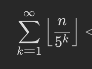

# int-summary

## 概述

参考1：[https://leetcode-cn.com/leetbook/detail/top-interview-questions-medium/](https://leetcode-cn.com/leetbook/detail/top-interview-questions-medium/)

## 数组和字符串

### 三数之和

给你一个包含 n 个整数的数组 nums，判断 nums 中是否存在三个元素 a，b，c ，使得 a + b + c = 0 ？请你找出所有和为 0 且不重复的三元组。

注意：答案中不可以包含重复的三元组。


```cpp
    vector<vector<int>> threeSum(vector<int>& nums) 
    {
        int size = nums.size();
        vector<vector<int> >res;            // 保存结果（所有不重复的三元组）
        if (size < 3) {
            return res;          // 特判
        }
        std::sort(nums.begin(), nums.end());// 排序（默认递增）
        for (int i = 0; i < size; i++)      // 固定第一个数，转化为求两数之和
        {
            if (nums[i] > 0) { // ！！！容易漏掉
                return res; // 第一个数大于 0，后面都是递增正数，不可能相加为零了
            }
            // 去重：如果此数已经选取过，跳过
            if (i > 0 && nums[i] == nums[i - 1]) {
                continue;
            }
            // 双指针在nums[i]后面的区间中寻找和为0-nums[i]的另外两个数
            int left = i + 1;
            int right = size - 1;
            while (left < right)
            {
                if (nums[left] + nums[right] > -nums[i]) {
                    right--;    // 两数之和太大，右指针左移
                } else if (nums[left] + nums[right] < -nums[i]) {
                    left++;     // 两数之和太小，左指针右移
                } else {
                    // 找到一个和为零的三元组，添加到结果中，左右指针内缩，继续寻找
                    vector<int> tmp {nums[i], nums[left], nums[right]};
                    res.push_back(tmp);
                    left++;
                    right--;
                    // 去重：第二个数和第三个数也不重复选取 ！！！容易漏掉
                    // 例如：[-4,1,1,1,2,3,3,3], i=0, left=1, right=5
                    while (left < right && nums[left] == nums[left-1]) {
                        left++;
                    }
                    while (left < right && nums[right] == nums[right+1]) {
                        right--;
                    }
                }
            }
        }
        return res;
    }
```

### 矩阵置零

给定一个 m x n 的矩阵，如果一个元素为 0 ，则将其所在行和列的所有元素都设为 0 。请使用 原地 算法。

```cpp
    void setZeroes(vector<vector<int>>& matrix) {
        int row = matrix.size();
        int col = matrix[0].size();
        // 用两个辅助数组，存这行和这列是否要变成0，
        // 然后再遍历原矩阵，如果二者有一个要变0，那就变成0
        vector<bool> rows(row, false);
        vector<bool> cols(col, false);
        for (int i = 0; i < row; ++i) {
            for (int j = 0; j < col; ++j) {
                if (matrix[i][j] == 0) {
                    rows[i] = true;
                    cols[j] = true;
                }    
            }
        }
        for (int i = 0; i < row; ++i) {
            for (int j = 0; j < col; ++j) {
                if (rows[i] || cols[j]) {
                    matrix[i][j] = 0;
                }    
            }
        }
    }
```

### 字母异位词分组

给你一个字符串数组，请你将 字母异位词 组合在一起。可以按任意顺序返回结果列表。

字母异位词 是由重新排列源单词的字母得到的一个新单词，所有源单词中的字母通常恰好只用一次。

其实就是个倒排

```cpp
    vector<vector<string>> groupAnagrams(vector<string>& strs) {
        unordered_map<string, vector<string> > xmap;
        for (auto& it: strs) {
            string xit = it;
            // 对string进行sort，搞成一个词，扔进map
            sort(xit.begin(), xit.end());
            xmap[xit].emplace_back(it);
        }
        vector<vector<string>> res;
        for (auto& it: xmap) {
            res.emplace_back(it.second);
        }
        return res;
    }
```

### 无重复字符的最长子串

给定一个字符串，请你找出其中不含有重复字符的 最长子串 的长度。

```
输入: s = "pwwkew"
输出: 3
解释: 因为无重复字符的最长子串是 "wke"，所以其长度为 3。
     请注意，你的答案必须是 子串 的长度，"pwke" 是一个子序列，不是子串。
```

双指针

```cpp
   int lengthOfLongestSubstring(string s) {
        set<char> set_char;
        int res = 0;
        // 双指针，两个指针都从头开始
        for (int i = 0, j = 0; i < s.size() && j < s.size(); ) {
            if (set_char.find(s[j]) != set_char.end()) {
                //找到重复了，那就把起始的扔了
                set_char.erase(s[i]);
                ++i;
            } else {
                if (j - i + 1 > res) {
                    res = j - i + 1;
                }
                set_char.insert(s[j]);
                //没重复的，右指针继续往前找
                ++j;
            }
        }
        
        return res;
    }
```

## 链表

### 两数相加

给你两个 非空 的链表，表示两个非负的整数。它们每位数字都是按照 逆序 的方式存储的，并且每个节点只能存储 一位 数字。

请你将两个数相加，并以相同形式返回一个表示和的链表。

你可以假设除了数字 0 之外，这两个数都不会以 0 开头。
head->...->tail 是倒序的整数，求两个整数的和，并返回同样格式的链表

```cpp
    ListNode* addTwoNumbers(ListNode* l1, ListNode* l2) {
        int carry = 0;// 进位
        ListNode* dummy_head = new ListNode(0); //需要有个dummy head，最后return head->next
        ListNode* tmp = dummy_head;
        ListNode* ptr1 = l1;
        ListNode* ptr2 = l2;
        while (ptr1 != NULL || ptr2 != NULL) {
            int val1 = ptr1 != NULL? ptr1->val: 0;
            int val2 = ptr2 != NULL? ptr2->val: 0;
            int sum = val1 + val2 + carry;
            //cout << sum << " " << carry << " " << val1 << " " << val2 << endl;
            carry = sum / 10; // 很重要！！！！！新的carry
            int remain = sum % 10;
            tmp->next = new ListNode(remain);
            ptr1 = (NULL == ptr1? NULL: ptr1->next); //判断的是ptr1，而不是ptr1->next！！！！！！
            ptr2 = (NULL == ptr2? NULL: ptr2->next);
            tmp = tmp->next;
        }
        if (carry > 0) {
            tmp->next = new ListNode(carry);
        }
        return dummy_head->next;
    }
```

### 奇偶链表

给定单链表的头节点 head ，将所有索引为奇数的节点和索引为偶数的节点分别组合在一起，然后返回重新排序的列表。

第一个节点的索引被认为是 奇数 ， 第二个节点的索引为 偶数 ，以此类推。

请注意，偶数组和奇数组内部的相对顺序应该与输入时保持一致。

你必须在 O(1) 的额外空间复杂度和 O(n) 的时间复杂度下解决这个问题。

12345 变成13524

```cpp
    ListNode* oddEvenList(ListNode* head) {
        // 先把第一个偶数保存下来，
        // 跳着指(2->4,3->5)，
        // 最后再把奇数的指向第一个偶数，
        // return的应该还是head
        if (head == nullptr) {
            return nullptr;
        }
        ListNode* even_head = head->next; //第一个偶数，存下来
        ListNode* odd = head;
        ListNode* even = even_head;
        while (even != nullptr && even->next != nullptr) {
            odd->next = even->next;
            odd = odd->next;
            even->next = odd->next;
            even = even->next;
        }
        odd->next = even_head;
        return head;
    }
```

### 最长回文子串

```
输入：s = "babad"
输出："bab"
解释："aba" 同样是符合题意的答案。
```

dp

```cpp
    string longestPalindrome(string s) {
        // p(i,j)表示i:j是回文串
        // 转移：
        // if  si == sj then p(i,j) = p(i+i, j-1)
        // 边界：len=1是，len=2，如果si==sj那是
        // 结果就是所有p(i,j)=1的j-i+1的max
        int n = s.size();
        if (n < 2) {
            return s;
        }
        int max_len = 1;
        int begin = 0;
        // n * n的矩阵
        vector<vector<bool> > dp(n, vector<bool>(n));
        for (int i = 0; i < n; ++i) {
            dp[i][i] = true;//1个字符的肯定是

        }
        // L是子串长度
        for (int L = 2; L <= n; ++L) {
            for (int i = 0; i < n; ++i) {
                // 根据L找j的位置, L = j-i+1
                int j = L + i - 1;
                if (j >= n) {
                    break; // 到尽头了
                }
                if (s[i] != s[j]) {
                    dp[i][j] = false;
                } else {
                    if (j - i < 3) {
                        dp[i][j] = true;
                    } else {
                        dp[i][j] = dp[i + 1][j - 1];
                    }
                }

                if (dp[i][j] && L > max_len) {
                    max_len = L;
                    begin = i;
                }

            }
        }
        return s.substr(begin, max_len);

    }
```

### 递增的三元子序列

给你一个整数数组 nums ，判断这个数组中是否存在长度为 3 的递增子序列。

如果存在这样的三元组下标 (i, j, k) 且满足 i < j < k ，使得 nums[i] < nums[j] < nums[k] ，返回 true ；否则，返回 false 。
```cpp
    bool increasingTriplet(vector<int>& nums) {
        // first < second,且second肯定大于first，那么如果second右边的比second大，就是找到了
        int n = nums.size();
        //if (n < 3) {
        //    return false;
        //}
        int first = INT_MAX, second = INT_MAX;
        for (int i = 0; i < n; ++i) {
            int num = nums[i];
            if (num <= first) {
                first = num; // 更新第一个数
            } else if (num <= second) {
                second = num; // 这个数比first大，那就是second
            } else {
                // 如果这个数比两个数都大，那return
                return true; 
            }
        }
        return false;
    }
```

### 相交链表

返回交点

```cpp
    ListNode *getIntersectionNode(ListNode *headA, ListNode *headB) {
        // a b一直走，判断是否相等，假设b比a长
        // a到null的时候，a从b的头开始，这样和b一起走b-a的长度；
        // b到null的时候，二者都走了b-a，b从a的头开始，就能和a相遇了
        // 假设没交点，那最后两个都会指向null
        if (headA == nullptr || headB == nullptr) {
            return nullptr;
        }
        ListNode* p1 = headA;
        ListNode* p2 = headB;
        while (p1 != p2) {
            p1 = (p1 == nullptr? headB: p1->next);
            p2 = (p2 == nullptr? headA: p2->next);
        }
        return p1;
    }
```

## 树

### 二叉树的中序遍历

栈 一直塞左子树，取出栈顶，扔到res里去，pop出来，开始遍历原栈顶的右子树

```cpp
vector<int> inorderTraversal(TreeNode* root) {
        stack<TreeNode*> stk;
        vector<int> res;
        while (root != nullptr || !stk.empty()) { // 两个条件 或！！！！
            while (root != nullptr) { // 一直把root的左子树丢进去
                stk.push(root);
                root = root->left;
            }
            root = stk.top();
            stk.pop(); // 栈顶扔出来
            res.emplace_back(root->val); // 值搞进去
            root = root->right; // 开始原栈顶的右子树
        }
        return res;
    }
```

### 层序遍历

队列（bfs）queue

### 二叉树的锯齿形层序遍历
给你二叉树的根节点 root ，返回其节点值的 锯齿形层序遍历 。（即先从左往右，再从右往左进行下一层遍历，以此类推，层与层之间交替进行）。

队列+优先队列deque

```cpp
    vector<vector<int>> zigzagLevelOrder(TreeNode* root) {
        // 层序遍历，加个参数，奇数左到右，偶数右到左
        // dequeue，双端队列
        vector<vector<int> > res;
        if (root == nullptr) {
            return res;
        }
        queue<TreeNode*> q;
        q.push(root);
        bool left_order = true;
        while (!q.empty()) {
            deque<int> level_lst;
            int size = q.size();
            for (int i = 0; i < size; ++i) { // 这里写size，而不是q.size，因为q一直在变！！！
                TreeNode* node = q.front();
                q.pop();
                if (left_order) {
                    level_lst.push_back(node->val);
                } else {
                    level_lst.push_front(node->val);
                }
                if (node->left) {
                    q.push(node->left);
                }
                if (node->right) {
                    q.push(node->right);
                }
            }
            res.emplace_back(vector<int>(level_lst.begin(), level_lst.end()));
            left_order = !left_order;
        }
        return res;
    }
```

### 从前序与中序遍历序列构造二叉树

前序：根 \[左]\[右] 中序：\[左] 根 \[右] 找到根在中序里的位置（先用map存好值-位置关系，o1查），然后递归

```cpp
    TreeNode* buildTree(vector<int>& preorder, vector<int>& inorder) {
        // 递归：
        // 通过前序找到根，再在中序里找到根的位置，左边是左子树，右边是右子树，这样就知道在前序里走几步是左，后面的就是右
        // 因此，区间的端点就是递归的参数
        // 把中序的值和index存到一个map里，这样就能知道在前序中的区间位置了
        int len_pre = preorder.size();
        int len_in = inorder.size();
        if (len_pre != len_in) {
            return nullptr;
        }
        unordered_map<int, int> xmap;
        for (int i = 0; i < len_in; ++i) {
            xmap.emplace(inorder[i], i);
        }
        // 前序，左右区间；中序map，左右区间
        return buildTreeSub(preorder, 0, len_pre - 1, xmap, 0, len_in - 1);
    }
    
    // 这里xmap要传引用，不然会超时。。
    TreeNode* buildTreeSub(vector<int>& preorder, int pre_start, int pre_end, unordered_map<int, int>& xmap, int in_start, int in_end) {
        if (pre_start > pre_end || in_start > in_end) { // 终止条件
            return nullptr;
        }
        int root_val = preorder[pre_start];
        TreeNode* root = new TreeNode(root_val);
        int in_index = xmap[root_val]; //肯定会有
        root->left = buildTreeSub(preorder, pre_start + 1, pre_start + in_index - in_start, xmap, in_start, in_index - 1);
        root->right = buildTreeSub(preorder, pre_start + in_index - in_start + 1, pre_end, xmap, in_index + 1, in_end);
        return root;
    }

        
        // 迭代法(看不懂)：
        // 前序中的任意连续两个节点u,v而言，要么v是u的左儿子，
        // 要么u没有左儿子的话，那么v就是u或者u的祖先的右儿子（u向上回溯，到第一个有右儿子的就是他的右儿子）
```

### 二叉搜索树中第K小的元素

给定一个二叉搜索树的根节点 root ，和一个整数 k ，请你设计一个算法查找其中第 k 个最小元素（从 1 开始计数）。


左边比根小，右边比根大，那就中序遍历，遍历完成左，然后根，然后右，然后k--，减到0就是了 中序就是栈

```cpp
    int kthSmallest(TreeNode* root, int k) {
        // 栈，中序遍历,左子树都比它小，所以找topk小，就先遍历完左的，再遍历它，再右
        stack<TreeNode*> stk;
        while (root != nullptr || stk.size() > 0) {
            while (root != nullptr) {
                stk.push(root);
                root = root->left;
            }
            root = stk.top();
            stk.pop();
            --k;
            if (k == 0) {
                break;
            }
            root = root->right;
        }
        return root->val;
    }
```

## 图

### 岛屿数量

给你一个由 '1'（陆地）和 '0'（水）组成的的二维网格，请你计算网格中岛屿的数量。

岛屿总是被水包围，并且每座岛屿只能由水平方向和/或竖直方向上相邻的陆地连接形成。

此外，你可以假设该网格的四条边均被水包围。


以1开始，dfs，visited置0，dfs就是上下左右地递归：

```cpp
    int numIslands(vector<vector<char>>& grid) {
        // dfs，看成一个无向图，垂直或者水平相邻的1之间是一条边
        // 遇到1，就以它为起点，dfs，每个走到的1重新记为0！！！
        // 这样，走了多少次dfs，就有多少个岛屿
        // dfs中 就是先置0，然后上下左右分别递归找
        int rows = grid.size();
        if (rows == 0) {
            return 0;
        }
        int cols = grid[0].size();
        int num_islands = 0;
        for (int r = 0; r < rows; ++r) {
            for (int c = 0; c < cols; ++c) {
                if (grid[r][c] == '1') {
                    ++num_islands;
                    dfs(grid, r, c);
                }
            }
        }
        return num_islands;

    }
    void dfs(vector<vector<char> >& grid, int r, int c) {
        int rows = grid.size();
        int cols = grid[0].size();
        grid[r][c] = '0';
        if (r -1 >= 0 && grid[r - 1][c] == '1') {
            dfs(grid, r - 1, c); // 上
        }
        if (r + 1 < rows && grid[r + 1][c] == '1') {
            dfs(grid, r + 1, c); // 下
        }
        if (c - 1 >= 0 && grid[r][c - 1] == '1') {
            dfs(grid, r, c - 1); // 左
        }
        if (c + 1 < cols && grid[r][c + 1] == '1') {
            dfs(grid, r, c+1); // 右
        }
    }
```

## 回溯法

### 回溯小结

回溯法：一种通过探索所有可能的候选解来找出所有的解的算法。如果候选解被确认不是一个解（或者至少不是最后一个解），回溯算法会通过在上一步进行一些变化抛弃该解，即回溯并且再次尝试。

套路： 调用：

```cpp
        vector<string> res; // 也可能是vec的vec
        string cur; // 也可能是vec，看题目
        backtrace(res, cur, xxx);
        return res;
```

回溯函数：

```cpp
    void backtrace(vector<string>& res, string& cur, xxx) { // xxx一般有两个参数，当前值a，上限len
        if (aaaa) { // a+1之类的 加到上限了如
            res.push_back(cur);
            return;
        }
        if (bbbb) {
            cur.push_back('aaa'); //扔进去
            backtrace(res, cur, xxxx); // a+1之类的操作,把len也传进去
            cur.pop_back(); // 放出来
        }
    }
```

模板：

```
回溯(子集, 全集):
    if 满足条件:
        加入答案
    for 元素 in 全集:
        元素加入子集
        回溯(子集, 全集)
        元素退出子集
```

### 电话号码的字母组合

给定一个仅包含数字 2-9 的字符串，返回所有它能表示的字母组合。答案可以按 任意顺序 返回。

给出数字到字母的映射如下（与电话按键相同）。注意 1 不对应任何字母。


```cpp
    vector<string> letterCombinations(string digits) {
        // 回溯+dfs
        unordered_map<char, string> phone_map {
            {'2', "abc"}, 
            {'3', "def"},
            {'4', "ghi"},
            {'5', "jkl"},
            {'6', "mno"},
            {'7', "pqrs"},
            {'8', "tuv"},
            {'9', "wxyz"}
        };
        vector<string> res;
        if (digits.empty()) {
            return res;
        }
        string comb;
        backtrace(res, phone_map, digits, 0, comb);
        return res;
    }
    void backtrace(vector<string>& res, const unordered_map<char, string>& phone_map, 
        const string& digits, int index, string& comb_str) {
            // index:输入的digits的第index个字母
            if (index == digits.length()) {
                 res.push_back(comb_str);
            } else {
                char digit = digits[index];
                const string& letters = phone_map.at(digit);
                for (const char& letter: letters) {
                    comb_str.push_back(letter); // 先搞一个
                    backtrace(res, phone_map, digits, index + 1, comb_str);
                    comb_str.pop_back(); // 扔掉，换一个新的
                }
            }

    }
```

### 括号生成

数字 n 代表生成括号的对数，请你设计一个函数，用于能够生成所有可能的并且 有效的 括号组合。

有效括号组合需满足：左括号必须以正确的顺序闭合。


```cpp
    vector<string> generateParenthesis(int n) {
        vector<string> res;
        string cur;
        backtrace(res, cur, 0, 0, n);
        return res;
    }
    // open左括号个数，close 右括号个数
    void backtrace(vector<string>& res, string& cur, int open, int close, int n) {
        if (cur.size() == n * 2) { // 一共2n个左右括号
            res.push_back(cur);
            return;
        }
        if (open < n) { // 还可以继续加左括号（最多可以加n个）
            cur.push_back('(');
            backtrace(res, cur, open + 1, close, n);
            cur.pop_back();
        }
        if (close < open) { // 准备加新的右括号了
            cur.push_back(')');
            backtrace(res, cur, open, close + 1, n);
            cur.pop_back();
        }
    }
```

### 全排列

给定一个不含重复数字的数组 nums ，返回其 所有可能的全排列 。你可以 按任意顺序 返回答案。

```
输入：nums = [1,2,3]
输出：[[1,2,3],[1,3,2],[2,1,3],[2,3,1],[3,1,2],[3,2,1]]
```


```cpp
    vector<vector<int>> permute(vector<int>& nums) {
        vector<vector<int> > res;
        backtrace(res, nums, 0, nums.size());
        return res;
    }
    void backtrace(vector<vector<int> >& res, vector<int>& output, int first, int len) {
        if (first == len) {
            res.push_back(output);
        }
        for (int i = first; i < len; ++i) {
            swap(output[i], output[first]); // 交换
            backtrace(res, output, first + 1, len);
            swap(output[i], output[first]); // 换回去
        }
    }
```

### 子集

给你一个整数数组 nums ，数组中的元素 互不相同 。返回该数组所有可能的子集（幂集）。

解集 不能 包含重复的子集。你可以按 任意顺序 返回解集。

```
输入：nums = [1,2,3]
输出：[[],[1],[2],[1,2],[3],[1,3],[2,3],[1,2,3]]
```


调用两次dfs，因为对于子集来说，每个数字可以选也可以不选。

```cpp
    void dfs(vector<vector<int> > &res, const vector<int>& nums, vector<int>& cur_res, int cur) {
        if (cur == nums.size()) {
            res.push_back(cur_res);
            return;
        }
        // 调用两次dfs，因为对于子集来说，每个数字可以选也可以不选。
        cur_res.push_back(nums[cur]);
        dfs(res, nums, cur_res, cur + 1);
        cur_res.pop_back();
        dfs(res, nums, cur_res, cur + 1);
    }

    vector<vector<int>> subsets(vector<int>& nums) {
        vector<vector<int> > res;
        vector<int> cur_res;
        dfs(res, nums, cur_res, 0);
        return res;
    }
```

### 单词搜索

给定一个 m x n 二维字符网格 board 和一个字符串单词 word 。如果 word 存在于网格中，返回 true ；否则，返回 false 。

单词必须按照字母顺序，通过相邻的单元格内的字母构成，其中“相邻”单元格是那些水平相邻或垂直相邻的单元格。同一个单元格内的字母不允许被重复使用。


```cpp
    bool check(vector<vector<char> >& board, vector<vector<int> >& visited, 
        int i, int j, string word, int k) {
        if (board[i][j] != word[k]) { //不匹配，不行 
            return false;
        } else if (k == word.length() - 1) { //到最后一个词了且相等，ok
            return true;
        }
        visited[i][j] = true;
        // 上下左右
        vector<pair<int, int> > directions{{0, 1}, {0, -1}, {1, 0}, {-1, 0}};
        bool res = false;
        for (const auto& dir: directions) {
            int new_i = i + dir.first;
            int new_j = j + dir.second;
            if (new_i >= 0 && new_i < board.size() && new_j >= 0 && new_j < board[0].size()) {
                if(!visited[new_i][new_j]) {
                    bool flag = check(board, visited, new_i, new_j, word, k + 1);
                    if (flag) {
                        res = true;
                        break;
                    }
                }
            }
        }
        visited[i][j] = false; //还原
        return res;
    }
    bool exist(vector<vector<char>>& board, string word) {
        int h = board.size(), w = board[0].size();
        vector<vector<int> > visited(h, vector<int>(w));
        for (int i = 0; i < h; ++i) {
            for (int j = 0; j < w; ++j) {
                bool flag = check(board, visited, i, j, word, 0);
                if (flag) {
                    return true;
                }
            }
        }
        return false;
    }
```

## 排序与搜索

### 各排序算法总结


大小顶堆参考：

```cpp
//小顶堆(是大于。。不是小于)，这也是默认
priority_queue <int,vector<int>,greater<int> > q;
//大顶堆
priority_queue <int,vector<int>,less<int> >q;
//默认大顶堆
priority_queue<int> a;

// 自定义比较函数：（小顶堆，实现大于操作）
struct MyCmp {
    bool operator()(pair<int, int>& a, pair<int, int>& b) {
        return a.second > b.second;
    }
};
// 小顶堆
priority_queue<pair<int, int>, vector<pair<int, int> >, MyCmp> q;
```

### 二分小结

```cpp
    int search(vector<int>& nums, int target) {
        int low = 0, high = nums.size() - 1;
        while (low <= high) { // 小于等于
            int mid = low + (high - low) / 2; // 标准写法，背下来
            if (nums[mid] == target) {
                return mid;
            } else if (nums[mid] > target) {
                high = mid - 1;
            } else {
                low = mid + 1;
            }
        }
        return -1;
    }
```

### 颜色分类

给定一个包含红色、白色和蓝色、共 n 个元素的数组 nums ，原地对它们进行排序，使得相同颜色的元素相邻，并按照红色、白色、蓝色顺序排列。

我们使用整数 0、 1 和 2 分别表示红色、白色和蓝色。

必须在不使用库的sort函数的情况下解决这个问题。


即荷兰国旗问题 数组里有0 1 2，要求相同颜色的相邻 单指针


```cpp
    void sortColors(vector<int>& nums) {
        int n = nums.size();
        int ptr = 0;
        // 遍历两次，第一遍把0交换到前面去，第二遍把1交换到0之后
        // 用指针ptr标记最后一个0的下一位，第二遍从ptr开始
        for (int i = 0; i < n; ++i) {
            if (nums[i] == 0) {
                swap(nums[i], nums[ptr]);
                ++ptr;
            }
        }
        for (int i = ptr; i < n; ++i) {
            if (nums[i] == 1) {
                swap(nums[i], nums[ptr]);
                ++ptr;
            }
        }
    }
```

### 前k个高频元素

给你一个整数数组 nums 和一个整数 k ，请你返回其中出现频率前 k 高的元素。你可以按 任意顺序 返回答案。
多存个map，堆里存的是个pair

```cpp
    struct MyCmp {
        bool operator()(pair<int, int>& a, pair<int, int>& b) {
            return a.second > b.second;
        }
    };
    vector<int> topKFrequent(vector<int>& nums, int k) {
        // 先遍历一遍，map存<k,cnt>，然后遍历map，用个小顶堆
        // 如果堆的元素个数小于 k，就可以直接插入堆中。
        // 如果堆的元素个数等于 k，则检查堆顶与当前出现次数的大小。
        //   如果堆顶更大，说明至少有 k 个数字的出现次数比当前值大，故舍弃当前值；
        //   否则，就弹出堆顶，并将当前值插入堆中。

        // c++的堆是priority_queue
        unordered_map<int, int> word_count;
        for (auto& v: nums) {
            word_count[v]++;
        }
        // pop的是优先级最高的元素，top也是优先级最高的
        // priorty_queue<int, vector<int>, cmp> 这是定义方式，一定要有个vec
        priority_queue<pair<int, int>, vector<pair<int, int> >, MyCmp> q;
        for (auto& [num, cnt]: word_count) {
            if (q.size() < k) {
                q.emplace(num, cnt);
            } else {
                if (q.top().second < cnt) {
                    q.pop();
                    q.emplace(num, cnt);
                }
            }
        }
        vector<int> res;
        while (!q.empty()){
            res.emplace_back(q.top().first);
            q.pop();
        }
        return res;
    }
```

### 数组中的第k个最大元素

给定整数数组 nums 和整数 k，请返回数组中第 k 个最大的元素。

请注意，你需要找的是数组排序后的第 k 个最大的元素，而不是第 k 个不同的元素。


堆顶就是了

```cpp
    int findKthLargest(vector<int>& nums, int k) {
        //小顶堆，堆顶就是要的
        struct MyCmp {
            bool operator()(int a, int b) {
                return a > b;
            }
        };
        priority_queue<int, vector<int>, MyCmp> q;
        for (auto& i: nums) {
            if (q.size() < k) {
                q.emplace(i);
            } else {
                if (i > q.top()) {
                    q.pop();
                    q.emplace(i);
                }
            }
        }
        return q.top();
    }
```

### 寻找峰值

峰值元素是指其值严格大于左右相邻值的元素。

给你一个整数数组 nums，找到峰值元素并返回其索引。数组可能包含多个峰值，在这种情况下，返回 任何一个峰值 所在位置即可。

你可以假设 nums[-1] = nums[n] = -∞ 。

你必须实现时间复杂度为 O(log n) 的算法来解决此问题。


二分，类似旋转数组，如果mid不是符合条件的，那看看是在上升还是在下降，如果是在上升，那就看右边区间，如果是下降，那看左边。

```cpp
    // 可以搞成匿名函数
    // pair<int, int> get(int i, int n, vector<int> & nums) {
    //     // 方便处理nums[-1]和nums[n]的边界情况
    //     if (i == -1 || i == n) {
    //         return {0, 0};
    //     }
    //     return {1, nums[i]};
    //     //保证能取到的比越界的大，都能取到的时候，用实际的数比较
    // }
    int findPeakElement(vector<int>& nums) {
        // 二分，类似旋转数组，如果mid不是符合条件的，那看看是在上升还是在下降，
        // 如果是在上升，那就看右边区间，如果是下降，那看左边。
        int left = 0, right = nums.size() - 1;
        int n = nums.size();
        auto get = [&](int i) -> pair<int, int> {
            // 方便处理nums[-1]和nums[n]的边界情况
            if (i == -1 || i == n) {
                return {0, 0};
            }
            return {1, nums[i]};
            //保证能取到的比越界的大，都能取到的时候，用实际的数比较
        };
        while (left <= right) {
            int mid = left + (right - left) / 2; //标准mid写法
            if (get(mid - 1) < get(mid) && get(mid) > get(mid + 1)) {
                return mid;
            }
            if (get(mid) < get(mid + 1)) {
                left = mid + 1;
            } else {
                right = mid - 1;
            }
        }
        return -1;
    }
```

### 在排序数组中查找元素的第一个和最后一个位置

给定一个按照升序排列的整数数组 nums，和一个目标值 target。找出给定目标值在数组中的开始位置和结束位置。

如果数组中不存在目标值 target，返回 [-1, -1]。

进阶：

你可以设计并实现时间复杂度为 O(log n) 的算法解决此问题吗？


```cpp
public:
    int binary_search(vector<int>& nums, int target, bool lower) {
        // ans初始化为n！！！，因为外面要-1，对于[1]且target=1的case，会有问题
        int left = 0, right = nums.size() - 1, ans = nums.size(); 
        //不要急着return，要找到边界
        while (left <= right) {
            int mid = left + (right - left) / 2;
            // lower = true，想找左边界，只要nums[mid] >= target就可能可以，只有<target的时候才停
            // lower = false，想找右边第一个>target的
            // 都是找左区间
            if (nums[mid] > target || (lower && nums[mid] >= target)) {
                ans = mid;
                right = mid - 1;
            } else {
                left = mid + 1;
            }
        }
        return ans;
    }
    vector<int> searchRange(vector<int>& nums, int target) {
        // 其实要找的就是第一个=target的位置，和第一个>target的位置-1
        int left_idx = binary_search(nums, target, true);
        int right_idx = binary_search(nums, target, false) - 1;
        if (left_idx <= right_idx && right_idx < nums.size() 
            && left_idx >=0 && nums[left_idx] == target && nums[right_idx] == target) {
            return vector<int>{left_idx, right_idx};
        }
        return vector<int>{-1, -1};

    }
```

### 合并区间

以数组 intervals 表示若干个区间的集合，其中单个区间为 intervals[i] = [starti, endi] 。请你合并所有重叠的区间，并返回 一个不重叠的区间数组，该数组需恰好覆盖输入中的所有区间 。
```cpp
    vector<vector<int>> merge(vector<vector<int>>& intervals) {
        // 先排序，然后第一个区间扔进去，遍历下一个的时候，
        // 看看和前面的最后一个区间有没交集，如果无交集（当前左>已有右），那就扔到最后
        // 如果有交集，那就取这两个区间max的右端点
        if (intervals.size() == 0) {
            return {};
        }
        sort(intervals.begin(), intervals.end());
        vector<vector<int> > merged;
        for (int i = 0; i < intervals.size(); ++i) {
            int left = intervals[i][0], right = intervals[i][1];
            if (merged.size() == 0 || left > merged.back()[1] ) {
                merged.push_back({left, right});
            } else {
                merged.back()[1] = max(merged.back()[1], right);
            }
        }
        return merged;
    }
```

### 搜索旋转排序数组

整数数组 nums 按升序排列，数组中的值 互不相同 。

在传递给函数之前，nums 在预先未知的某个下标 k（0 <= k < nums.length）上进行了 旋转，使数组变为 [nums[k], nums[k+1], ..., nums[n-1], nums[0], nums[1], ..., nums[k-1]]（下标 从 0 开始 计数）。例如， [0,1,2,4,5,6,7] 在下标 3 处经旋转后可能变为 [4,5,6,7,0,1,2] 。

给你 旋转后 的数组 nums 和一个整数 target ，如果 nums 中存在这个目标值 target ，则返回它的下标，否则返回 -1 。


```cpp
    int search(vector<int>& nums, int target) {
        // 局部有序，二分
        int n = nums.size();
        if (n == 0) {
            return -1;
        }
        if (n == 1) {
            return nums[0] == target? 0: -1;
        }
        int left = 0, right = n - 1;
        while (left <= right) {
            int mid = left + (right -left) / 2;
            if (nums[mid] == target) {
                return mid;
            }
            // 看下mid在哪个区间里，因为有两个上升的区间，和nums[0]比就行
            if (nums[0] <= nums[mid]) {
                // mid在第一个上升区间里
                if (nums[0] <= target && target < nums[mid]) {
                    // target也在这个区间里
                    right = mid -1;
                } else {
                    left = mid + 1;
                }
            } else {
                if (nums[mid] < target && target <= nums[n - 1]) {
                    left = mid + 1;
                } else {
                    right = mid - 1;
                }
            }
        }
        return -1;
    }
```

### 搜索二维矩阵 II

编写一个高效的算法来搜索 m x n 矩阵 matrix 中的一个目标值 target 。该矩阵具有以下特性：

每行的元素从左到右升序排列。
每列的元素从上到下升序排列。

```cpp
    bool searchMatrix(vector<vector<int>>& matrix, int target) {
        // 右上角开始，保证只有一个搜索方向，要么变大要么变小，z字形
        int m = matrix.size(), n = matrix[0].size();
        int x = 0, y = n - 1;
        while (x < m && y >= 0) {
            if (matrix[x][y] ==  target) {
                return true;
            }
            if (matrix[x][y] > target) {
                --y;
            } else {
                ++x;
            }
        }
        return false;
    }
```

## dp

### 跳跃游戏

```cpp
    bool canJump(vector<int>& nums) {
        // 贪心
        // 对于每个位置x，实时维护最远可到达的位置x+nums[x]，
        // 如果这个位置x在最远可到达位置内，那么可以从起点经过若干次跳跃到达
        // 在遍历的过程中，如果最远可到达位置>=数组最后一个位置 ，就可以return True
        int n = nums.size();
        int most_right = 0;
        for (int i = 0; i < n; ++i) {
            if (i <= most_right) {
                most_right = max(most_right, i + nums[i]);
                if (most_right >= n - 1) {
                    return true;
                }
            }
        }
        return false;
    }
```

### 不同路径

一个机器人位于一个 m x n 网格的左上角 （起始点在下图中标记为 “Start” ）。

机器人每次只能向下或者向右移动一步。机器人试图达到网格的右下角（在下图中标记为 “Finish” ）。

问总共有多少条不同的路径？

简单二维dp，注意边界条件

```cpp
    int uniquePaths(int m, int n) {
        // f(i,j)表示从左上角走到(i,j)的路径数量，
        // 这个点只可能是从左边或者上面走过来的，所以
        // f(i,j) = f(i-1,j) + f(i, j-1)
        // 对于第0行和第0列，f(i,0)=1，f(0,j)=1，因为只有直着能走到
        // f(0,0) = 1
        vector<vector<int> > f(m, vector<int>(n));
        for (int i = 0; i < m; ++i) {
            f[i][0] = 1;
        }
        for (int j = 0; j < n; ++j) {
            f[0][j] = 1;
        }
        for (int i = 1; i < m; ++i) {
            for (int j = 1; j <n; ++j) {
                f[i][j] = f[i - 1][j] + f[i][j - 1];
            }
        }
        return f[m - 1][n - 1];
    }
```

### 零钱兑换

给你一个整数数组 coins ，表示不同面额的硬币；以及一个整数 amount ，表示总金额。

计算并返回可以凑成总金额所需的 最少的硬币个数 。如果没有任何一种硬币组合能组成总金额，返回 -1 。

你可以认为每种硬币的数量是无限的。


```cpp
    int coinChange(vector<int>& coins, int amount) {
        // dp[i]：组成金额i需要的最少硬币数
        // dp[i] = min(dp[i-c[j]) + 1, j = 0,...,n-1，
        // ！！！注意，是两项,dp[i]和dp[i - coins[j]]+ 1
        // dp[i] = min(dp[i], dp[i - coins[j]]+ 1);
        // c[j]是第j个面额，+1表示选择这个面额，那i-c[j]就是剩下的面额了
        // ！！需要判断凑不出的情况：把dp初始化为amount + 1，如果凑不出就不更新，
        // 如果最后还是amount +1那就是凑不出，当然也可以是amount+999
        int xmax = amount + 1;
        // 因为最后一个下标要是amount，所以大小是amount + 1
        vector<int> dp(amount + 1, xmax);
        dp[0] = 0;
        for(int i = 1; i <= amount; ++i) {
            for (int j = 0; j < coins.size(); ++j) {
                // 遍历每种面额
                if (coins[j] <= i) {
                    dp[i] = min(dp[i], dp[i - coins[j]]+ 1);
                }
            }
        }
        return dp[amount] > amount? -1: dp[amount];
    }
```

### 最长递增子序列

给你一个整数数组 nums ，找到其中最长严格递增子序列的长度。

子序列 是由数组派生而来的序列，删除（或不删除）数组中的元素而不改变其余元素的顺序。例如，[3,6,2,7] 是数组 [0,3,1,6,2,2,7] 的子序列。


```cpp
    int lengthOfLIS(vector<int>& nums) {
        // 不要求连续，比如[3,6,2,7]是[0,3,1,6,2,2,7]的子序列
        // dp[i]：以第i个数字结尾（选了nums[i]）的最长递增子序列的长度
        // dp[i] = max(dp[j]) +1, 0<=j<i，nums[j] < nums[i]，这样才能递增
        // 最终的结果是max(dp[i])
        int n = nums.size();
        if (n == 0) {
            return 0;
        }
        vector<int> dp(n, 0);
        int res = 0;
        for (int i = 0; i < n; ++i) {
            dp[i] = 1;
            for (int j = 0; j < i; ++j) {
                if (nums[j] < nums[i]) {
                    dp[i] = max(dp[i], dp[j] + 1);
                }
            }
            res = max(res, dp[i]);
        }
        return res;
    }
```

## 设计

### 二叉树的序列化与反序列化

序列化是将一个数据结构或者对象转换为连续的比特位的操作，进而可以将转换后的数据存储在一个文件或者内存中，同时也可以通过网络传输到另一个计算机环境，采取相反方式重构得到原数据。

请设计一个算法来实现二叉树的序列化与反序列化。这里不限定你的序列 / 反序列化算法执行逻辑，你只需要保证一个二叉树可以被序列化为一个字符串并且将这个字符串反序列化为原始的树结构。

提示: 输入输出格式与 LeetCode 目前使用的方式一致，详情请参阅 LeetCode 序列化二叉树的格式。你并非必须采取这种方式，你也可以采用其他的方法解决这个问题。


```cpp
class Codec {
public:

    // 前序遍历，到叶子的时候，左右儿子均搞成None
    void rser(TreeNode* root, string& str) {
        if (root == nullptr) {
            str += "None,";
        } else {
            str += to_string(root->val) + ",";
            rser(root->left, str);
            rser(root->right, str);
            //cout << str << endl;
        }
    }
    // Encodes a tree to a single string.
    string serialize(TreeNode* root) {
        string res;
        rser(root, res);
        return res;
    }

    TreeNode* rde(list<string>& data_vec) {
        // 如果当前的元素为 None，则当前为空树
        // 否则先解析这棵树的左子树，再解析它的右子树
        // list的front是第一个元素的值，begin是迭代器
        if (data_vec.front() == "None") {
            data_vec.erase(data_vec.begin());
            return nullptr;
        }
        TreeNode* root = new TreeNode(stoi(data_vec.front()));
        data_vec.erase(data_vec.begin());
        root->left = rde(data_vec);
        root->right = rde(data_vec);
        return root;
    }

    // Decodes your encoded data to tree.
    TreeNode* deserialize(string data) {
        list<string> data_vec;
        string str;
        // 人肉实现下split
        for (auto &ch: data) {
            if (ch == ',') {
                data_vec.push_back(str);
                str.clear();
            } else {
                str.push_back(ch);
            }
        }
        if (!str.empty()) {
            data_vec.push_back(str);
            str.clear();
        }
        return rde(data_vec);
    }
};

// Your Codec object will be instantiated and called as such:
// Codec ser, deser;
// TreeNode* ans = deser.deserialize(ser.serialize(root));
```

### O(1) 时间插入、删除和获取随机元素

实现RandomizedSet 类：

```
RandomizedSet() 初始化 RandomizedSet 对象
bool insert(int val) 当元素 val 不存在时，向集合中插入该项，并返回 true ；否则，返回 false 。
bool remove(int val) 当元素 val 存在时，从集合中移除该项，并返回 true ；否则，返回 false 。
int getRandom() 随机返回现有集合中的一项（测试用例保证调用此方法时集合中至少存在一个元素）。每个元素应该有 相同的概率 被返回。
```

你必须实现类的所有函数，并满足每个函数的 平均 时间复杂度为 O(1) 。

```cpp
class RandomizedSet {
public:
    // 数组可以o(1)地获取元素，哈希可以o(1)插入删除，
    // 二者结合起来就是vec+hashmap
    RandomizedSet() {
        // 初始化随机种子
        srand((unsigned)time(NULL));
    }
    
    bool insert(int val) {
        // 塞进vec里，同时记录下标到map中
        if (indices.count(val)) {
            return false;
        }
        int index = nums.size();
        nums.emplace_back(val);
        indices[val] = index;
        return true;
    }
    
    bool remove(int val) {
        // 为了o(1)，先把这个数找出来，
        // 然后在vec把这个元素换成最后一个元素，pop_back就行
        // hashmap里也删掉，同时更新last的下标
        if (!indices.count(val)) {
            return false;
        }
        int index = indices[val];
        int last = nums.back();
        nums[index] = last;
        nums.pop_back();
        indices[last] = index;
        indices.erase(val);
        return true;
    }
    
    int getRandom() {
        int rand_idx = rand() % nums.size();
        return nums[rand_idx];
    }
    vector<int> nums;
    unordered_map<int, int> indices;
};

/**
 * Your RandomizedSet object will be instantiated and called as such:
 * RandomizedSet* obj = new RandomizedSet();
 * bool param_1 = obj->insert(val);
 * bool param_2 = obj->remove(val);
 * int param_3 = obj->getRandom();
 */
```

## 数学

### 快乐数

编写一个算法来判断一个数 n 是不是快乐数。

「快乐数」 定义为：

对于一个正整数，每一次将该数替换为它每个位置上的数字的平方和。
然后重复这个过程直到这个数变为 1，也可能是 无限循环 但始终变不到 1。
如果这个过程 结果为 1，那么这个数就是快乐数。
如果 n 是 快乐数 就返回 true ；不是，则返回 false 。

```cpp
    int square_sum(int n) {
        int sum = 0;
        while (n > 0) {
            int bit = n % 10;
            sum += bit * bit;
            n /= 10;
        }
        return sum;
    }
    bool isHappy(int n) {
        // 只有两种情况，
        // 一直走，最后是1，相当于无环链表，是快乐数，可以快慢指针
        // 一个有环链表，可以快慢指针，相遇点不是1
        // 没有第三种情况，因为数字再大，也会归结到一个小很多的数开始的链表，
        // 具体证明可以参考https://leetcode-cn.com/problems/happy-number/solution/kuai-le-shu-by-leetcode-solution/
        int fast = n, slow = n;
        // ！！用do while，因为一开始fast=slow，但仍想走一次循环
        do {
            fast = square_sum(square_sum(fast));
            slow = square_sum(slow);
        } while (fast != slow);
        if (fast == 1) {
            return true;
        }
        return false;
    }
```

### 阶乘后的零

给定一个整数 n ，返回 n! 结果中尾随零的数量。


其实这个就是n一直除以5，然后加起来

```cpp
    int trailingZeroes(int n) {
        // 因为5*2=10,其实就是看质因子中5和2的个数，5的个数肯定没有2多，
        // 如上图，其实就是一直除以5，再加起来
        int res = 0;
        while (n) {
            n /= 5;
            res += n;
        }
        return res;
    }
```

###  Excel 表列序号

给你一个字符串 columnTitle ，表示 Excel 表格中的列名称。返回 该列名称对应的列序号 。

例如：
```
A -> 1
B -> 2
C -> 3
...
Z -> 26
AA -> 27
AB -> 28 
```


```cpp
    int titleToNumber(string columnTitle) {
        // 其实是26进制转10进制
        int num = 0;
        long multiple = 1; // 从1开始，需要是long，因为int会爆！！！！！
        //倒着来，其实是从最低位开始
        for (int i = columnTitle.size() - 1; i >= 0; --i) {
            int k = columnTitle[i] - 'A' + 1; // 记得+1...
            num += k * multiple;
            multiple *= 26;
        }
        return num;
    }
```

### Pow(x, n)

实现 pow(x, n) ，即计算 x 的 n 次幂函数（即，xn ）。


```cpp
    double pow_sub(double x, long long N) {
        double res = 1.0;
        double x_contribute = x;
        while (N > 0) {
            if (N % 2 == 1) {
                res *= x_contribute;
            }
            x_contribute *= x_contribute;
            N /= 2;
        }
        return res;
    }
    double myPow(double x, int n) {
        // 其实就是把幂指数n进行二进制拆分，如n=9，那就是
        // 1 * 2^3 + 0 * 2^2 + 0 * 2^1 + 1 * 2^0= 2^3+1 
        // ==> x^9=x^8 *x^1
        // 这么变成二进制：
        // n=9，n %2 =1,要！ 
        // n/=2==> n=4, n%2=0，不要！
        // n/=2==>n=2, n%2=0，不要！
        // n/=2 ==>n=1, n%2=1，要！
        // 因为除了1外，2^n全是偶数，所以如果n%2=1，那就需要这个1
        // 还需要考虑如果n是负的，那就是1/xx
        long long N = n;
        return N >= 0? pow_sub(x, N): 1 / pow_sub(x,-N);
    }
```

### x 的平方根

给你一个非负整数 x ，计算并返回 x 的 算术平方根 。

由于返回类型是整数，结果只保留 整数部分 ，小数部分将被 舍去 。

注意：不允许使用任何内置指数函数和算符，例如 pow(x, 0.5) 或者 x ** 0.5 。


```cpp
    int mySqrt(int x) {
        // 二分
        // 只返回整数部分，那就是k^2<=x的最大k，可以从0到x开始二分
        int left = 0, right = x, res = -1;
        while (left <= right) {
            int mid = left + (right - left) / 2;
            if ((long long)mid * mid <= x) {
                res = mid; // 一直更新 不break
                left = mid + 1;
            } else {
                right = mid - 1;
            }
        }
        return res;
    }
```

### 两数相除

给定两个整数，被除数 dividend 和除数 divisor。将两数相除，要求不使用乘法、除法和 mod 运算符。

返回被除数 dividend 除以除数 divisor 得到的商。

整数除法的结果应当截去（truncate）其小数部分，例如：truncate(8.345) = 8 以及 truncate(-2.7335) = -2

```cpp
    // 求dividend / divisor
    int divide(int dividend, int divisor) {
        // // 参考https://leetcode-cn.com/problems/divide-two-integers/solution/jian-dan-yi-dong-javac-pythonjs-liang-sh-ptbw/
        // // 先处理边界
        // // INT_MIN：-2147483648=2^31，INT_MAX：2147483648=-2^31
        // // int 属于[-2^31 +1, 2^31 - 1]
        // 假设x <0， y <0，求x/y相当于找个最大的正数z，使得
        // yz>=x，注意应该是最大！，举例：算-10/-2，
        // 如果z=5, -10=-10，z=4，那-8>-10,z=6，那-12<-10
        // 因此，是最大的z，使得yz>=x，因为z=6就yz<x了

        if (dividend == INT_MIN) {
            if (divisor == 1) {
                return INT_MIN;
            }
            if (divisor == -1) {
                return INT_MAX;
            }
        }
        if (divisor == INT_MIN) {
            // a / (-2^31) = 0，因为除数绝对值最大
            return dividend == INT_MIN? 1: 0;
        }
        if (dividend == 0) {
            return 0;
        }
        bool rev = false; // 看最后要不要变号
        if (dividend > 0) {
            dividend = -dividend;
            rev = !rev;
        }
        if (divisor > 0) {
            divisor = -divisor;
            rev = !rev;
        }
        auto quick_add = [](int y, int z, int x) {
            // 判断zy是否>=x
            // y负数，x负数，z正数！
            // 对于三个负数a b c，要比较a+b与c，因为a+b可能溢出
            // 所以要改成a与c-b比较，因为两个负数的差不会越界

            // 计算y*z类似y^z
            // 3^5= 3^(1*2^2 + 0*2^1 + 1)
            // 3 * 5 = 3 * (1*2^2+ 0*2^1 + 1)=3*1*2^2+ 3*0 + 3 *1
            // 都是相当于对z=5不断除以2
            // y^z：如果是1，那就res*=y，然后y*=y
            // y*z：如果是1，那就res+=y，然后y+=y

            int result = 0, add = y;
            while(z) {
                if (z & 1) {
                    // z的二进制的最后一位是1,z % 2 == 1，
                    // 要保证result + add >= x
                    if (result < x - add) {
                        return false; //注意这里是直接return false
                    }
                    result += add;
                }
                if (z != 1) {
                    // 要保add + add >= x
                    if (add < x - add) {
                        return false; //注意这里是直接return false
                    }
                    add += add;
                }
                z >>= 1;// z/2
            }
            return true;
        };

        int left = 0, right = INT_MAX, res = 0;
        while (left <= right) {
            int mid = left + ((right - left) >> 1);
            bool check = quick_add(divisor, mid, dividend);
            if (check) {
                res = mid;
                if (mid == INT_MAX) {
                    break;
                }
                left = mid + 1; // 想找更大的 直到找到最大的
            } else {
                right = mid - 1;
            }
        }
        return rev? -res: res;

    }
```

### 分数到小数

给定两个整数，分别表示分数的分子 numerator 和分母 denominator，以 字符串形式返回小数 。

如果小数部分为循环小数，则将循环的部分括在括号内。

如果存在多个答案，只需返回 任意一个 。

对于所有给定的输入，保证 答案字符串的长度小于 104 。

有限小数：

无限循环小数：


```cpp
    string fractionToDecimal(int numerator, int denominator) {
        // !!!!!无限不循环小数属于实数中的无理数，
        // !!!!!并且任何一个无限不循环小数都找不到一个与之相等的分数来对应。
        // 所以如果是无限小数，肯定是无限循环小数
        // 每一位小数=余数*10再除以除数得到的商。
        // 循环小数：通过判断被除数（*10之前）有没有出现过，
        // 出现的位置就是循环节的开始，到结尾就是循环节的结束(哈希记录)
        // 如果余数==0，那就是可以除尽了，不是循环小数
        long numerator_long = numerator; //防止溢出，转成int64！！！
        long denominator_long = denominator;
        if (numerator_long % denominator_long == 0) { //整除
            return to_string(numerator_long / denominator_long);
        }
        string res;
        if ((numerator_long < 0) ^ (denominator_long < 0)) {
            //异或，为true说明二者异号
            res.push_back('-');
        }
        numerator_long = abs(numerator_long);
        denominator_long = abs(denominator_long);
        long integer = numerator_long / denominator_long;
        res += to_string(integer);
        res.push_back('.');
        string fraction;
        unordered_map<long, int> remainder_index_map;
        long remainder = numerator_long % denominator_long;
        int idx = 0;
        while (remainder != 0 && !remainder_index_map.count(remainder)) {
            remainder_index_map[remainder] = idx; // 记录*10之前的remainder的位置
            remainder *= 10;
            fraction += to_string(remainder / denominator_long);
            remainder %= denominator;
            ++idx;
        }
        if (remainder != 0) {
            int first_idx = remainder_index_map[remainder];
            // 把循环节部分用括号包起来
            fraction = fraction.substr(0, first_idx) + '(' + \
                fraction.substr(first_idx) + ')';
        }
        res += fraction;
        return res;
    }
```


## 其他

### 两整数之和
给你两个整数 a 和 b ，不使用 运算符 + 和 - ​​​​​​​，计算并返回两整数之和。

```cpp
    int getSum(int a, int b) {
        // 不能用+-，那就位运算
        // 正整数的补码与原码相同；
        // 负整数的补码为其原码除符号位外的所有位取反后加1。
        // 可以将减法运算转化为补码的加法运算来实现。
        // 0 + 0 = 0
        // 0 + 1 = 1
        // 1 + 0 = 1
        // 1 + 1 = 0 (进位)
        // 相当于不考虑进位，就是a^b（异或），
        // 而进位的值是a&b，进位完就是左移一位 (a&b) << 1
        // 注意，实际的a b是很多位的，所以进位也是很多位的，
        // 所以要有个while，一直加进位直到没有进位为止！！！
        while (b != 0) {
            // 当我们赋给signed类型一个超出它表示范围的值时，结果是undefined；
            // 而当我们赋给unsigned类型一个超出它表示范围的值时，结果是
            // 初始值对无符号类型表示数值总数取模的余数！！
            // 因此，我们可以使用无符号类型来防止溢出。
            unsigned int carry = (unsigned int)(a & b) << 1;
            // 另外，这里得是(unsigned int)(a & b) 再<<1，而不是(a & b) << 1再unsigned int!!!
            a = a ^ b;
            b = carry;
        }
        return a;
    }
```

### 逆波兰表达式求值

根据 逆波兰表示法，求表达式的值。

有效的算符包括 ```+、-、*、/ ```。每个运算对象可以是整数，也可以是另一个逆波兰表达式。

注意 两个整数之间的除法只保留整数部分。

可以保证给定的逆波兰表达式总是有效的。换句话说，表达式总会得出有效数值且不存在除数为 0 的情况。

```cpp
    bool is_num(string& token) {
        return !(token == "+" || token == "-" || token == "*" | token == "/");
    }

    int evalRPN(vector<string>& tokens) {
        // 栈：从左到右遍历表达式
        // 遇到数字，入栈
        // 遇到运算符号op，pop栈顶b出来作为右，再pop栈顶a出来作为左，
        //   计算a op b的结果再入栈
        // 遍历完后，栈内只有一个数，就是结果
        // 注意 题目要求除法只保留整除的结果，所以stk用int就行
        stack<int> stk;
        int n = tokens.size();
        for (int i = 0; i < n; ++i) {
            string& token = tokens[i];
            if (is_num(token)) {
                stk.push(atoi(token.c_str())); // string转int
            } else {
                int right = stk.top();
                stk.pop();
                int left = stk.top();
                stk.pop();
                switch (token[0]) {
                    case '+':
                        stk.push(left + right);
                        break;
                    case '-':
                        stk.push(left - right);
                        break;
                    case '*':
                        stk.push(left * right);
                        break;
                    case '/':
                        stk.push(left / right);
                        break;
                }
            }
        }
        return stk.top();
    }
```

### 多数元素

给定一个大小为 n 的数组 nums ，返回其中的多数元素。多数元素是指在数组中出现次数 大于 ⌊ n/2 ⌋ 的元素。

你可以假设数组是非空的，并且给定的数组总是存在多数元素。


```cpp
    int majorityElement(vector<int>& nums) {
        // 因为题目说了大于半数，所以排序后肯定会占据一半一上的区间，
        // 所以中间的数肯定是它
        sort(nums.begin(), nums.end());
        return nums[nums.size() / 2];
    }
```

### 任务调度器

给你一个用字符数组 tasks 表示的 CPU 需要执行的任务列表。其中每个字母表示一种不同种类的任务。任务可以以任意顺序执行，并且每个任务都可以在 1 个单位时间内执行完。在任何一个单位时间，CPU 可以完成一个任务，或者处于待命状态。

然而，两个 相同种类 的任务之间必须有长度为整数 n 的冷却时间，因此至少有连续 n 个单位时间内 CPU 在执行不同的任务，或者在待命状态。

你需要计算完成所有任务所需要的 最短时间 。


```cpp
    int leastInterval(vector<char>& tasks, int n) {
        unordered_map<char, int> freq; // 记录每一种任务的个数
        for (auto& i: tasks) {
            ++freq[i];
        }
        // stl的max_element
        // 获取所有任务中最多的次数
        int max_exec = max_element(freq.begin(), freq.end(), 
            [](const auto& a, const auto& b) {
                return a.second < b.second;
            })->second;
        // <1> [var] 表示值传递方式捕捉变量var
        // <2> [=] 表示值传递方式捕捉所有父作用域的变量（包括this指针）
        // <3> [&var] 表示引用传递捕捉变量var
        // <4> [&] 表示引用传递捕捉所有父作用域的变量（包括this指针）
        // <5> [this] 表示值传递方式捕捉当前的this指针
        // <6> [=，&a，&b] 表示以引用传递的方式捕捉变量 a 和 b，而以值传递方式捕捉其他所有的变量
        // <7> [&，a，this] 表示以值传递的方式捕捉 a 和 this，而以引用传递方式捕捉其他所有变量
        
        // 计算总共有多少个任务出现了max_exec次
        int max_cnt = accumulate(freq.begin(), freq.end(), 0, 
            [=](int acc, const auto& u){
                return acc + (u.second == max_exec);
            });
        
        // 对于max_exec个任务a来讲，每执行一次后面要n个空位，
        // 所以要(max_exec -1) * (n+1) +1，最后这个+1是最后一个a任务，因为它执行完就行了
        // 而总共有max_cnt个a任务，如果max_cnt<= n+1，那么可以塞进去
        // 就有max_exec - 1) * (n + 1) + max_cnt了
        // 填后面任务按这个方法：
        // 我们从倒数第二行开始，按照反向列优先的顺序（即先放入靠左侧的列，同一列中先放入下方的行），
        // 依次放入每一种任务，并且同一种任务需要连续地填入。
        // 如果max_cnt > n+1，那排完n+1后还要再排k列，然后才是其他任务，
        // 这个时候就不需要再这么按顺序了，因为任意两个任务间肯定大于n，所以总时间就是|tasks|
        // xx.size()需要强转成int，因为原来是size_t
        return max((max_exec - 1) * (n + 1) + max_cnt, static_cast<int>(tasks.size()));
    }
```


